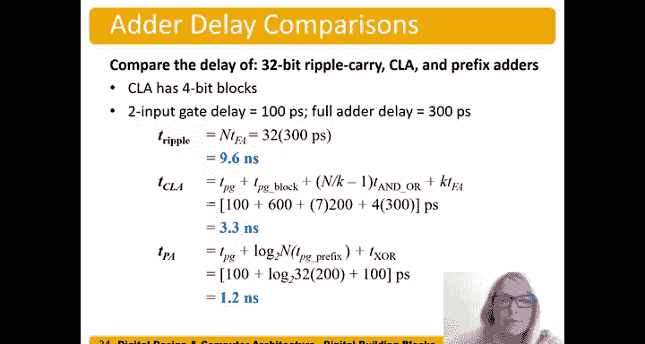

# 数字设计和计算机架构：5：前缀加法器


## 概述
在本节中，我们将学习本章要讨论的最后一种进位传播加法器——前缀加法器。前缀加法器与先行进位加法器目标相同，都旨在尽可能快地计算进位，但其计算方式不同，它通过分而治之的策略，高效地计算出每一位的进位输入。

## 前缀加法器的基本原理
上一节我们介绍了先行进位加法器，本节中我们来看看前缀加法器。前缀加法器的核心目标是快速计算每一位的进位输入 `C_i-1`，然后利用这些进位来计算最终的和 `S_i = A_i XOR B_i XOR C_i-1`。

其计算过程分为两步：
1.  首先计算每一位的生成 `G_i` 和传播 `P_i` 信号。
2.  然后通过合并相邻位的生成和传播信号，以对数级的速度计算出所有需要的进位。

一个块的进位输出 `C_out` 可能由两种情况产生：要么在该块内部生成进位，要么该块传播了一个来自其右侧块的进位。

我们可以用左组和右组的概念来思考。对于一个由左组和右组结合而成的块，其生成信号 `G` 的计算公式为：
```
G_combined = G_left OR (G_right AND P_left)
```
这意味着，整个块会生成一个进位，如果左组自己生成了进位，**或者**右组生成了进位并且左组能够传播它。

关于前缀加法器，一个重要细节是列 `-1` 代表进位输入 `C_in`。因此，`G_-1` 就等于 `C_in`。由于没有列在 `-1` 的右侧，其传播信号 `P_-1` 是无关项。

## 前缀计算示例
让我们通过一个简短的例子来理解前缀加法器的计算过程。

假设我们计算两个4位数（加上进位输入列）的加法。我们设定进位输入 `C_in = 1`。

首先，我们计算每一列（位）的生成 `G_i` 和传播 `P_i` 信号：
*   **列 -1**: `G_-1 = C_in = 1`， `P_-1 = X` (无关)
*   **列 0**: `A=0, B=0` -> `G_0 = 0`, `P_0 = 1`
*   **列 1**: `A=0, B=1` -> `G_1 = 1`, `P_1 = 1`
*   **列 2**: `A=0, B=0` -> `G_2 = 0`, `P_2 = 1`
*   **列 3**: `A=0, B=0` -> `G_3 = 0`, `P_3 = 1`

现在，我们开始合并计算跨度更广的生成信号。

**第一步：合并为2位块**
我们计算从列0到列-1这个2位块的生成信号 `G_{0:-1}`：
```
G_{0:-1} = G_0 OR (G_{-1} AND P_0) = 0 OR (1 AND 1) = 1
```
这实际上就是进位 `C_0`。

同样，计算列2到列1的块：
```
G_{2:1} = G_2 OR (G_1 AND P_2) = 0 OR (1 AND 1) = 1
P_{2:1} = P_2 AND P_1 = 1 AND 1 = 1
```

**第二步：合并为4位块**
现在，我们利用上一步的结果计算列2到列-1这个4位块的生成信号 `G_{2:-1}`：
```
G_{2:-1} = G_{2:1} OR (G_{0:-1} AND P_{2:1}) = 1 OR (1 AND 1) = 1
```
这实际上就是进位 `C_2`。

**第三步：计算中间进位**
我们还需要计算进位 `C_1`，即 `G_{1:-1}`。我们可以通过合并一个1位列（列1）和一个2位块（列0到-1）来得到：
```
G_{1:-1} = G_1 OR (G_{0:-1} AND P_1) = 1 OR (1 AND 1) = 1
```
至此，我们得到了所有需要的进位前缀：`C_0 = 1`, `C_1 = 1`, `C_2 = 1`。

## 前缀加法器电路结构
让我们观察一个16位前缀加法器的电路结构图。电路主要由三种模块构成：

1.  **黄色模块（预计算层）**：计算每一位的 `P_{i:i}` 和 `G_{i:i}`（即 `P_i` 和 `G_i`），以及 `G_{-1}`（即 `C_in`）。
2.  **黑色模块（前缀合并层）**：这是核心计算层。它接收两个相邻块的 `(P, G)` 信号，并输出合并后更大块的 `(P, G)` 信号。其逻辑遵循公式：
    *   `P_{out} = P_left AND P_right`
    *   `G_{out} = G_left OR (G_right AND P_left)`
    电路通过分层（2位、4位、8位、16位）合并，以对数级速度计算出所有跨度直到 `-1` 的生成信号 `G_{i:-1}`（即 `C_i`）。
3.  **蓝色模块（求和层）**：一旦得到进位 `C_i-1`（即 `G_{i-1:-1}`），便可通过异或门计算最终的和位：
    ```
    S_i = A_i XOR B_i XOR C_i-1
    ```
    注意，`A_i XOR B_i` 在预计算层早已完成，因此求和层只增加一个门延迟。

电路的关键路径在于黑色前缀合并层。对于N位加法器，合并层有 `log2(N)` 级，每一级包含一个与门和一个或门（共2个门延迟）。

## 性能分析与比较
现在我们来分析并比较几种进位传播加法器（CPA）的性能。假设使用32位加法器，一个两输入门延迟为100皮秒，一个全加器延迟为300皮秒。

以下是三种加法器的延迟计算：

*   **行波进位加法器**：延迟为 `N * T_FA = 32 * 300ps = 9.6 ns`。
*   **先行进位加法器（4位块）**：延迟公式为 `T_PG + (N/k - 1) * T_AND_OR + k * T_FA`。计算得 `600ps + 7*200ps + 4*300ps = 3.2 ns`（注：与视频中3.3ns略有差异，系计算舍入导致）。
*   **前缀加法器**：延迟公式为 `T_PG + log2(N) * 2 * T_GATE + T_XOR`。计算得 `100ps + 5 * 200ps + 100ps = 1.2 ns`。

从比较中可以看出：
*   先行进位加法器比行波进位加法器快约3倍。
*   前缀加法器比行波进位加法器快约8倍，比先行进位加法器快约2.7倍。

尽管前缀加法器需要更多的硬件逻辑（与门和或门），但它极大地缩短了关键路径（进位传递路径）的延迟，在性能上获得了显著的回报。



## 总结
本节课中我们一起学习了前缀加法器。我们了解到，前缀加法器通过先计算每位的生成和传播信号，然后采用分治策略，以对数时间复杂度 `O(log N)` 高效计算出所有进位。我们通过示例逐步演算了其计算过程，分析了其电路结构，并最终通过性能对比，认识到前缀加法器在速度上的显著优势，尽管其硬件复杂度更高。这种设计体现了数字系统中在速度与面积/复杂度之间进行权衡的经典思想。