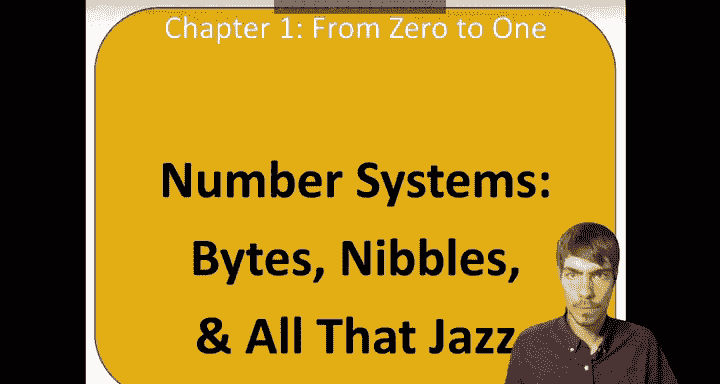
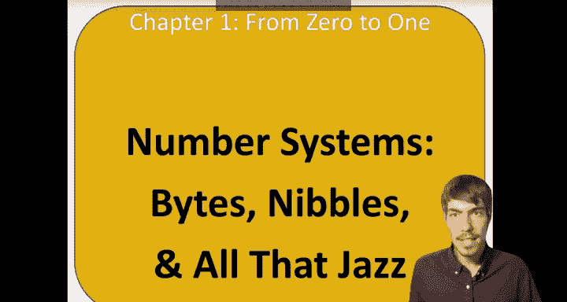
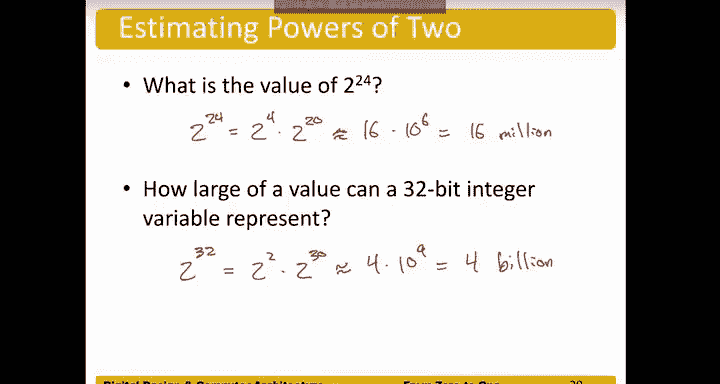

# 数字设计和计算机架构：1.4：字节、半字节与相关概念 🎵

在本节课程中，我们将继续探讨数字系统，重点介绍比特、字节、半字节等基本单位，以及如何估算二进制数的大小。这些概念是理解计算机如何存储和处理数据的基础。

上一节我们讨论了二进制数系统，本节中我们来看看构成这些数字的基本单位。

## 比特与字节

首先讨论比特。我们在二进制数中已经见过比特。有两个特定的比特位需要特别注意：**最高有效位**和**最低有效位**。最高有效位是二进制数中代表最大2的幂次的那一位。最低有效位则是代表最小2的幂次的那一位。

接下来是字节和半字节。字节由8个比特组成，是另一种对二进制数进行分组的方式。当我们用十六进制表示时，每个字节可以用两个十六进制数字表示，因为每个十六进制数字代表4个比特。半字节是一个不太常用但确实存在的术语，它代表4个比特，恰好可以方便地用一个十六进制数字表示。

与最高/最低有效位的概念类似，字节也有最高有效字节和最低有效字节的区分。最高有效字节代表数值中最重要的部分，而最低有效字节则代表我们所讨论数值的最小部分。

## 2的幂次估算

对2的幂次及其对应的十进制近似值有一个大致的了解会很有帮助。

以下是常见的2的幂次及其近似十进制值：
*   `2^10 ≈ 10^3 = 1,024 ≈ 1千 (Kilo)`
*   `2^20 ≈ 10^6 = 1,048,576 ≈ 1兆 (Mega)`
*   `2^30 ≈ 10^9 = 1,073,741,824 ≈ 1吉 (Giga)`

这些近似值在你讨论二进制数的大小时非常有用。你可能在查看电脑文件大小（如多少兆字节或吉字节）或测试网络速度（如每秒多少兆比特）时见过这些单位。这为你提供了一种估算这些数字对应十进制近似大小的方法。

## 估算练习

记住这些值非常有用，你会经常用到它们，而不必每次都去查表。让我们通过练习来巩固一下。

假设我们想估算 `2^24` 的值。我们可以将其拆分为已知的部分：
`2^24 = 2^4 * 2^20`
我们知道 `2^4 = 16`，并且从上一张幻灯片可知 `2^20 ≈ 10^6`。
因此，`2^24 ≈ 16 * 10^6 = 1千6百万`。

类似地，如果我们想知道一个32位整数能表示的最大值，我们可以这样做：
一个32位整数能表示的最大值约为 `2^32`。
使用类似的策略：
`2^32 = 2^2 * 2^30`
`2^2 = 4`，并且 `2^30 ≈ 10^9`。
因此，`2^32 ≈ 4 * 10^9 = 40亿`。

再次强调，了解这些值可以让你快速估算并感知一个数字的大致规模。这在试图理解问题时，是一个非常实用的经验法则。

本节课中我们一起学习了比特、字节和半字节的概念，掌握了如何利用2的幂次的近似值来快速估算二进制数的大小。这些知识是后续学习计算机数据表示和内存寻址的重要基础。