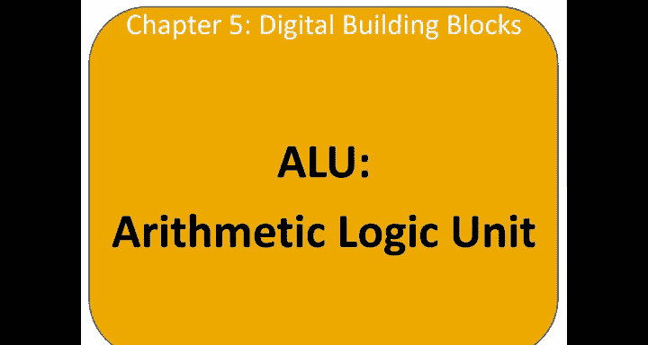
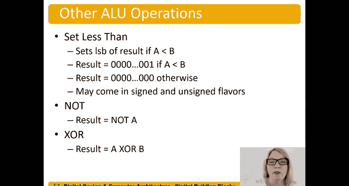

# 哈维穆德学院《数字设计和计算机架构RISC版｜Digital Design and Computer Architecture： RISC-V Edition》 - P60：Chapter 5 7.Arithmetic Logic Units (ALUs).zh_en - GPT中英字幕课程资源 - BV1JC1MY1E7F

Now let's talk about the ALU， the arithmetic logic unit。

 so the ALU is really the brains of a processor and it performs the kind of basic arithmetic and logic functions。

 addition subtraction and an or。So we can input a control signal， AU control。

And indicate what function we want to perform because we have four functions in this case that we want to perform add subtract and or we use two bits for ALU control。

And we have a symbol here for an ALU that looks much like an adder。

And we'll put the words ALU on that。On that symbol。So this is an endB ALU and the result。

 depending on ALU control， will give us the addition。

 the subtraction or the and or or of the two inputs A and B。So let's take an example。

 Let's perform A or B。 So the control bits， we look at our table here that we've chosen。

 the control bits AU control would be 11。And then we'd get the result here would be the bit wise or。

Of A and B。So how do we build this？So let's build the ALU。 So let's start with the or operation。

So here we have an oreggate。And。Want to put in our inputs a。And B。And we'll put our end。Sybols here。

 say those are endbit。 So really， that's N to input and gates。Producing an end bit result。

 one out of each of the two input and gates。Okay， well， so if that's all we were doing。You know。

 we would tie that directly to。You know result。And would be done。But that's not all we want to do。So。

We can go ahead and put that into a multiplexer and say， okay， well。

May want to do multiple operations here。In fact， we do。

And so we know that let's go ahead and put our AU。Control signal here。And so for the oral operation。

 we want that to be 11。 so here we go。So if the A U controls 1，1， then。We get out。

Are the or operation of A or B。Okay， so let's go ahead and do and then。And。Let's see。 That's the 1，0。

Option for AU control。It's our two bit control signal。Well， similar， we can now just put our and。

Gate here。 and Pluff are。Signals a。B。And those are all end at buses again。Okay。

 so we've got those two。 Let's， let's go jump up to do add。

 So let's say we want to do an ad operation of a plus B。 And that would be our 0，0 option here。Okay。

So。A plus B will put our adder there。A plus B， and we'll feed in our。诶。And then we'll feed in。B。

 again。And the buses。Okay， well， that was pretty easy so far。

So now we have this AU that performs three functions， add and。And or operations。

 But we also wanted to do subtraction。 So let's think about how we can do that。 Well。

 we could put a subtractor in there， right， We could say， okay， well。

 here we'll add a subtractor in here。That one。But as we know， adders are expensive， right。

 They take a lot of hardware， especially if we want't do it fast and so。

Let's think about some other options。 Well we do have this adder here。

 and we know an adder can perform subtraction if we feed in。B bar and a one into the。

 into the carry in input。 So we could have a。A multixer here。That says， well， sometimes I want B。

And sometimes I want B bar to be fed into into this。

 And we can see that while ads totract what' the difference is this。The zeroth bit of AU control。

 So when that's the one， we want to subtract。Once a one we feed in AU control。Bt。0。

And when it says zero， we want to feed in just be as usual。

And so we can take that AU control bit zero and also feed it into the carry in input of our adder。

So when A you control is one。Then we're going to perform sub traction because it will choose B bar。

And make， carry in。1。And。Then， we。Also feed this into our 01。Input of our multiplexer。And again。

 these are all。En bit buses as well。Okay， so let's。Then then you know。Machine written drawing that。

So it looks looks pretty good。 So we have our， our some input here。😊，That one's subtraction0，1。

 when that is true， AU controls， but zero is going to be a1 equals one。And we will say， okay， well。

 choose B bar。And make the carry into this to the。To the adder， a one。So we get a plus a negative v。

Or the choose complement of B。Okay， so let's do our other example we had before。

We want to perform A or B。We feed in11 into our AU control that's going to select。On the multiplexer。

 select the or operation。Of a or B。And then feed that out to the result。

Let's suppose we want to perform a plus B。 Okay， well， we want to do addition。

So we make ALU controls 0，0。 All right， it's going multiplexer is going to pick。That output。

 the output of the adder。And our ALU control some0， bit 0 is 0。 So it says， okay， we'll choose B。

To feed into the adder。 and A is always fed into the other input of the adder。 So a plus B。

 A you control 0。 So the carry in is also 0。So we get a plus b。And that's fed into you。

Our multiplexer， which selects that input00 input and feeds that to the result。

And we get result equals。A plus B。And we can also add some flags and status flags to our ALU。

 and these indicate whether the result is negative， so we have an end flag。0。

Whether the adder produces a carry out and whether overflow occurred。 So overflow。

We're going to refer to and this is signed overflow， so this is for choose complement numbers。

So choose compliment。Overflow。Okay， so we're going look at these these four flags here and we can add this output ALU flags and these are useful to right that the ALU just performs the operation doesn't give us information about hey。

 did overflow actually occur or maybe I want to know if the result was zero if I'm doing some kind of comparison。

 maybe I subtract them and I want to see if the result is zero。And other other types of operations。

So how do we add these flags？We have our ALU。 This is our original circuit here。Or ALU。

 and now we have this extra circuitry。😊，Kind of off of that AU to tell us， well。

 let's output these flags as well。 So we have our overflow carry， negative and0 flags。

 Let's look at those each individually。So the negative flag， this is probably the easiest one。

 If the result is negative。 So if this output of the。Of the multiplexer is negative。Well。

 we can tell that because the most significant bit in this case we're 32 bit AU。

Results of bit 31 is a one， and we can just make that tie that to our negative output。

So when the result is negative， n will be one， and we can tell of that result， the output of it。

 the AU is negative。😊，Okay， let's look at the next one。😊，So we also have the zero flag。😊。

So we want z to be equal to one if all the bits of result are zero。Well， how do we do that。

 well it's not。Right。Result。It0。If that's a0。 So that bar and。W。

Result at one bar and result at two bar blah， blah， blah， blah， blah。And so we have this。

 what kind of gate is that？People often think that's a N gate。 That's actually a noer gate。

 right Remember that this gate。Push those bubbles through。And we're going to get。

Kind of more typical。Or easily recognizable。I take those two bubbles to push them to the output。

 the body of gate changes to an or and we get a bubble on the output at's our noer gate。Okay。

 but in this case， it's easier to draw this way and easier to think about Well， we want all the bits。

To be 0。So we were detecting。Result of zero bar and results of one bar and blah， blah。

 blah up to results of 31 bar。 If those are all0， then the output。Theze flag。Okay。

 so the next staff flag is the carry flag。 So this is， we want to know， hey， if carry out is a。

 is a one。And if and if it's performing addition。Then we or subtraction。 We want to。

 we want to know if if carry out was a one。 So how do we tell if it's additional or subtraction。

 Well， remember from our our table here。Addition and subtraction， this bet AU control of one。

AL you control bit one。Is equal to a 0。When the ALE is performing addition or subtraction。

And so if that's happening， we put ALU control bit1 into inverter， this tells us， hey。

 it's adding subtract or subtracting。And now I care about what the carryout is。So if that's true。

 if it's adding or subtracting。And carry out as one。

We want to output this carry flag and make that carry flag one。The last flag is the most complex one。

 saved it for last， so is the overflow status flag and this is for adding two two numbers to choose complement numbers or sign numbers right refer to two complement numbers generally as just sign numbers。

😊，Okay， so。Fee is going to be one if the addition of， So there's several conditions here。

 So the addition of two same sign numbers that produces a result with opposite sign right。

 So we're adding to positive numbers。 we get a negative result or we're adding to negative numbers and get a positive result。

So first of all， we have to know。Are we adding two numbers with the same sign？

So that's the only possibility where it possibly could get overflow。And。

The result is the opposite sign。Okay， so let's take a look at this this circuit more closely so overflow is going to be one if well first of all。

 we have to know if it's doing an addition or subtraction to start with so。That。

ALU control bit1 is going to be zero。Remember we have0，0，01。For addition。It's 0，0 and subtraction。

 It's 0，1。 So this bit。This most significant bit of AU control。Is zero， Let we say， hey。

 was that alienile control bit10。So we inver it and say yep。If that's a one， then we know， hey。

 we're doing an addition or a subtraction。So we need to detect for overflow。

We're not going to just type for overflow if the A is performing or an and operation。Okay。

 so first of all， is it performing additional or subtraction？Next condition is。

Do A and some have the opposite sign？Okay， so we're going to say， we just pick one of them。

 it could be B or some have the opposite sign， but we， you know in this case， just pick a bit 31。

X or some bit 31， right， if they're the opposite sign number the。

The X or function is going to output a1 if they're the opposite， So 0，1，1，0。

 another way of thinking about x or， right， if A and D have the opposite。Value， A is0。

 is 1 or A is 1 b is0。And that outputs a one that's tell us， hey， are they offset。

 are they different？So Ax were sum 30 bit 31。And。A and B have the same signs for addition。

Or A and B have different signs for subtraction。Okay， so that's this last part。This last gate here。

Tll us。Okay， if A you control bit zero， remember that's for addition。Pools addition， we want to know。

 hey， do these have the same signs？Right， if therere addition，s， let's do an example。

 Let's suppose there are 1，1。That does have the same sign， we get the x nor of 110。One，1。

 and ALU control in this case， where an addition it' going to be zero。It's going to say， okay， well。

 the xno of1 x nor1 x nor is0。 remember xno outputs a1 if an even number of inputs is one。

 And so this says yep， they do have the same sign So there's a possibility that we're going to get overflow。

Okay， let's do the other case where let's suppose it's doing subtraction。0，1。It's subtraction。

So we get a one here， and now we care if they have opposite signs。So if we have opposite signs。

 zero minus negative numbers going be basically like adding two positive numbers。

 so possibility of overflow and so we're going to get the same thing here， one x or0， x or1。

 we have two ones in that x nor8， one x nor0 x nor1， we have two ones in that x nor8。

 so we're going to get a1。Outll put insane， oh， it's possible you have overflow。

Let's let's let's recap that again。 So well here's the case， for example。

 where we're doing subtraction and let's say they're the same sign。Positive minus， a positive。

There's no way to get overflow like adding a positive and negative number。

Here we only have a single one， so we have1 x nor to0， x nor0 and can say， hey。

 no possibility of getting overflow。It's going to say， hey， just ignore these zero and whatever。

 it's going to say there's no possibility， there's no way to get overflow。Okay。

 so overflow is going to be one if the ALU is performing addition。😊，That's this case here。

 This tells us addition to worth subtraction。 that's that wire there。And。

A and sum have the opposite signs， that's this wire here。And let's do a different color here。

And either A and B are the same sign for addition， ALU control zero， ALU controls bit zero is zero。

Or A And B have different science for subtraction。 And that's our， our final。Exnoorgate here。

That tells us that。So if， for example， not doing an addition or subtraction， alien control bit one。

Is is a one， so it's doing an and or an or operation， this one says hey， you know。

Not going to get overflow。I because this is a one， either the 10 or 11 case for AU control。

Not going to happen， right， so zero。Not going to even detect for overflow。 Okay。

 so let's say it is performing an addition or subtraction。 So we 0 on this 0，0 or 0，1 for AU control。

And we get that inverted。And says， hey， a possibility of overflow here。 Okay， this is a one。

 And it says， hey， yeah， the， the operaands and the sum。Really just a and sum。Have opposite signs。诶。

That 31 x or sum。But maybe we're doing an addition and A and B have opposite signs， okay。

 this one says。not going to happen or we're doing subtraction and they have the same sign saysm。

 not going to happen。But if all of those are true。We're doing additional subtraction。Yes。

 the sum and the operas have opposite signs。And。We're adding and the opera have the same sign or subtracting。

 and they have different signs。Yep， then we have one and one and one overflow。

 So all of those conditions have to be true in order to get overflow。

So here's our complete AU with status flags， again， our AU here on the right。

And our Sa circuitry on the left。So we can also use these status flags to compare numbers We first subtract the numbers so we perform a minus B。

 and then we look at the flags to do the comparison So after performing a minus B。

 if the zero flag is asserted， so the result was all zeros。

 then whether signed or unsigned whether we're dealing with signed or unsigned numbers for A and B。

 they are equal。So if the zero flag is one。After we subtracted A B。A and B are equal。

 and then we just invert the zero flag to say whether they were not equal for both signed and unsigned。

Now for less than comparison， it's different for signed and unsigned numbers so we actually introduced less than comparison for signed numbers in in the earlier slide and we said。

 well just look at the most significant bit to see if if the results negative after you subtract them then。

😊，A is less than B， right， A minus B A is。Less than B。When we subtract them。

 we'll get at a negative result，2 minus3， it's going to be minus1。Yep， A is less than B。

 but we said to watch out for overflow。 And so， in fact。That's how we take care of。

Of if overflow occurs， then we have to ex or it with a negative flag to tell us whether a is less than B。

 So let's do an example here。 Let's suppose A。 So we're going to perform a minus B trying to tell us A is less than B。

Let's make a multill for bit。Comparisons。Let's suppose a is minus-8 and B is。One or something。

And so we know we're going to get overflow with four bits， minus eight。-1 is going to give us -9。

 we know that doesn't fit in four bits。 So let's see what happens。 So -8 is 1，0，0，0。

 There's our minus8， and we're performing minus B， B is1。So minus a plus a negative one。

So this is performing a minus B。 So -8 -1。We're going to add those together， we get one，1，1， zero。

 carry the one。Okay， so remember with signed numbers。

That carryout of the most significant bit means absolutely nothing。We just the overflow by saying。

 oh， hey。Do I have two operarans with the same sign and did the result have an opposite sign， Yes。

 in fact， it did right we're adding two negative numbers，-8 and -1。

 and we got a positive result So overflow occurred。In this case， and。The negative。

Flag that most significant bit。Is0。So if we x or those together and x or overflow， you get one x or0。

Equals one。In fact， a is less than B， which is exactly what we wanted， right， minus-8。

Is less than one check。So in order to。Compensate for overflow。 We have to。X or the negative。

Flag with our overflow flag。For unsigned addition or unsigned comparison， less than comparison。

 we look at the carryout of that most significant bit。And so。

We're going to say when there's no carry out， A is less than B。 So let's look at this， So a。

Less than B， now we're doing。ImInting these numbers as unsigned numbers， so let's say a is。

eight or something。A is 8， and B is。Let's9 or 1。 let's make B10。So eight， is it less than 10？Yes。

 it is。 So we expect to get。This we expect to have a no carry out。

Of that most significant bit so that we get a one to say， yep， A is less than B。

So let's see what happens。 So A less than B， we're still performing a minus B。

So we're going to get a， there's a or8 minus B。 So we still take that。B。😔。

And take a two complement of it， invert the bits。Add one。And we're going to get one plus one is zero。

 carry the one。one。1，0。 so we're going to get 0，1，1，0。All right， that sounds good。And so。

 we're gonna。Now do this。And we will go it。0，0 plus 1，1，1，1。

 And notice that there's no carry out of that most significant bit。 So C is 0。 and we get。Not see。

To tell us whether。A is less than B。 So not C。 since C is 0 is carry out of the most significant bit with a carry flag is going to be 0。

Overflow or less than。Comparison is。A less than B。Equals Nazi。Equals。Okay。

 so different for unsigned and signedign numbers for less than comparison， and we've also now taken。

Care of what happens when overflow occurs。So now we have our。

Signed and unsigned less than comparison， well greater less than or equal to actually let's do the opposite of that。

 so we have less than here。😊，The opposite of that is。Greater than or equal to。Okay。

 well let's just put a bar over this， right？N X or V bar will give us the opposite case。

 It's not less than， in fact， it's greater than or equal to。 And same thing here。

 we put a bar over this C bar with a bar over it is just C。Involution。

And now let's look at the next case less than or equal to。 Well。

 we already took care of less than here's the less than case or equal to we have the equal to case here。

😊，So we or that less than or equal to。And same thing for unsigned。Less than。We。😔，Equal to。

And now greater than is going to be the opposite right these have the inverse relationship less than or equal to and greater than。

Have the inverse relationship， right， if it's not less than or equal to， it means they're greater。

 they have a greater than relationship， right If A is not less than or equal to B。

 it means that a is greater than B。 And so we take this。And we invert it。So we get Z。Or。And。X or V。

And we。Invert that。And then we can do the mors on that and say， okay， well。

 turn that orura into an end。Bring down the terms。Im import them。Let me get Nazi。And。Not an。

X or V or the x nor of n。And V。Okay， but the easiest way to think about that is this is just。

Maybe just put a bar over that。The inverse of that。 and same thing here。

Put a bar over that and we get greater than。whether a is greater than B。And so Z or C bar。Well。

 that would be less than or equal to， if we went greater than。

We invert that performed to mors that or， turns into an and， bring down the terms。

And then put the bar over each of the terms， and we get not see。And C。

We can also expand our ALU to perform other operations such as SF Le than or SLT。

ThisThis operation sets to the least significant bit of the result。

 If a is less than B and otherwise it's  zero。 So if a is less than B。

The result will be all zero than a1， otherwise the result will be zero。

We can also expand it to form the not function and the X oral function。

