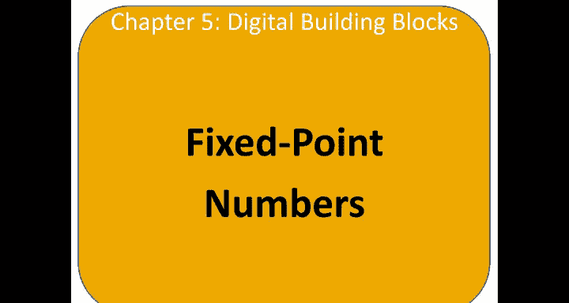
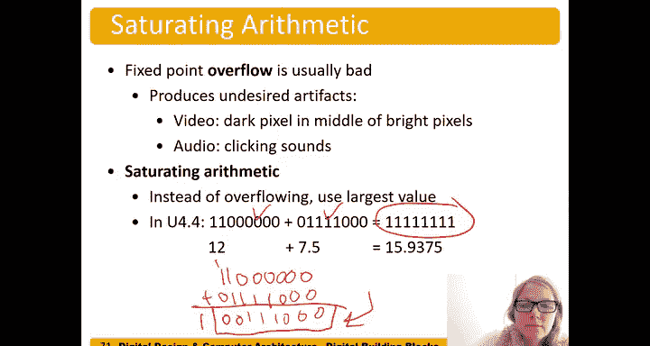

# 数字设计和计算机架构：5.9：定点数表示法 🧮

在本节中，我们将学习如何使用二进制位来表示小数。我们将重点介绍两种主要表示法中的第一种：**定点数**表示法。这种表示法使用固定数量的位来表示整数部分和小数部分。

---

## 概述

之前我们已经讨论了无符号二进制数（仅表示正数）以及有符号数的表示方法（如符号-幅度和二进制补码）。现在，我们将探讨如何表示分数。本节将详细介绍**定点数**表示法，其特点是二进制小数点的位置是固定的。

---

## 定点数表示法

定点数使用固定数量的位来表示整数部分，同时使用固定数量的位来表示小数部分。

例如，考虑一个具有4个整数位和4个小数位的格式。在无符号二进制中，整数位的权重是2的幂次：2^0（个位）、2^1（二位）、2^2（四位）和2^3（八位）。对于小数部分，我们扩展这个模式，使用负指数幂：2^-1（二分之一）、2^-2（四分之一）、2^-3（八分之一）和2^-4（十六分之一）。

二进制小数点的位置是隐含的，我们需要事先约定整数位和小数位各有多少位。

以下是一个具体的例子。假设我们有一个二进制数 `0110.1100`（其中小数点是为了清晰而标出，实际存储中并不存在）。其值为：
*   整数部分 `0110` = 0×8 + 1×4 + 1×2 + 0×1 = 6
*   小数部分 `.1100` = 1×(1/2) + 1×(1/4) + 0×(1/8) + 0×(1/16) = 0.5 + 0.25 = 0.75
因此，这个定点数表示的十进制值是 **6.75**。

---

## 无符号定点数格式

无符号定点数格式通常表示为 **Ua.b**，其中 `a` 是整数位的数量，`b` 是小数位的数量。

例如，我们刚才的例子（6.75，4个整数位，4个小数位）可以表示为 **U4.4**。同一个数 6.75 也可以用其他格式表示，如 **U3.5** 或 **U6.2**，只要分配的位数足够容纳该数值即可。

常见的定点数格式有8位、16位和32位。例如：
*   **U.8.8** 常用于表示传感器数据、音频和像素数据。
*   **U.16.16** 用于需要更高精度的信号处理。

---

## 有符号定点数格式

有符号定点数（使用二进制补码）格式通常表示为 **Qa.b**，其中 `a` 是包括符号位在内的整数位的数量，`b` 是小数位的数量。

对一个Q格式的定点数进行取负操作（求其相反数），方法与标准的二进制补码相同：**将所有位取反，然后在最低有效位上加1**。这里的关键是，这个“最低有效位”指的是整个数（包括小数部分）的最低位。

例如，要用 **Q4.4** 格式表示 -6.75，步骤如下：
1.  首先得到 +6.75 的表示：`0110.1100`
2.  将所有位取反：`1001.0011`
3.  在最低位（小数部分最后一位）加1：`1001.0011 + 0.0001 = 1001.0100`
因此，`1001.0100` 就是 -6.75 在 Q4.4 格式下的表示。

一个特别常见的格式是 **Q1.15**（常简写为 **Q15**），它使用1个符号位和15个小数位。其表示范围约为 +1 到 -1。

---

## 饱和运算

在讨论算术运算时，我们必须考虑溢出问题。在音频或视频处理中，如果发生溢出，一个很大的正数突然变成负数，会产生可闻的“爆裂”声或视频中的“黑像素”。

为了避免这个问题，我们常常使用**饱和运算**。饱和运算在发生溢出时，不会让数值“环绕”到另一端，而是将其限制在可表示的最大或最小值上。

例如，在 **U4.4** 格式下计算 12 + 7.5：
*   12 表示为 `1100.0000`
*   7.5 表示为 `0111.1000`
*   直接相加结果为 `10011.1000`，这需要5个整数位，在U4.4格式下发生溢出，结果会错误地变小。
*   使用饱和运算，结果将被限制在U4.4能表示的最大值，即 `1111.1111`（15.9375）。

---

## 总结

本节课我们一起学习了**定点数**表示法。我们了解到，定点数通过预先固定整数位和小数位的数量来表示小数。我们介绍了无符号格式（Ua.b）和有符号格式（Qa.b）的表示方法，以及如何对Q格式数进行取负操作。最后，我们探讨了在信号处理中至关重要的**饱和运算**概念，它可以防止溢出导致的质量劣化，是处理音频、视频等数据时的常用技术。