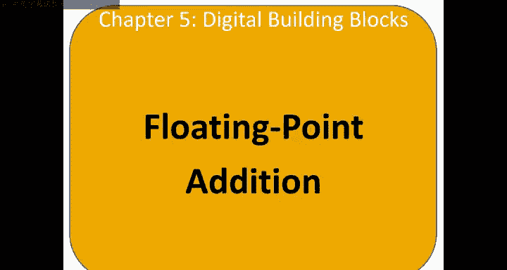
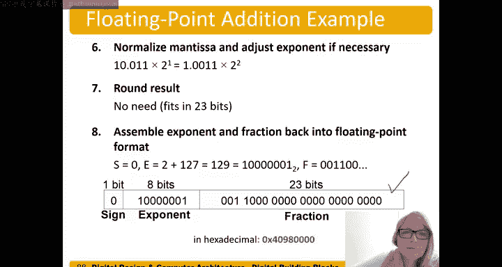

# 数字设计和计算机架构：5.11：浮点数加法 🧮

在本节中，我们将学习如何对浮点数进行加法运算。这个过程比补码或无符号二进制数的加法要复杂得多，因为它涉及提取字段、对齐指数、尾数相加、结果规范化以及可能的舍入操作。

## 概述

浮点数加法需要将数字从其紧凑的存储格式中“拆解”出来，执行实际的算术运算，然后再将结果“组装”回标准格式。接下来，我们将详细介绍每个步骤。

## 加法步骤详解

以下是执行浮点数加法的具体步骤。我们将逐一拆解，并通过一个例子来演示。

### 第一步：提取字段

首先，我们需要从浮点数的二进制表示中提取出符号位、指数位和尾数位（分数位）。对于单精度浮点数（32位），其格式为：1位符号位（S），8位指数位（E），23位尾数位（F）。

**公式**：`(-1)^S × 1.F × 2^(E-127)`

### 第二步：添加前导1

在IEEE 754标准中，规格化数的尾数部分隐含了一个前导的“1”。在进行计算前，我们必须将这个“1”显式地添加到提取出的尾数（F）前面，以构成完整的尾数（Mantissa）。

**代码表示**：`Mantissa = 1 + Fraction`

### 第三步：比较并对齐指数

两个加数的指数可能不同。为了使尾数能够直接相加，我们需要将指数较小的那个数的尾数向右移位，直到两个数的指数相等。移位时，移出的低位可能会丢失，这将在后续的舍入步骤中处理。

### 第四步：尾数相加

当两个数的指数对齐后，我们就可以将它们的完整尾数（包括前导1）进行二进制加法。

### 第五步：规范化结果

相加后的尾数可能不再是`1.xxx`的形式（例如，可能得到`10.xxx`或`0.1xxx`）。我们需要通过左移或右移尾数，并相应地调整指数，使结果重新变为规格化形式（即尾数部分为`1.xxx`）。

### 第六步：舍入

由于尾数的位数有限（如23位），规范化后的结果可能位数过多。我们需要根据IEEE 754的舍入规则（如向最近偶数舍入）将结果截断到指定的精度。

### 第七步：组装结果

最后，我们将结果的符号位、调整后的指数（加上偏置值127）以及舍入后的尾数（去掉前导1）重新组合成一个32位的浮点数。

## 示例演示

现在，让我们通过一个具体的例子来实践上述步骤。假设我们要计算 `3.0 + 0.5` 的浮点数表示。

**第一步：提取字段**
*   数字 `3.0` (十六进制 `0x40400000`):
    *   符号位 S = 0
    *   指数 E = 10000000 (二进制) = 128
    *   尾数 F = 100 0000 0000 0000 0000 0000
*   数字 `0.5` (十六进制 `0x3F000000`):
    *   符号位 S = 0
    *   指数 E = 01111110 (二进制) = 126
    *   尾数 F = 000 0000 0000 0000 0000 0000

**第二步：添加前导1，构成完整尾数**
*   `3.0` 的尾数 M1 = `1.100 0000 0000 0000 0000 0000`
*   `0.5` 的尾数 M2 = `1.000 0000 0000 0000 0000 0000`

**第三步：比较并对齐指数**
*   E1 = 128, E2 = 126。E2 较小。
*   将 M2 的指数对齐到 128，需要将其尾数右移 2 位：M2' = `0.010 0000 0000 0000 0000 0000`

**第四步：尾数相加**
*   M1 + M2' = `1.1000000...` + `0.0100000...` = `1.1100000...`

**第五步：规范化**
*   结果 `1.1100000...` 已经是规格化形式（`1.xxx`），指数保持为 128。

**第六步：舍入**
*   尾数 `1.1100000...` 恰好符合23位精度，无需舍入。

**第七步：组装结果**
*   符号位 S = 0
*   指数 E = 128 (二进制 `10000000`)
*   舍去前导1后的尾数 F = `110 0000 0000 0000 0000 0000`
*   最终32位结果：`0 10000000 11000000000000000000000` (二进制) = `0x40600000` (十六进制) = `3.5`

## 总结

本节课我们一起学习了浮点数加法的完整流程。可以看到，与整数加法相比，浮点数加法需要多个额外的步骤来处理指数对齐、结果规范化和舍入。理解这个过程对于深入理解计算机如何执行浮点运算至关重要，也有助于在编程中预判和处理可能的精度问题。