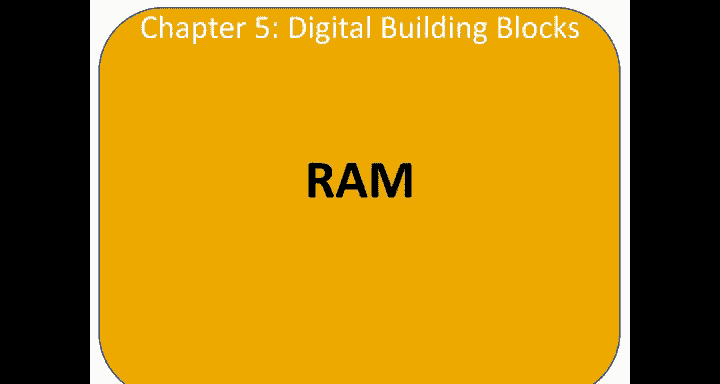
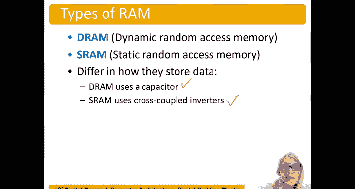
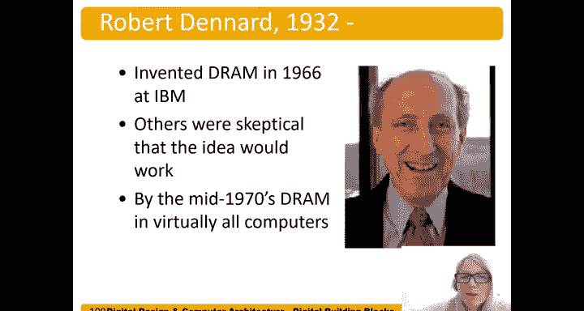
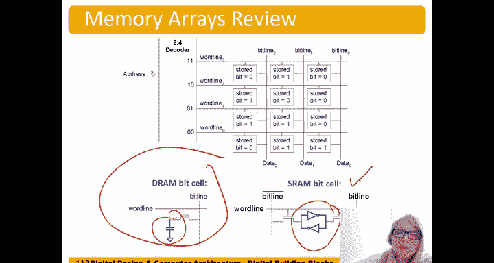

# 哈维穆德学院《数字设计和计算机架构RISC版｜Digital Design and Computer Architecture： RISC-V Edition》 - P67：Chapter 5 14.RAM.zh_en - GPT中英字幕课程资源 - BV1JC1MY1E7F

Let's dive into Ram how RamM is built。 There are two types of Ram DRAM and S RamM DRAM stands for dynamic random access memory。

 and SRAM stands for static random access memory or SRA。

 So they different how they store data DRAM uses as a capacitor。

And SRAM uses cross coupled inverters， and we'll talk about those in detail now。

Robert Zard invented DRAM in 1966 at IBM and many others were skeptical that it would even work。

But a short time later in the mid 1970s， DRAM was in virtually all computers。

So DRA dynamic random access memory stores bits on a capacitor。

 so it's called dynamic because the value on that capacitor needs to be refreshed or rewritten periodically and every time after it's read。

😊，Well this is due to pastors aren't perfect there's some leakage of that charge so over time that the value stored on that capor is going to degrade and reading a bit always destroys it so this is called refreshing the data and so this stored bit we're going to you know now dive into what's inside that box。

In DrRA， it is a transistor。Followed by。A capacitor。And so if。For example， the word line is one。

 this is an N MoOSs transistor， and so it allows current to flow if there are charges on this capor。

 they're going to flow over to the bit line and start charging of。The bit line。

So here's an example of a stored bit being one right when the word line becomes one。

 those charges can then flow over to the bit line and charge that up if。The store bit is zero。

 there are no charges here。 so when the board line goes high。The bit line remains。

Remains where it's added， doesn't receive any additional charges。So。

S RamM is different than D Ram in that， while， it still has a stored bit。

But we're going to store it in a way that we don't need to refresh the value。

 and we store it by storing it on cross coupled。Inverters。And so if we have， for example。

 a zero here。Ignore this side for a second， and we'll get back to that in a minute。

 But if we have a zero stored on our bit and the word line goes high。Well that enables that zero。

To go on the bit line or pull that bit line low if there's a one stored。Word line goes high。

Enables the flow of charges。 And this is now actively driving this these inverters are actively。

This inroidter。It's actively driving。That one onto that bit line。

And so we actually have both bit line and because of the cost coupled inverters。We also have the bit。

 the data bit we want， and also the inverse on the other side。

 And so we also just include bit line bar。So it turns out we read， so if there's a zero here。

 there's a one here， and we can actually read the difference between these two。

To help us accelerate that reading time to make it faster， faster to read。

But the main thing is that we're storing now our bit on cross couple inverters instead of a capacitor。

And so this is called static random access memory because it doesn't get the value of the bit doesn't get destroyed upon reading it。

 right we don't lose all our charges， this is being actively driven。Byuy inverters。

And it also doesn't leak away just over time like our DRAM did on the capacor。

So here's our memory array again， and now we know what's in this box for DRAM。And SRAM。

And if you were asked to draw a picture of an array of DRAM。

 I would recommend drawing this and then drawing this once and say， hey， this is what's in that box。

To make it faster。And also we're then using the principle abstraction right。

 it's a lot easier to look at this instead of， you know， this or this。Drawn。You，12 times。Okay。

 so we have D REM cells， which。Where the bit is stored on pastor or SRM bit cells。

 where the bit is stored on cross coupled inverters。

