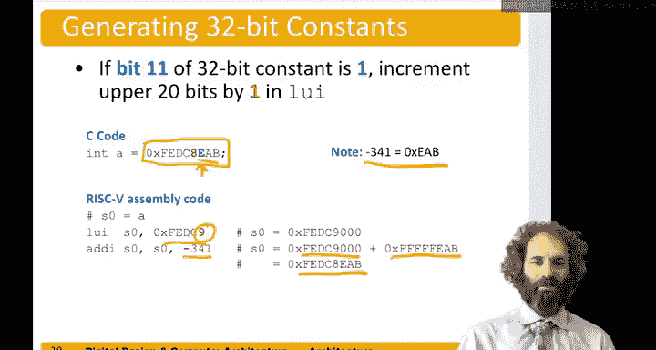

# 数字设计和计算机架构：6.5：立即数（常量）🔢


在本节中，我们将学习RISC-V指令集中如何处理常量，也称为立即数。我们将了解如何将12位立即数嵌入到指令中，以及如何通过组合指令来加载更长的32位常量。

---

## 立即数简介

上一节我们讨论了寄存器和内存中的操作数。本节中，我们来看看常量操作数，它们被称为“立即数”，因为其值作为指令的一部分立即可用。

例如，像 `addi` 这样的指令可以接受一个12位的立即数作为指令的一部分。

## 使用12位立即数

假设我们有这样一个程序：`A = -372` 和 `B = A + 6`。我们想将 `A` 存储在 `s0` 中，`B` 存储在 `s1` 中。

以下是实现此功能的指令：
```assembly
addi s0, zero, -372  # s0 = 0 + (-372)， 将 -372 存入 A
addi s1, s0, 6       # s1 = s0 + 6， 计算 B = A + 6
```
由于指令长度有限，我们只能存储有限长度的立即数。在RISC-V指令集中，我们最多只能在指令中直接存储12位的立即数。这些立即数以二进制补码形式存储，并符号扩展为32位。因此，我们可以存储从 **-2048** 到 **+2047** 范围内的正数和负数。

## 加载32位常量

假设我们需要一个更长的常量，比如一个32位的数。RISC-V为此提供了一条特殊指令，称为“高位立即数加载”（`lui`）。

`lui` 指令将一个20位的立即数放入目标寄存器的高20位，并将低12位清零。然后，我们可以使用一条 `addi` 指令来添加低位的值。

例如，我们想将32位常量 `0xFEDC8765` 加载到寄存器 `s0` 中。

以下是加载此常量的步骤：
```assembly
lui s0, 0xFEDC8     # 将 0xFEDC8 加载到 s0 的高20位，低12位为0
addi s0, s0, 0x765  # 将 0x765 加到 s0 的低12位，完成 0xFEDC8765
```
`lui` 指令只需要一个寄存器和一个立即数参数，因此指令中有空间容纳20位的立即数。尽管我们追求“简单性倾向于规律性”，但这是一个为了能处理32位指令而做出的良好折衷。

## 处理符号扩展的注意事项

重要的是要记住，`addi` 指令会对12位立即数进行符号扩展。如果12位立即数的最高位（第11位）是1，它将被符号扩展，在所有高位填充1，这实际上会使其看起来像一个负数。

因此，如果我们想加载一个32位常量，并且其低12位的最高位是1，我们需要将 `lui` 指令中的高20位加1。

例如，要加载常量 `0xFEDC8EAB`：
- 低12位 `0xEAB` 的最高位是1，其作为有符号数是 `-341`。
- 因此，我们不能直接 `lui 0xFEDC8` 然后 `addi 0xEAB`，因为 `addi` 会将 `0xEAB` 符号扩展为 `0xFFFFFEAB`。

正确的做法是：
```assembly
lui s0, 0xFEDC9     # 高位部分加1：0xFEDC8 + 1 = 0xFEDC9
addi s0, s0, -341   # 添加有符号立即数 -341 (即 0xFFFFFEAB)
                    # 结果：0xFEDC9000 + 0xFFFFFEAB = 0xFEDC8EAB (忽略进位)
```
当你尝试创建这样的长常量时，必须注意这一位并妥善处理。

---

## 本节总结

本节课中，我们一起学习了RISC-V中立即数的处理。我们了解到：
1.  基本的 `addi` 等指令可以处理12位有符号立即数。
2.  通过 `lui` 和 `addi` 指令的组合，可以加载任意的32位常量。
3.  在组合加载32位常量时，必须注意低12位立即数的符号扩展问题，并在必要时对高位部分进行调整。



理解立即数的编码和加载方式是编写高效汇编代码的基础。