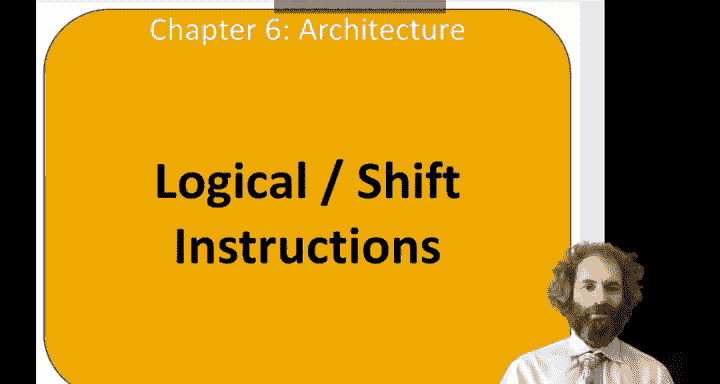
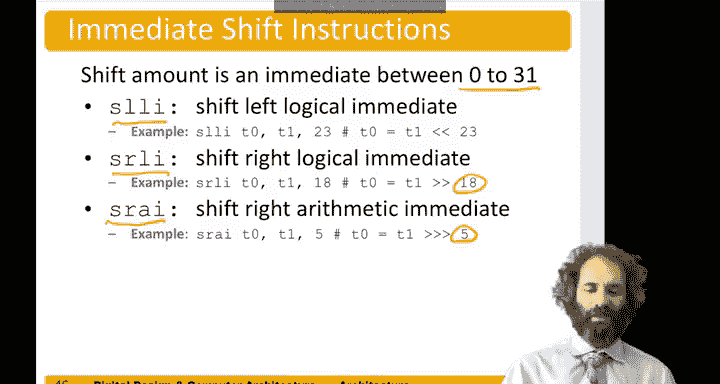

# 哈维穆德学院《数字设计和计算机架构RISC版｜Digital Design and Computer Architecture： RISC-V Edition》 - P76：Chapter 6 6.Logical Instructions.zh_en - GPT中英字幕课程资源 - BV1JC1MY1E7F

Hello， in this video， we'll start looking at programming Rik5 assembly language beginning with logical and shift instructions。

So imagine we have a program in a high level language like C or Java or Python written at a higher level of abstraction。

 and we want to translate it to assembly language that high level program is going to have constructs like loops。

 conditional statements， arrays， and function calls。

And we're going to begin by introducing the set of risk 5 instructions to support these。

 We'll talk about logical operations， shift operations both those in this video。

 multiplication and division in the next video and branches and jumps in the one after that。

 and then we'll start putting them together to write the higher level code。

So as we're talking about programming， it's worth highlighting one of the world's first programmers at a Lovelace。

 she was the daughter of Lord Byron， born into aristocracy， and she was friends with Charles Babbage。

 so as Babbage was building the analytical engine， she actually wrote the first interesting computer program that calculated the Bernoulli numbers on that。

Machine。All right， so let's look at the logical instructions in risk 5。

 there are three logical instructions and or。An exclusive work。They do bitwise operations。

 so they each take 2 32 bit sources and produce a 32 bit result。

 where each bit in the result is the operation on the corresponding bits of the two sources。

So and it's useful for masking bits， let's say her first source was that second source was this。

Anything and one makes itself。 So F is one。 F， F is 8 ones。In the bottom8 bits。

So adding a number with zeros in the top 24 bits and ones in the bottom 8 bits。

Leavs us just the values that were in the bottom8 bits and forces everything else to zero。

 That's known as masking。Or can be useful for combining bits。So for instance。

 if we had something in the top 16 bits and another register with something in the bottom 16 bits and we wanted to combine them。

 we could or them together。这个。Something in all 32 bits。

Or can also be used to set certain bits to one。Exclusive war is good for inverting bits。

So a exclusive or negative one， number negative  one is Fff F， F， F F FF。

So something exclusive or one is it's inverse and this gives us a not operation。

If we exclusive word with another source that only had ones in certain places。

 we would only invert those individual bits。Let's take a look at an example of some logical operations。

 say S1 had a bunch of random stuff in it。And S 2 had ones in the top 16 Bs and zeros in the bottom 16 Bs。

If we do an and of S1 with S2。Then anything and0 will make 0。 So the bottom 16 bits are cleared to 0。

Anything and one leaves itself。So the top 16 bits are the same as they were in S1。For an or。

 anything or0 is itself。 so the bottom 16 bits are unchanged。Anything or one is one。

 So the top 16 Bs are forced to once。And with exclusive or， anything exclusive or zero is itself。

So the bottom 16 B are the same as S1。 Anything exclusive where1 is inverted。

 So the top 16 B are the inverse of the top of S1。嗯。Instructions also come with immediates。

And these immediates are 12 bits long， just like in add I， and they can be positive or negative。

 their sign extended。 So if we had the number negative 1484。

That is this particular pattern that gets signed extended to all ones in the top 20 bits。

Because it's negative。So if we did an and， S5 gets T3 with this。Here's our T3。 If we do0 and1。

 we get0，0 and1， makes zero， one and1 makes one，0 and1， makes zero。1 and0 is0，1 and1 is1，0 and 1，0。

0 and 0，0， likewise 0，0，0，1， and then for the upper bits， anything and one is itself。

 so we just copy over t3。And so forth。When we do an or immediate。Anything or zero is itself。

 anything or1 is1。So zero or1 is one， zero or1 is one， one or1 is one， zero or1 is one， one or zero。

Is one，1 or1 is1，0 or 1 is1，0 or0 is0。And so forth。Exclusive or， remember？

When the second source is zero， believes the first source unchanged， when the second source is one。

 it inverts the first source。So 0 x or 1 is 1，0 x or 1 is1，1 x or 1 is 0，0 x or 1 is。1。1 x or0 is 1。

1 x or 1 is 0，0 x or1 is 1，0 x or 00。And so forth。We also have shift instructions。

And shift instruction will take two sources and shift the first source by the second。

So there are three types of shifts， shift left logical， shift right logical。

 and shift right arithmetic。Lo shift left。Of T10 gets t1 by T2 does t0 equals T1 shifted left by T2。

Shift right logical。Is a shift right and shift right arithmetic is sometimes written with three arrows。

 Remember the difference between a logical and arithmetic shift。

Right is a logical fills the upper bits with zeros。

 the arithmetic shift fills the upper bits with a copy of the s bit of the original number。

So a logical shift left is equivalent to a multiply by a power of two。

 a logical shift right is equivalent to a divide by power of two。

And we would use logical if the numbers unsigned and arithmetic if it's signed to preserve the end。

These shifts also come with a immediate。 And， in fact。

 I should have mentioned the shift amount is only the bottom 5 B of a register。

 So when we're shifting 32 B numbers， it's only interesting to shift them by 0 through 31。

 Anything else will leave nothing。So only the bottom five bits of the second source are considered。

An immediate shift also takes a5 bit immediate to say how much to shift by。

So there's shift leftft logically immediate， shift right， logically immediate and shift rate。

 arithmetic immediate and。They can shift by a constant in the range of 0 to 31。

