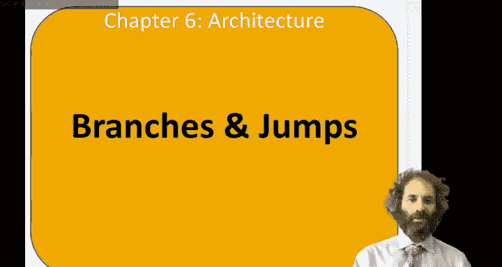
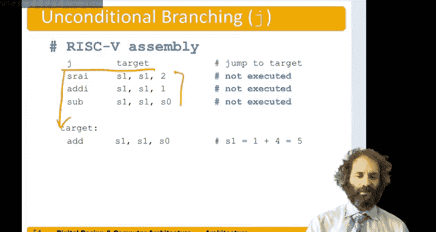

# 哈维穆德学院《数字设计和计算机架构RISC版｜Digital Design and Computer Architecture： RISC-V Edition》 - P78：Chapter 6 8.Branches.zh_en - GPT中英字幕课程资源 - BV1JC1MY1E7F

Hello， in this video we'll look at control flow instructions， including branches and jumps。

So so far， all the instructions we've looked at are executed in the sequence of the program。

But branches and jumps allow us to control that sequence and change the order that we're executing instructions。

There are two types of branches， conditional and unconditional。

Conditional branches are known as branch and Rik five， the unconditional are called jump。

And they're four flavors of conditional branches。Branch on equal， branch on not equal。

 branch of less than or branch of greater。So all of these conditional branches take two sources。

 they compare them and based on their relative values。They may take the branch or not。

The unconditional jump。Jy。We'll always take the jump no matter what。

And there are some other flavors of it that are used in function calls that we'll talk about later。

So let's start with some conditional branches。I suppose we wanted to do。

A program like this where first we add immediate S0 get0 plus4， so S0 is getting four。

Add a media S1 gets0 plus 1。 So now S1 gets1。Shift left logically immediate S1 gets S1 shifted by 2。

 so one shift left by 2。Gets4。 so now S0 and S1 are equal。

If we do a branch on equal of S0 and S1 to a label called targetrg。It compares S 0 and S1。

 They're both four， so they're equal， so the branch is taken。

 and now we continue running the program here at Target， and do add S1 gets S1 plus S 0。

 which is 4 plus 4 mix 8。And we don't execute these two instructions。

You'll notice target is called a label。And it eyes followed by a colon to identify it as a label。

 I can't be any sort of reserved word。 So， for instance， it couldn't be the name of an instruction。

And we refer to the target in the branch instruction to say where to go to。Heres the same program。

 but the BEQ has been replaced by a BNE。So now S1 and S2 are both four again。And so they're equal。

 a branch on not equal， therefore is not taken， and we just continue executing the program。

Add I S1 gets S1 plus4， S1 is4 plus sorry S1 plus1。Get 4 plus1 makes5。Then subtract。

S1 gets 5-4 gives us1。 So now S1 is 1。 and in our final edition， add。S1 gets the one plus。

Four makes five。 so I get a different result because the branch is not taken instead of taken。

Here's an example of an unconditional jump。So if we have instruction， jump to target。

That then goes straight down to here to target and skips over these instructions in between。

