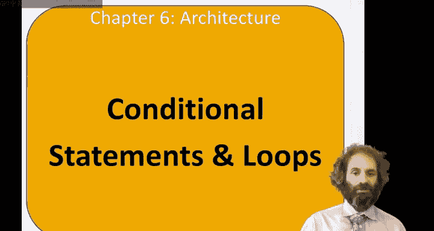
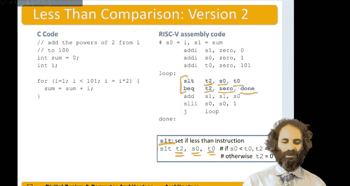

# 哈维穆德学院《数字设计和计算机架构RISC版｜Digital Design and Computer Architecture： RISC-V Edition》 - P79：Chapter 6 9.Conditional Statements & Loops.zh_en - GPT中英字幕课程资源 - BV1JC1MY1E7F

Hello， in this video， we'll be talking about translating conditional statements and loops into a simple language。

So in high level languages like C， there are conditional statements of the form。If。Or if else。

And their loops are the form while or four。 So we'll look at how to translate each of these。

So suppose we had an if statement and C。If I equald to J， then F equals g plus H。 and in any case。

 f equals F minus I。And let's say our variables were stored in registers like this as0 has F。

 as 1 has G， has 2 has H， as 3 has I， and as 4 has J。

The first thing we would need to do is compare if I equals J。If I equals J， we want to do the body。

 but let's figure out when we want to skip the body。 That's the opposite condition。

 So if I is not equal to J， we want to skip the body。So we'll start with a branch on not equal。

S 3 has I。 S 4 has J。 And let's go to some place we'll call label 1 to skip over。

Make a better question mark。对。😔，Question。😔，Now， if they are equal， we want to do the body。

 so that would be add。F is an S0。Gets S1 plus S2。Now we'll have label 2。

And this is where we would continue with the F equals F minus I。Subtract。Ss0。It says 0 minus S 3。

So when we have an if statement。We check if the condition is false。If it is。

 we branch to something after the of statement。Then we do the body of the if。

And then we continue with the code for after this。Suppose we had an F L statement similar。

 but now the F equals F minus I should only be done when I is not equal to J。

So we'll start out again。Branch are not equal。S 3， S 4。Bbel one。

Let's call this label one this time else。If they are equal， we do the first the body had。Have。

It's no ce。S1 and S 2。F equals G plus H。But now we don't want to do the else when we were in the F。

 So we need to jump to some label done。Now at the else label。We do the f equals F minus I， subtract。

S0 gets S0 minus S3。And then we have our done label。Where the code resumes in either case。

Let's take a look at loops。Suppose we wanted to write a little program。

That computed what power of x satisfies2 to the x equals 128。

And were going to do this by starting with2 to the0 and then just keep counting powers until we get there。

So。Here， willll start。X is 0， and 2 to the0 is 1。Then we'll see as long as the power is not yet 128。

 we will double the power and will add1 to x。So first power is1， then power will be 2， then 4，8，1632。

64 and finally 128， and at that point x will be 7， so we'll discover2 to the seventh as 128。

So first we need to assign our inputs。 We do that with the add eye。So PAu is an S0。And we can。

Do add S0 gets 0 plus 1。It is pal。Equals0。Next， we need x to be0， so that could be another add I。

S1 gets 0。Plus，0。X equal0。Now we'll have the whileup。嗯。We need to compare powder 128。

 so we needed to have the number 128 sitting someplace we can use it。

And so let's actually load that into a register as well。

 How about we put it into a temporary register。Maybe T 0。Now。

 we want to continue doing the body of the while loop as long as p is not equal to 128。

 So the opposite of that condition is as p equal to 128。We'll do a branch， if equal。Pow is an S0。And。

😔，嗯。T 0 has 128。So we'll check if it's done。 and if so， let's go to some label one。

That will be down here。Now we can do the body of the loop。

 So power equals p times 2 multiplying by 2， we can do with a left shift in assembly language。

 So logical shift left。Immediate。P is an S0， S0。Alright。And then， add1 to X。Andd。S 1 gets S1 plus 1。

And then。We're done with this loop。 So we need to go back and check the condition so we want to unconditionally jump back to the while loop。

So again， the idiom is we set up our variables before the while loop。We in the while we start。

 we compare if the condition is not satisfied with an branch to a done。

Then we do the body of the loop。And then we jump back to check the condition again。

4 loops are similar。 Remember， for loop and C has。Four parts。

Has an initialization that takes place before the loop begins。

Then it checks the condition at the beginning of each iteration of the loop。

If the condition is satisfied， we do the statement。

And then we come back and do the loop operation and then go back to the beginning of the loop to check the condition again。

And as long as the condition satisfied， we continue executing the statement in the loop operation。

 Otherwise， we leave the forlipip。So let's say we wanted to write a little program to add up the numbers from 0 to 9。

 We'll have a variable for the running sum that will start at 0。

 and we'll have a variable I to count from 0 to9。I for loop。Has an initialization to set I to 0。

Its condition is I is not equal to 10。 So as long as I is not equal to 10。

 we'll continue doing the body。In the body， we do sum equals sum plus I to add the current number。

And then， in the。The operation we do I equals I plus 1。 So after each iteration。

 we add one to I and then go back and check our conditioning。So starting this out， sum equals zero。

Well， sum let's keep it in S1。 So we'll add。はい。S1 gets 0。Plus，0。

Now we have the initialization of the loop I equals 0。Had I。Has0 gets0。Plus0。はいこすよ。

Now I need to check the loop condition。We'll have a label here at the start of the for loop。

 because this sort of will return。Considereration。So if I is not equal to 10。

 we want to leave the loop。 So we'll do a branch equal。If I。

Ass equal to some temporary register containing 10。Then we'll go it done。And let's put。

Temporary 0 holding。真能不见。So if I is equal to 10， we leave the loop。 otherwise we do the body。

 some equals some plus I。Is add。S1 gets S1。Plus， S 0。

And then we do the post operation I equals I plus 1。That would be an add eye。I equals I plus 1。

And finally， we're ready to jump back。期在。For label to check the condition again。

And here we put a done label to continue when we're done with the forlip。

Here's another example of a for loop。 let's say we wanted to add the powers of two from  one to 100。

And this time， let's。Use a less than comparison instead of a not equal， just for variety。So。Again。

 we'll initialize sum to 0 Does an S1。I1 gets zero。Plus，0。And we'll start I at one。

And we're going to need to be comparing against 101。 So let's put that in a temporary。

Now we have our for loop。And we start by checking the condition。 So if I as less than 101。

 we want to do the body。 So the op condition is greater than or equal to。

 So we'll do a branch on greater than or equal to。Comparing I。2，1，0，1。

If it's less than we'll do the body。 If it's greater than we want to go to a du。

Now we get to do the body body with sum equals sum plus I。S1 gets S1 plus S 0。

And now we do the post operations。The operation。I equalals I times 2。

 We can do that with a shift left。Sheiff left immediate。S serial， it says serial shifted left by one。

And then we need to jump back to the foil。To continue checking the condition。

High is no longer less than 1，01。That was using the branch on less than or greater than or equal to。

There's another instruction in。Risk 5 assembly that is handiny to know。

It's the set less than instruction。And it compares two numbers。

 and then it puts a bit into the result。The destination register that's 0。

 If the first thing is not best in， it's one if file this first thing is less than the second source。

So， here。We could use a set less than and then a branch equal comparison。So， we could。

Set less than some temporary register T2。If I is less than 101。Then we'll set T2 to be one。

Otherwise will clear T 2 to be 0。Then we can do a branch if T2 is equal to 0。To对。

So this is not more efficient in this case， because the set list than is one instruction branch equals another。

 we could have just done a branch on greater than or equal to like we did before。

 But sometimes if you need to put a Boolean based on。

relativeel comparison into a register set less than a handy for that。

