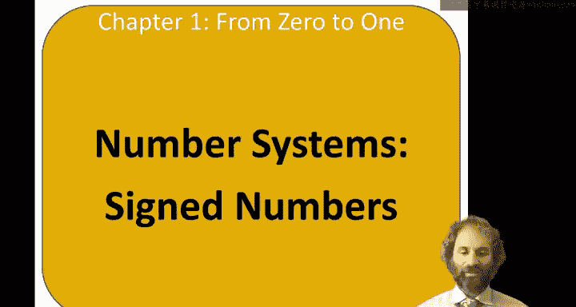
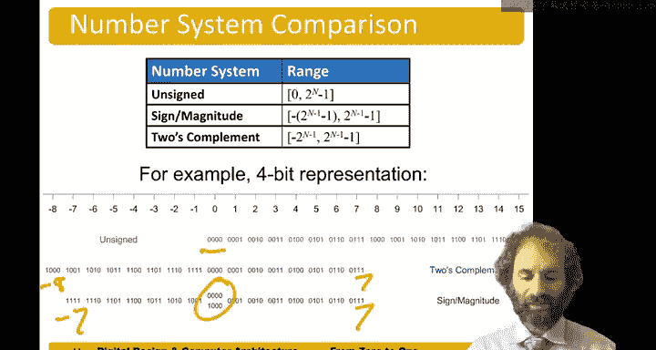

# 哈维穆德学院《数字设计和计算机架构RISC版｜Digital Design and Computer Architecture： RISC-V Edition》 - P7：Chapter 1 6.Signed Numbers.zh_en - GPT中英字幕课程资源 - BV1JC1MY1E7F

Hello and welcome to the next exciting installment of digital design。😊。

The topic of this video is number systems， in particular， sign numbers。

So there are two common ways that binary numbers can with negative values can be represented。

 One is called sine magnitude， and the other is called two's complement。And s magnitude numbers。

The most significant bit is called the s bit， and the remainder are the magnitude bits。

So the s bit determines whether the number is positive or negative。

 as 0 means positive or one means negative。And the other bits are。Smed up as usual。

So if I wanted the number 6 represented as a 6 bit sine magnitude number。嗯。Number 6 is 1，1。

0 with a 3 B of magnitude。 and then the s is 0 for positive。Number negative 6。

 the magnitude again is 1，1，0， Schm 6， and the s is  one， meaning negative。

So an nbit sine magnitude number。Has a range。From negative。2。😔，The n -1，-1。To 2 to the n -1。N-1。

For instance， a 3 B sine magnitude number has a range of -7 to 7。For four bit timing。

Another strange thing about sine magnitude numbers is there two zeros。 There's a positive 0。

And a negative 0。Let's make that look more like a zero。Plus， and -0。

 which represent the same value of 0， which is a little weird。

And another problem with sine magnitude numbers is addition doesn't work properly with a simple binary addition。

 So sine magnitude numbers are not the most popular system。To complement numbers。

Have fixed these problems。 Ed works， and there's a single representation for0。

The way a whose complement number works is the most significant bit has a weight of negative2 the n -1。

So for example a。Four bit2s complement number， the columns have weights of 1，2，4。Instead of8。

 negative8。So， the most positive。Forbitit choose complement number would be no negative8s。4。

 a2 and a one。Which makes  seven。The most negative。Would be a negative 8， no force， no twos， no ones。

AndThat is negative 8。The most significant bit still indicates the sign A one in the most significant bit means negative and 0 means positive。

And the range。Goes from  -2。The n -1 to2， the n -1-1。So in the case of four bit numbers。

 this goes from minus8。plus 7。That's a little interesting that the range is asymmetric。

 but there's no negative 0 now。There is a method to flip the sign of a two's complement number。

 It's known as taking the two's complement。 And what you do is invert the bits and add one。

So let's say we had the number 3。Which is 0，0，1，1。 And we wanted to get negative 3。

 We wanted to negate it。We first flipped the bits。1，1，0，0。Switch zeros from ones。

 and then we would add one。And we'd get 1，1，0，1。This is a one in the negatives8s column。Plus， a one。

The forest column。No choose plus a one in the ones column。Butut sure enough， his negative3。

Let's do another example。Let's find negative 6 by taking the two's complement of 6。 First。

 we flip the bits，1，0，0，1。And then we add one。1，0，1，0。Similarly。

 let's say we had the tooth complement number。1，0，0，1。And we want to know the decimal value。

 two ways we could get at it。We see this as negative。We could go directly。 It's a negative 8， No4 is。

 no 2s。OneSo this is negative 7。Or since it's negative。

 we could take the two's complement to make it positive。So taking the two complement of this is。0，1。

10。Put the bits plus 1。0，1，1，1。Which is positive 7。 So we know the original was negative 7。

Addition works in to's complement。For example， let's do 6 plus negative 6，0 plus 0 is 0。

1 plus 1 is 0 carrier 1。1 plus 1 plus 0 is 0。 Car 1。1 plus 0 plus 1 is 0， carrier 1。

We get an overflow out that we discard， and we're left。0。Similarly， let's do negative 2 plus 3。

Negative 2， well，2 is 0，1， sorry，0，0，1，0。Invert the bits。That one。Make 1，1，1，0。So this is negative 2。

 This is positive 3。0 plus1 mix 1，1 plus 1 mix 0， carry 1。1 plus 1 plus 0 makes 0 carry1。

1 plus 1 plus 0 makes0 carry 1。And again， drop that overflow， and we're left with one。

 So negative 2 plus 3 equals positive one， as we'd expect。

We can perform subtraction by flipping the sign， and then adding。So let's say we wanted to do 3-5。

 That's the same as 3 plus negative 5。Three is 0011。Negative 5 is 1，0，1，1。

 which we could have gotten by a two complement。And we add them up， and we get 1，1，1，0。

 which is negative 2。So sure enough， subtraction works。

So let's summarize by comparing the range of numbers。Unsigned numbers。

Sa for four bit number would go from zero。To 15。A 4 B2s complement number would go from -8。

To positive 7。And a for bitit sine magnitude number would go from negative 7 to positive 7 with。

Both positive and negative0。

