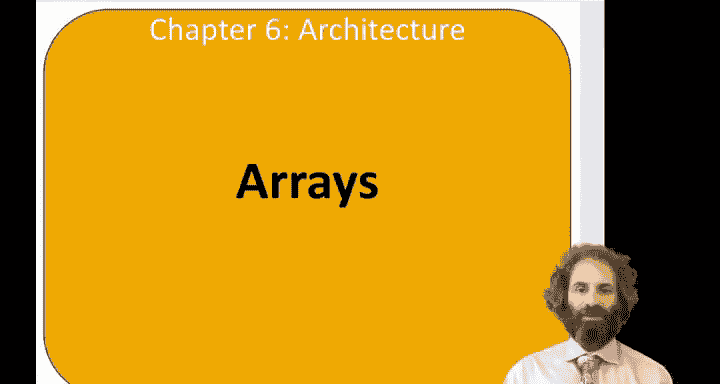
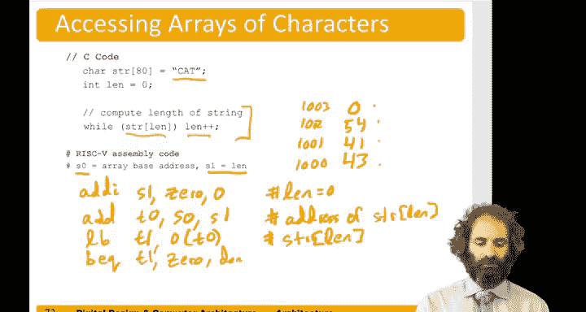

# 哈维穆德学院《数字设计和计算机架构RISC版｜Digital Design and Computer Architecture： RISC-V Edition》 - P80：Chapter 6 10.Arrays.zh_en - GPT中英字幕课程资源 - BV1JC1MY1E7F

Hello， in this video， we'll look at how to access a array in assembly language。

So arrays represent possibly a large amount of similar data。

And I recall that index of an array is which element we want to access。

 and the size is the total number of elements。So suppose we had a five element array。

That was at a base address of 1，2，3， B47，8。And。嗯。That should be。Consistent 1，2，3， B，4。7，8。

And these elements were one word or 32 bits each。So the first step in accessing the array is to load the base address of the array。

So let's say we wanted to access this array and take two elements and double them。And suppose。

Variable S 0 was going to hold the base address of the array。If it wasn't already loaded up。

 we could do that with two steps， load up or immediate。Into S 0。Of。1，2，3， B，4。

That brings in the upper 20 bits。Then， add。Immediate。Has0， has0 and。0 x，7，8，0。So that will load。

Initialize。Base address。Now， if we wanted to load element0， we could do a load word。

 say in temporary0。Z parentheses S 0。That will load array。Fracket 0。Then we could shift left logical。

T 0 gets T 0。Sliologically immediate201 to double it。And store。Start back into the array。

We could do the same thing for element 1。But element 1 is4 Bs later in memory。

So we had an offset set of four。Allright。Suppose we wanted to access an array using a for loop。

So let's say we wanted to multiply every element of an array by 8。

And suppose S0 already contain the base address of the array。

And we'll use variable register S1 to the I variable。So we need to do the initialization。And I。S 1。

Gets。Actually， we have this code on the next example。嗯。Here's， say。

 loading the base address of the array。Now this is the I equals 0。And will'll compare to 1000。

Now in our loop。Willll check。If。I is equal to 1000。 If it's greater than equal to 1000， if it is。

 we're done。Otherwise。We need to load。Aray， bracket eye。So。The eye is in units of words。

And so we need to multiply by 4 to get units of bys。 So we'll shift left I by2。

To get the offset and by it instead of words。Then we'll add that。To the base address as 0。

To get the address of a ray bracket eye。Now， will load。

From 0 relative to that base address to load in the value of a array I。We will shift left by3。

To multiply by 8。And then we'll store the result back into the address we've already calculated that was in T0。

Now， we're ready to。Do the post operation I equals I plus 1。

 so add S1 gets S1 plus1 and then jump back to the loop and check if we're done yet。

So another common。Data structure of strings， which are arrays of characters。

 And recall that the American standard code for information Interchange ASI defines a value of 1 by value for each key on the keyboard。

So， for instance。Upper case A is hex decimal 41， which is decimal 65。 B is 42。 C is 43， and so on。

 Lower case are hex 20 later。There are digits。And so on。

And so remember and see that a string ends with a。嗯。AsI value of 0， not the character 0。

 which has an ASI value 30， but actually an ASI value， the byte0。So suppose we had a string cat。

 and we wanted to know how long it is in memory， C is 43。A is。41。Ti。Is 54。And then a 0。

 So if the base address say were 1000。Then at 1001， be the A 1002。We do the T and 1003。

Would be that no termination。So here's a program to determine the length of the string。

 We'll start with a length of 0。 And while the string bracket line is not 0。

 while we haven't reached the end yet。 will increment line。

 So initially length of 0 string of 0 is a C。So we increment length。

 Now length is one string of1 is a。So that's not zero yet。 increment length， length is now2。

 string of2 is T。 that's not zero。 increment length again， Now length is 3， string of  three is 0。

 so we leave the while。So here's some code to do that。

Let's say that S0 already contained the base address。Of this array。And S1 is for length。

 So we're going to initialize length of 1 to 0。Had I。S1 gets 0。Plus，0。

Now we'll check the condition of the while， so we need to go into memory and read the value of STR at length。

And this example is showing us how to use load byte and that byte offsets are not multiplied by four because the memory is by addressed。

So we'll add。Let's say 2 0 gets the base address S 0 plus the offset S1。And give us the address。

Of STR。Now， we need to use the load bike command。Say to load into T 1。0 parenthesesis T 0。

That will load SR。Ween。Of the value。Now， if it is。not。0， we want to do the body。 So if it is 0。

 we want to exit。 So B， E， Q， T 1，0。If the value is0， then we go to done。

Otherwise， we want to add one to length。Andd。T123。S1 is length。It gives us a length plus plus。

 and finally jump back to the while loop。And the while loop。

Starts here where we're accessing the element of the array。

So now we've seen accessing the arrays in a simple language， if the elements are a single byte。

 we use load byte and we just add the base address in the offset。

 if the load elements were a word size we need to multiply the offset by four to go from words to bytes。

 add that to the base address and use load。