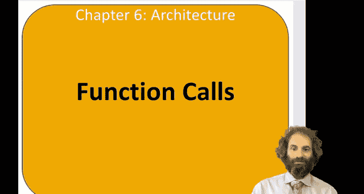
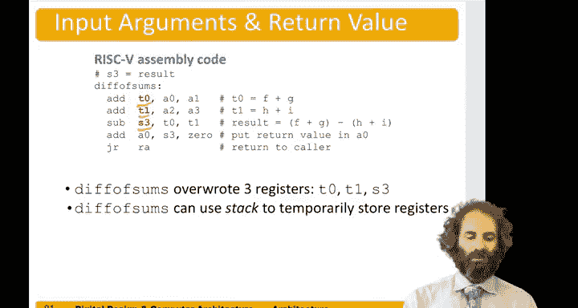

# 哈维穆德学院《数字设计和计算机架构RISC版｜Digital Design and Computer Architecture： RISC-V Edition》 - P81：Chapter 6 11.Functions.zh_en - GPT中英字幕课程资源 - BV1JC1MY1E7F

Hello， in this video we'll look at how to do function calls in assembly language。So a function call。

Something like this where say we have a main function。That calls another function， in case。

 called sum。The collar is the one that's doing the calling。 So in this case。

 main is the collar and the colee is the function that's called， which in this case is some。So。

This is kind of silly。 We could write a function that adds two numbers together and returns the result。

 So y is the sum of 42 and 7 when we call sum A is 42， B is 7， We compute A plus B is 49。

 and we turn that as the value， which goes into y in main。🤧嗯。Let's start with a simple function call。

 a very simple one。 say in main， we just call a function called simple。

That takes no inputs and returns no outputs。And then we do something else like a equals a plus as B plus C。

嗯。So。Let's say the main function is right here。To call simple， we do a jump and link to simple。That。

Transfers。Let's look at the rest of the code and then see how it works。 Then when we come back。

 we do an addd S 0 gets S 1 plus， let's make that in S2。嗯。And then we keep going in me。

The simple function does nothing at all。 It just needs to return。

And it does that with a jump register to return address。So let's look at how these jumps work。A。

Jump and link to simple Does two things。One is the link。 It stores the return address。

 which is the current program counter plus 4 into the RA register。So right now。

 the program is at address 300。In memory。The next instruction that we want to come back to is 304。

So 300 is what we call the program counter saying where we are in memory。

And so we store 304 in the RA register。Then we jumped to the label simple。

I'm going to change the program counter over to be 51 c。The address of that simple。

The simple function doesn't do anything it just returns to do that we do this jump register instruction to RA。

So RA contained the value 304， a jump register to RA will jump back to location 304。

 which returns to the next function after the simple cut。Simple壮高。

And you'll note simple is declared as void， meaning that it doesn't return any values。So。

Let's generalize this if we had arguments。The calling function needs to some put the arguments somewhere that the collie will find them。

And then jump to the collie with that jump and link command。

To go to the collie and also save where to come back to。The callee now needs to do the function。

It needs to return to the call， return the result。To the collar。

And go back to the point of the call and it mustn't overwrite any registers or memory that the caller was expecting to still have。

So can't trash the colors's variables， for example。So to do a function call。

 we use that jump and link。And the name of the function。To return， we use the Ju register RA。

We pass arguments and registers A through0 through A7 for up to 8 arguments。

 and we take the return result in a0。So。These are conventions for Ri5。

 there's no magic reason that all functions have to go this way。

 but if everybody agrees to have functions， look for their arguments in these places and return the value in A0。

 then two different people could write two different functions without having to consult each other about which registers will be used。

So here's a slightly more interesting function， let's say that how we wanted。We want it I。Main to do。

The difference of sums will have some integer Y， and y is going to be the difference of sums of 2，3。

4， and 5。Then the difference of sum's function will take four arguments， F，G， H， and I。

And it will compute F plus G minus H plus I。I computes that。

 puts it in result and then returns the result， so when we come back to main the answer is and y。

Here is a。Send the language code for doing that。So let's say in main S 7 contains y。And first。

 we need to put the arguments in。Were calling diff of sums of 2，3，4， and 5。

So we need to put two in a0，3 and A 1，4 in a 2， and 5 and A3。Then we can do a jump and link。

To diiff of sums。And our result comes back in A0。 We wanted to put it into S7。Into Y。

 so we can use the add S 7 get say 0 plus 0。To move。The return value into Y。And we could keep going。

Let's look at the diff of sums function。Suppose for that function。

 we wanted to keep the result use S3。To hold a result。

Then we could first add F plus G that were in a0 and a1。Put that in T 0。Next， we could add a2 and A3。

 put that in T 1。Next week， could subjecttract to。0 minus T1。 put that in S3。 So that's our result。

Equals the F plus G minus H plus I。Then we want to return this result。

 so we need to copy the result from S3 into a0。We can do that with an add a0 get three plus 0。

And finally， we return with that jump register to RA。Now。

 you notice it was a little bit wasteful to put our answer in S 3 and then immediately have to copy it to a 0。

 And if we were writing an optimizing compiler。 or if we cared about optimizing this by hand。

 we could have just had this objecttract， but the answer straight in a 0。 But for now， let's do it。

In a straightforward way， would not worry about those optimizations。All right。

 so let's look a little more closely。嗯。The diF of sum's function overrote three variables， T0。

 T1 and S3。And main function might have been expecting to use some of those registers。So， diiffs。

Sums can use something called a stack to temporarily store registers so we don't overwrite things。

And we'll look at that in more detail in another few videos。

