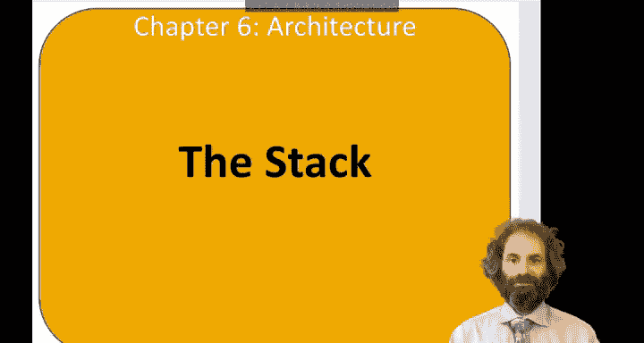
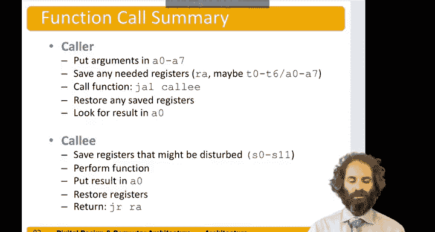

# 数字设计和计算机架构RISC版：6.12：栈（The Stack）📚

在本节中，我们将学习计算机架构中的一个重要概念——栈。栈是主内存的一部分，用于临时存储变量。我们将了解它的工作原理、如何通过栈指针进行管理，以及它在函数调用过程中如何保存和恢复寄存器状态。

## 概述

栈是一种遵循“后进先出”原则的数据结构，类似于一摞盘子。在计算机架构中，栈通常从高内存地址向低地址方向“向下”增长。一个名为栈指针（SP）的特殊寄存器始终指向栈的顶部。

## 栈的基本操作

上一节我们介绍了内存和寄存器的基本概念，本节中我们来看看栈的具体操作。

栈可以扩展和收缩。当需要更多内存空间时，栈可以向下扩展；当不再需要这些空间时，栈可以向上收缩。

在计算机架构中，栈是“倒置”的。它通常从一个较高的内存位置开始，向较低的地址方向增长。有一个名为栈指针（SP）的寄存器，它是32个寄存器之一，用于指向栈的顶部。

想象我们有一段内存。在栈的顶部，栈指针指向一些数据，即最顶部的元素。

现在，假设我们想在栈上再放入两个字。由于栈是向下增长的，因此栈指针需要向下移动两个字的位置。旧的值保持不变，但我们可以放入两个新值。此时，栈指针指向内存中低8字节的位置。

## 栈在函数调用中的应用

在函数调用中，我们必须确保没有意外的副作用。回想一下 `diff of sums` 函数，它会覆盖 `t0`、`t1` 和 `s3` 这三个寄存器。因此，我们可能希望在修改这些寄存器之前保存它们，然后在函数返回之前恢复它们。

以下是保存三个寄存器的示例。每个寄存器是32位（4字节），因此我们需要将栈指针向下移动12字节，为这三个数据腾出空间。

然后，我们可以使用 `sw`（存储字）指令，将 `s3`、`t0` 和 `t1` 依次存储在栈顶上方偏移量为0、4和8字节的位置。

现在，我们已经保存了这些值，可以自由地执行会修改 `t0`、`t1` 和 `s3` 的 `diff of sums` 函数了。函数最终将结果放在 `a0` 中。

接下来，我们需要通过恢复这些值来进行清理。我们使用 `lw`（加载字）指令，从栈顶偏移量为8、4和0的位置将值加载回 `t1`、`t0` 和 `s3`。

最后，我们将栈指针移回最初的位置。至此，除了本应存放返回结果的 `a0` 外，所有寄存器都未改变，栈指针也回到了开始时的位置。然后，我们通过 `jr ra` 指令返回。

## 寄存器的保存约定

现在让我们思考一下哪些寄存器需要被保存。

`s` 寄存器用于表示变量。因此，当一个函数调用另一个函数并返回时，合理地期望局部变量没有被破坏，所以我们需要在函数调用期间保存这些寄存器。同样，栈指针在函数调用结束后应该回到原来的位置，返回地址寄存器（`ra`）也应保持不变，以便我们知道返回到哪里。栈指针上方的栈空间也不应被破坏。

如果一个被调用的函数（即被调用者）想要使用任何 `s` 寄存器、栈指针或 `ra`，它需要在使用前保存它们。

临时寄存器（`t` 寄存器）和参数寄存器（`a` 寄存器）被称为“非保留”寄存器。临时寄存器本来就是临时的，你不能指望它们在函数调用期间保持其值。因此，如果调用者希望它们保持值，它应该自己保存这些寄存器。同样，调用者将通过 `a0` 到 `a7` 传递参数，所以这些寄存器的值本质上会被改变。如果调用者在进行函数调用前关心 `a` 寄存器的旧值，调用者有责任保存它们。

## 优化 `diff of sums` 函数

让我们重新审视 `diff of sums` 函数。但这次，只需要保存 `s3`，因为它是被保留的寄存器之一。`diff of sums` 必须承诺不会破坏任何 `s` 寄存器，但它可以自由地使用 `t` 寄存器。

在这个版本的 `diff of sums` 中，我们只将栈指针向下移动一个字（4字节），保存 `s3`。然后执行计算，将答案放入 `s3`，再复制到 `a0`。最后，我们通过 `lw` 指令从栈上恢复 `s3`，并将栈指针移回。

我们甚至可以做得更好。既然结果最终要放入 `a0`，那么中途没有特别的理由将其放入 `s3`。如果我们不使用 `s3`，那么我们就不需要保存或恢复任何东西。因此，这里有一个优化后的 `diff of sums` 版本，它直接将答案放入 `a0`，无需保存或恢复任何内容。

## 非叶子函数与栈帧

假设我们有一个非叶子函数，即一个会调用其他函数的函数。

例如，我们在函数 `F1` 中，想要调用函数 `F2`。在此之前，`F1` 需要知道返回地址。因此，它需要移动栈指针，并将其返回地址保存到栈上。然后它可以调用 `F2`。`F2` 的执行会改变 `ra`。所以当我们返回时，结果在 `a0` 中，我们需要从栈上加载 `ra` 回来，并将栈指针移回原处。

任何会调用其他函数的非叶子函数都有责任首先保存返回地址。

以下是一个稍微复杂一点的函数对示例：`F1` 和 `F2`。假设 `F1` 是一个非叶子函数，因为它调用了 `F2`。`F2` 被称为叶子函数，因为它不调用任何其他函数。假设 `F1` 使用 `s4` 和 `s5`，并且在调用 `F2` 返回后还需要 `a0` 和 `a1`。

`F1` 首先在栈上为五个数据腾出空间，将栈指针向下移动20字节。它会保存它需要的 `a0` 和 `a1`，保存它的返回地址（以便 `F1` 知道最后返回到哪里），并保存它想要使用的 `s4` 和 `s5`。然后，我们可以使用 `jal`（跳转并链接）指令跳转到函数 `F2`。我们可以在 `F1` 中做一堆其他事情，包括可能在使用 `s4` 和 `s5` 作为内部变量时改变它们。当我们全部完成后，我们需要从栈上加载返回地址，将栈指针移回原处，恢复我们关心的其他变量，然后跳转回返回地址。

`F2` 更简单一些。假设它只使用 `s4`（这是它唯一需要的被保留寄存器），并且不调用任何其他函数。因此，它只需要在栈上保存 `s4`：将栈指针向下移动4字节，将 `s4` 存储到栈上，执行其操作，然后从栈上恢复 `s4`，将栈指针移回原处（这应该是加4），然后跳转回返回地址。

这是一个函数调用期间栈的示例：假设栈指针最初在栈顶的某个位置。然后我们调用 `F1`，将 `a0`、`a1`、`ra`、`s4` 和 `s5` 放入栈中，这被称为函数 `F1` 的“栈帧”。接着，当我们调用 `F2` 时，栈指针会再次向下移动一个字，`F2` 会将其 `s4` 寄存器保存在 `F2` 的栈帧中。一旦 `F2` 完成，我们会释放 `F2` 的栈帧，栈指针移回这里。一旦 `F1` 完成，栈指针最终回到最初的位置。

## 总结

本节课中我们一起学习了栈的概念及其在RISC-V架构函数调用中的关键作用。

总结如下：
*   当调用者想要调用另一个函数时，它将任何参数放入 `a0` 到 `a7`。
*   它保存任何可能需要的寄存器，这包括 `ra`，以及可能的临时寄存器或 `a` 寄存器（最好在将参数放入它们之前保存）。
*   然后，它使用 `jal` 指令调用被调用者。
*   当返回时，它将恢复它保存且仍然需要的任何寄存器，并在 `a0` 中查找结果。
*   被调用者将保存它可能想要扰动的任何被保留寄存器（例如 `s` 寄存器）。
*   它执行其功能，然后将结果放入 `a0`，恢复它接触过的那些寄存器，并通过 `jr ra` 指令返回。