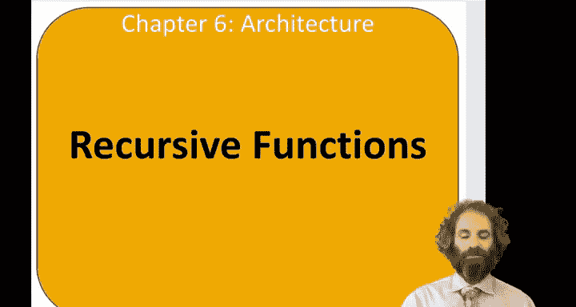
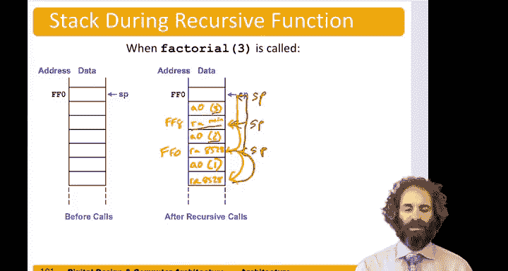

# 数字设计和计算机架构RISC版：第六章：递归函数 🌀

在本节课中，我们将学习递归函数调用，即函数调用自身的过程。我们将重点探讨在汇编语言中如何处理递归调用，特别是如何通过栈来保存和恢复寄存器的状态，以确保程序正确运行。



---

## 概述

递归函数是编程中的一个核心概念，它通过函数调用自身来解决问题。在汇编层面实现递归时，我们需要特别注意寄存器状态的保存与恢复，因为每次递归调用都可能覆盖前一次调用的数据。本节课将以经典的阶乘函数为例，详细讲解如何将递归逻辑转换为正确的RISC-V汇编代码。

---

## 递归函数定义

递归函数是指直接或间接调用自身的函数。在将其转换为汇编代码时，一个有效的方法是先将其视为调用另一个普通函数，忽略寄存器被覆盖的问题，然后再回过头来考虑如何通过栈来保存和恢复必要的寄存器。

一个经典的递归函数例子是阶乘函数，记作 `n!`，其定义为：
\[
n! = n \times (n-1) \times (n-2) \times \ldots \times 2 \times 1
\]
例如，`6! = 6 × 5 × 4 × 3 × 2 × 1 = 720`。

阶乘的递归定义如下：
- 如果 `n <= 1`，则返回 `1`（基本情况）。
- 否则，返回 `n × factorial(n-1)`。

假设主函数调用 `factorial(3)`，其执行过程为：
1.  `factorial(3)` 返回 `3 × factorial(2)`
2.  `factorial(2)` 返回 `2 × factorial(1)`
3.  `factorial(1)` 返回 `1`
4.  然后逐层返回：`factorial(2) = 2 × 1 = 2`，`factorial(3) = 3 × 2 = 6`

---

## 初步汇编代码转换

首先，我们忽略栈和寄存器保存问题，将递归逻辑直接转换为汇编代码。以下是第一遍转换得到的“黑盒”代码框架：

```assembly
factorial:
    li t0, 1          # 将1加载到t0寄存器，用于比较
    bgt a0, t0, ELSE  # 如果 n > 1，跳转到ELSE标签
    li a0, 1          # 基本情况：将返回值设为1
    jr ra             # 返回调用者
ELSE:
    addi a0, a0, -1   # 计算 n-1，并作为新参数
    jal factorial     # 递归调用 factorial(n-1)
    # 假设返回后，a0中保存着 factorial(n-1) 的结果
    # 此处需要将原n值乘以该结果，但原n值已被覆盖
    # 我们稍后会处理这个问题
    mul a0, t1, a0    # 用临时寄存器t1（应保存原n值）乘以结果
    jr ra             # 返回
```

这段代码实现了基本逻辑，但存在一个问题：在递归调用 `jal factorial` 后，参数寄存器 `a0` 的值（原 `n`）被新的参数 `n-1` 覆盖了，导致后续无法计算 `n * factorial(n-1)`。

---

## 保存与恢复寄存器

为了解决上述问题，我们需要在递归调用前保存关键寄存器的状态，调用后再恢复。对于阶乘函数，需要保存的两项是：
1.  **返回地址寄存器 `ra`**：因为 `jal` 指令会修改 `ra`，我们需要知道每次调用后应返回到哪里。
2.  **参数 `n` 的值**：在计算 `n * factorial(n-1)` 时，我们需要用到原始的 `n` 值。

以下是修改后的完整汇编代码，包含了栈操作：

```assembly
factorial:
    # 为两个寄存器（a0和ra）在栈上分配空间
    addi sp, sp, -8
    sw a0, 0(sp)      # 将当前的n值保存到栈上
    sw ra, 4(sp)      # 将返回地址保存到栈上

    # 检查基本情况：n <= 1
    li t0, 1
    bgt a0, t0, RECURSE
    # 基本情况：返回1
    li a0, 1
    # 恢复栈指针并返回
    addi sp, sp, 8
    jr ra

RECURSE:
    # 准备递归调用：计算 n-1 作为新参数
    addi a0, a0, -1
    jal factorial     # 递归调用 factorial(n-1)
    # 递归调用返回后，a0中保存着 factorial(n-1) 的结果
    # 现在从栈中恢复原n值到临时寄存器t1，并恢复ra
    lw t1, 0(sp)      # 将原n值加载到t1
    lw ra, 4(sp)      # 恢复返回地址
    addi sp, sp, 8    # 释放栈空间
    # 计算最终结果：n * factorial(n-1)
    mul a0, t1, a0
    jr ra             # 返回
```

---

## 栈帧变化过程分析

为了更好地理解递归调用时栈的变化，我们假设 `factorial` 函数从内存地址 `0x8500` 开始，并且初始栈指针 `sp` 指向 `0xFF0`。以下是调用 `factorial(3)` 时栈帧的演变过程：

1.  **第一次调用 `factorial(3)`**：
    *   `sp` 下移8字节至 `0xFE8`。
    *   将 `a0=3` 和 `ra=[主函数返回地址]` 保存到栈帧 `[0xFE8, 0xFF0)`。

2.  **第二次调用 `factorial(2)`**：
    *   `sp` 再次下移8字节至 `0xFE0`。
    *   将 `a0=2` 和 `ra=0x8528`（`factorial(3)` 中 `jal` 后的地址）保存到新栈帧。

3.  **第三次调用 `factorial(1)`**：
    *   `sp` 下移至 `0xFD8`。
    *   将 `a0=1` 和 `ra=0x8528` 保存到栈帧。

4.  **开始返回**：
    *   `factorial(1)` 遇到基本情况，返回 `a0=1`，并将 `sp` 恢复至 `0xFE0`。
    *   `factorial(2)` 从栈中恢复 `t1=2` 和 `ra=0x8528`，计算 `2 * 1 = 2`，存入 `a0`，返回并将 `sp` 恢复至 `0xFE8`。
    *   `factorial(3)` 从栈中恢复 `t1=3` 和 `ra=[主函数返回地址]`，计算 `3 * 2 = 6`，存入 `a0`，返回并将 `sp` 最终恢复至初始的 `0xFF0`。

通过栈帧的压入和弹出，每个递归调用实例都能独立地访问其自身的参数和返回地址，从而保证了程序的正确执行。

---

## 总结

本节课我们一起学习了递归函数在汇编层面的实现。关键要点如下：
*   递归函数通过调用自身来解决问题，在汇编中需要仔细管理寄存器的状态。
*   **栈**是保存和恢复寄存器（如返回地址 `ra` 和参数）的关键数据结构。
*   实现递归的通用模式是：在递归调用前将必要数据压栈，调用后弹栈恢复，最后进行计算并返回。
*   通过分析阶乘函数的栈帧变化，我们直观地看到了递归调用与返回过程中栈的动态调整。



理解递归的汇编实现，有助于我们深入认识函数调用机制和计算机系统如何管理程序状态。