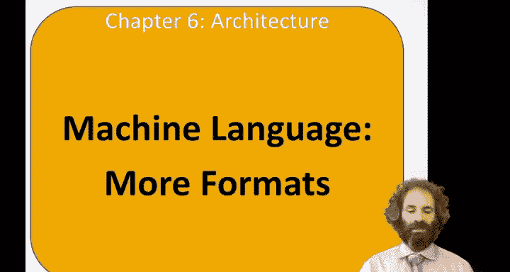
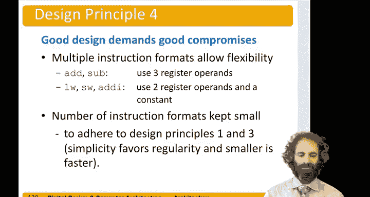

# 哈维穆德学院《数字设计和计算机架构RISC版｜Digital Design and Computer Architecture： RISC-V Edition》 - P86：Chapter 6 16.Machine Language I, S B, U J-Type Instr. Formats.zh_en - GPT中英字幕课程资源 - BV1JC1MY1E7F

Hello， in this video we'll talk about the other machine language formats for Rik5。

So second format is i type， this stands for immediate type。

And I type instructions also have three operas。 They have a first source register。

 they have a destination register， but instead of having a second source。

 they have a 12 bit immediate。I like our type， they have an op code。And like our type。

 they have a three bit function code， but they don't have room for another seven bit function code。

So the OT instructions， they O tape， have the up down at the bottom。They have par D and R S as 2。

5 bit fields like before， They also have the funct 3 field of I type。

 But instead of having an R S 2 and a funct 7， they have a 12 bit immediate and the upper bits。

And that for instructions like addI that could do add eye。Say our。X。5 gets x 3 plus 42。

up and func would represent atey。RRS1 would be x3， R D would be x5， and the immediate would be 42。

Here's some examples of that。With an add eye。S0 is x 8， S1 is x9 and constant 12。So， they。

Up code for add I。 Look in Appendix B。I is 19， and its' functiont 3 is0。

The destination register is S 0。 The first source is S1， and the immediate is 12。

And just the same way as with our type， we pack these into bits and we can express the 32 bit instruction to exit Smo。

Here's an add eye with a negative。Immediate。And so now the immediate is-14。

Which is a choose complement number is this。Another example of an eyeT instruction would be a load。

For instance， load word。Has an op code of three， a funt 3 field of2。The destination register is T2。

 which is register 7。Base address。Is Rs1， it's S3， which is number 19。

And the offset here is negative 6。There's also， we've talked about load byte。

 and we haven't mentioned load half word yet， but load half word is like load word or byte。

 but it loads 16 bits。So a load half word has the same op as load word。

 but the funt field is different。And load by also has the same op。 And again， a different fet field。

S and B type instructions are for stores and branches。And they differ only in the encoding of the。

So like the other instructions we've seen。They have an op field， the bottom 7 B and an R S 1。

5 B of source。these take a second source。嗯。In the same place as the R type instructions had them。

They also have the fun3， I call the other instructions we've seen。

I take a 12 bit immediate for an S type， the immediate has the bottom 5 bits here， and the upper。

7 Bs here。And the reason that we couldn't put them all in a row like an eye type is we needed this second source。

B type is for branches and the least significant branch。

 least significant bit of a branch offset is always zero because branches are always by an even amount。

 so there's no need to store immediate0 because that's always0。

 so instead we can store a 13 bit branch offset bits 12 through one。

And therein a bit of a funny encoding like this。And we'll come back and look at that further later on。

So here's S type again。It's like we talked about。And some examples of store instructions using guest type encoding。

All the stores have an op of 35。And at， a funct is two for store store word。

 one for store half word and0 for store byte。They have two source registers。And an offset。

 So an offset of negative 6。In hexodadecimal， a negative 6 is a 12 bit number。Is 1，1，1，1。1，1，1。1，1，0。

1，0， x negative 6。So， we pack。The bottom 5 bits。In here。 And the upper。7 bits。好片。

Store half and store byte are similar。B type again， our similar format。

 just the way the immediate is stored。So let's say we wanted to do B， EQ。If S0 is equal to S5。

 we want to branch to label one。So。嗯。This instruction is at address， says 70。

Label 1 is at address 80。Four instructions later。So we need to add 16。 These are in he Emo so 70。

To 80 is hex 1，0 or decimal 16。A by further in the program。So we need an immediate offset of 16。

And16。Is。A bunch of zeroes。A one in the 16s column， No8s， no fours， no twos， no ones。

But remember that branches are always by an even amount。

 so theres no need to store the least significant bit， so we won't even encode it。So。😔。

We need to store now 12 bits， but their bits 12 through  one instead of 11 through 0。And。

 you need to find where they go。So， bit 0，1。Sorry， bits 1，2，3， and 4。Our 1，0，0，0。

They're going right here。Bits 5 through 10。Are all zeros？And they're the blue ones going here。

Bit 11 is this zero and it goes here and bit 12 is that zero， and it goes here。

So you see the process of doing this by hand is kind of tedious to encode the branch。

 a computer will do it。For you automatically， that program is called an asmbler to do the encoding。

But the key for a branch is to figure out what the offset needs to be。 In this case， at 16。

That's what we need to add to 70 to get up to 80。And then we have to stick those offset bits in the appropriate parts of the immediate。

U and J type instructions are also similar， They have an op。

A destination register and a 20 bit immediate。You type instructions are used for load up per immediate J type are for jumps。

So。😔，You type takes a 20 bit immediate that is just in the upper 20 bits。

 and it's the value that we want to load。J type again， jumps are by an even amount。

 so there's no need to store the least significant bit。

And they're mund in a kind of funny order here。 And again。

 we'll see in a little bit why we do that funny order。So you type for load up re。

Lets say we wanted to do an L UI of S 5 gets  H C， D， E F。The op code for a load up per is 55。

Register S5 is number 21。And then the H C， D， E， F goes in the upper bits。

And our instruction is HC C D E F， A B7。For J type， these are used for jump and link。So。

Got to be careful with this funny ordering of the immediate。But suppose we were at。5，4，0， c。

And we want to do a jump in link， R。To function1。And Fct 1 is up here at address 1， ABC 0，4。So1， AB。

C，0，4 minus。5，4，0， c。Well，4 minus C， we can't do， but 14。Minus C is 8。We had to borrow one。

 get an F here。And to be here。Half minus0。Is F。B-4 is 7。B -5 is6， A-0 is a， and 1-0 is 1。 So funt 1。

Is an offset of 1， a 6，7 F 8 bys past jump in link。Now， that offset。Since it's even， again。

 we aren't going to store the least significant bit of it at simplicityly zero。

And writing this number 8。Is the 1，0，0，0。F is all ones。7even。This is 7。6。Ai。Huai。So。We need to。

I represent this。As。H。All those bits and pack them into the right place。

So we've been put bit 20 up here。Then we put bits 10 through1。1 you。Wen。Are this1，1，1，1，1，1，1，1，0，0。

Which I is。1，1，1，1，1，1，1，1，1，0，0。Next， we have bit 11， the blue 1。Goes here。And then。

 bits 19 through 12。19。Through 12。Are these。1，0，1，0，0，1，1，0，1，0，1，0，0，1，1，0。

So that's the immediate pact in this funny way。And our machine code。Heres this。So in summary。

 here are the instruction formats in。嗯。Risk 5。All the instructions。Have op in the same place。

 So that's how you figure out what type of instruction you're looking at。

 You look at the bottom 7 bits。 and based on the op。

 you decide what type of instruction you're doing。All the instructions to take a funct 3 also have that in this middle position。

You'll notice all the instructions that need an RD have it here。

 all the ones that need an RS have it here， R 1， R 2， have it here。

And then our type instructions have seven more bits available for funt。

 The other types of instructions have an immediate， and it's packed into various places。

So this is a good example of design principle  four that good design requires good compromises。

So we' have got multiple instruction formats to allow flexibility。 For instance。

 add and subtract need two sources in a destination。

While something like loadward storeward or add I only need two registers and a constant。

If wed had three source registers and just disregarded them， one of them， say an atey。

 that would have taken up 5 Bs of the instruction， leaving only 7 and 12 instead of 12 B for adding immediate。

 And it wouldn't have allowed us to have as many immediate。On the other hand。

 the number of instruction formats is kept small to adhere to principles 1 and 3。

 that simplicity favors regularity and smallers faster。 So by having just a small number of。

Instruction formats， we get the flexibility we need while still allowing a fast and simple decoor。

