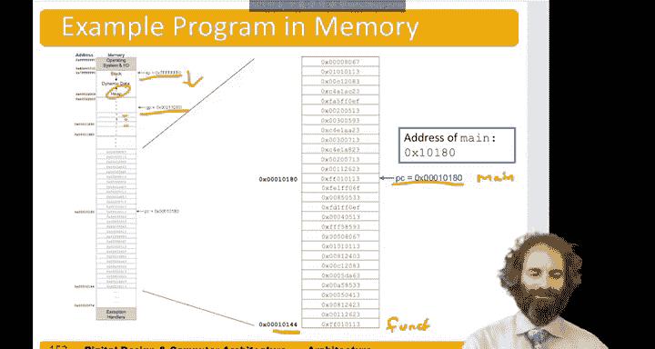

# 数字设计和计算机架构：6.19：程序的编译、汇编与加载 🖥️

在本节课中，我们将学习程序从高级语言代码到最终在内存中运行的全过程。我们将探讨编译、汇编和加载的步骤，并了解程序和数据在内存中的布局。

---

## 存储程序的概念 💾

数字计算机的一项伟大创新是存储程序的概念。可以想象一个硬连线的系统，例如一个计算器，其电路负责检测按键，然后将数据送入算术逻辑单元执行运算，最后通过硬件将结果显示在屏幕上。这个计算器只能是计算器，无法执行其他任务。

但有了存储程序，程序本身是一组存储在内存中的指令。如果你想改变硬件执行的任务，无需重新布线整个系统，只需重新编程处理器，将新程序放入内存即可。

在我们的处理器中，32位的指令和数据都存储在内存中。处理器上运行的不同应用程序之间的唯一区别，就是指令序列的不同。执行程序时，处理器按适当顺序从内存中获取指令，并为每条指令执行指定的操作。

---

## 程序在内存中的布局 📊

上一节我们介绍了存储程序的概念，本节中我们来看看程序和数据在内存中是如何组织的。

程序的指令需要存储在内存中，这部分也称为程序的**文本段**。数据也需要存储在内存中。

我们已经了解过**栈**，它用于保存一些临时数据。此外，还有一部分内存用于存储**全局或静态变量**，它们在程序开始前就已分配。另一部分内存则用于存放**动态分配**的变量，例如通过 `malloc` 请求的变量。

那么，内存有多大呢？在我们的32位处理器上，地址是32位长，因此最多有 **2^32 字节**的内存，即4GB。地址范围从 `0x00000000` 到 `0xFFFFFFFF`。

计算机架构中一个几乎无法挽回的错误，就是地址空间不够大。4GB在很长一段时间内是足够的，但现代计算机甚至移动设备通常拥有超过这个容量的内存，因此需要更大的地址空间，这也推动了向64位微处理器的发展。

每个系统都有一个**内存映射**，它显示了内存的不同部分用于何种目的。内存映射取决于整个系统和操作系统，不一定由处理器本身定义。

以下是一个RISC-V处理器可能使用的内存映射示例：
*   底部32KB用作**异常处理程序**。例如，复位时程序计数器被设置为地址0，该地址可能有一个ROM，指示系统从启动闪存中获取指令并加载到内存，然后跳转到这些指令。
*   接着是**文本段**，用于存放程序指令。
*   然后是**全局数据段**，为全局变量提供空间。这部分可能较小，因为程序中全局变量的数量是确定的。
*   之后是动态数据的空间。**堆**从全局数据的顶部开始，当你调用 `malloc` 请求内存时，堆会向上增长。
*   **栈**从内存顶部开始，随着函数调用和变量存储，栈会向下增长。

如果堆和栈发生碰撞，就意味着内存耗尽，会出现问题。内存的上半部分可能预留给操作系统使用。

---

## 编译与链接工具链 🔗

我们已经了解了程序在内存中的布局，现在来看看将高级语言代码转换为可执行文件的工具链过程。

如果我们想运行一个程序，需要经历以下步骤：
1.  从用C或类似语言编写的**高级代码**开始。
2.  将其输入**编译器**。编译器会生成**汇编代码**。
3.  汇编代码通过**汇编器**处理，得到称为**目标文件**的机器语言代码。
4.  需要将我们代码的目标文件与来自库或其他开发者编写的程序部分的其他目标文件结合起来。
5.  **链接器**将所有不同的目标文件放在一起，创建**可执行文件**。
6.  **加载器**将可执行文件加载到内存中，将机器语言指令放入内存的正确位置。

在计算早期，格蕾丝·霍珀是一位关键人物。她获得了耶鲁大学数学博士学位，是开发出第一个编译器的人。她还开发了COBOL编程语言。在此之前，所有程序都是用汇编语言或直接用机器语言编写并手工翻译的。她构建了这个从高级语言到汇编语言的编译器。

---

## 从代码到内存：一个具体示例 📝

上一节我们介绍了工具链，本节我们通过一个具体示例，看看程序如何从源代码一步步映射到内存。

假设我们有以下程序：
*   有一些全局变量 `f`, `g`, `y`。
*   有一个函数 `func`，它接收两个输入，执行一些操作（可能是递归的）。
*   有一个 `main` 函数，它将全局变量 `f` 设为2，`g` 设为3，用这些变量调用 `func` 函数，将结果放回 `y`，然后返回。

以下是 `func` 程序翻译成汇编语言和机器语言的示例。`func` 需要在栈上保存一些内容，因此将栈指针下移，存储返回地址和一些局部变量，执行一些操作（包括可能对其自身的递归调用），然后返回。

我们还会注意到，这个程序使用了一些伪指令，例如 `move` 指令等价于 `addi`，`return` 指令等价于 `jalr ra`。

每条指令都对应一组机器码，所有这些机器码都存储在不同的地址。注意，每一行都是4字节。

`main` 函数也存储在这里，每条指令也是4字节。我们需要在栈上分配空间来存储一些变量，还需要将一些值加载到 `f` 和 `g` 中。`f` 和 `g` 是全局变量，因此它们的访问是相对于**全局指针**（全局变量的基地址）的。

当通过工具链运行此程序时，其中一个中间结果称为**符号表**。它记录了：
*   文本段从地址 `0x1074` 开始。
*   具体来说，`func` 和 `main` 分别从 `0x10144` 和 `0x10180` 开始。
*   数据段从 `0x115e0` 开始。
*   全局变量 `f`, `g`, `y` 分别位于 `0x11a38`, `0x11a34`, `0x11a30`。
*   每个 `f`, `g`, `y` 长4字节。
*   `func` 函数长 `0x3c` 字节，`main` 函数长 `0x34` 字节。

现在我们可以看到所有这些是如何放入内存的：
*   文本段从 `0x10144` 开始，包含 `func` 和 `main`。
*   开始运行程序时，程序计数器被设置为 `main` 的开头，我们开始执行代码。
*   全局指针指向全局段的起始位置，`y`, `g`, `f` 位于该全局段中。
*   栈指针设置在内存顶部，随着我们存入内容而向下增长。
*   在这个程序中，没有动态分配内存，因此没有内容向上增长。

---

## 总结 ✨

本节课中，我们一起学习了程序从编译、汇编到加载的完整过程。我们了解了存储程序的核心概念，认识了程序在内存中的布局（包括文本段、数据段、堆和栈），并回顾了将高级语言代码转换为可执行文件的工具链步骤。最后，通过一个具体示例，我们看到了源代码如何最终映射到内存地址中并准备执行。理解这些步骤对于掌握计算机如何运行软件至关重要。