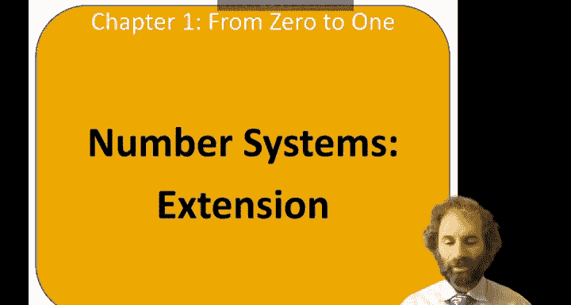
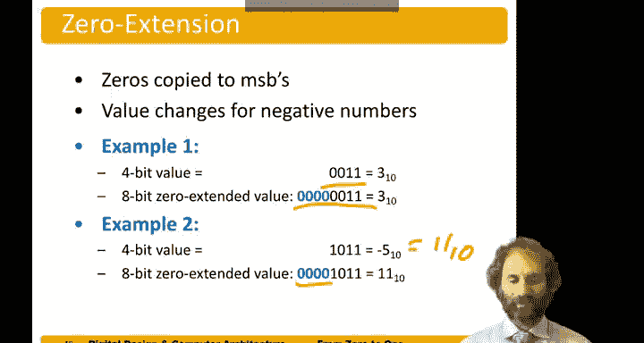

# 哈维穆德学院《数字设计和计算机架构RISC版｜Digital Design and Computer Architecture： RISC-V Edition》 - P8：Chapter 1 7.Extension.zh_en - GPT中英字幕课程资源 - BV1JC1MY1E7F

Hello and welcome to the next exciting installment of digital systems。 Our topic now is extension。😊。

So imagine you wanted to extend a number that was M bits long to a wider M bits。

If we're working with two complement numbers， that's done with something called sine extension。With。

Unassigned numbers， we do zero extension。So for sign extension of two's complement numbers。

 we simply copy the sign bit into the most significant bits。

And that gives you a new value with more bits， but has same value。So suppose we had the number three。

As a four bit number， it's 0，0，1，1。And the sign bit。Is positive， zero。

So to turn this into an 8 bit number that still moving 0， we copy that sign bit into the upper bits。

And now we have 0，0，00-0011， which is still free。On the other hand， if we have the number negative5。

Negative 5 and2s complement is an 8， a negative 8。Plus。2。😔，Plus， a one。W is negative 5。

To extend it to 8 bits。That s bit is one。 So we copy that into the upper bits。

 And now this number is negative 128。Plus 64 plus 32 plus 16。8。Two plus one。

 but sure enough is still negative 5。So sign extension worked。If our numbers are unsigned。

 then we just do zero extension。So suppose we had an unsigned number 3。0，0，1。

1 again to extend it to 8 Bs。 We just put zeros in。If we had。Number 1011。As a。2 complement number。

 That's negative 5。But as an unsigned number， that's 8 plus 2 plus 1。Is 11。When we zero extend it。

We put zeros in the upper bits， and now we've got 0，0，0，0-1011， which is 11。

So this has the correct value if we interpreted the number as unsed， but the incorrect value。

 if we interpreted as signed。

