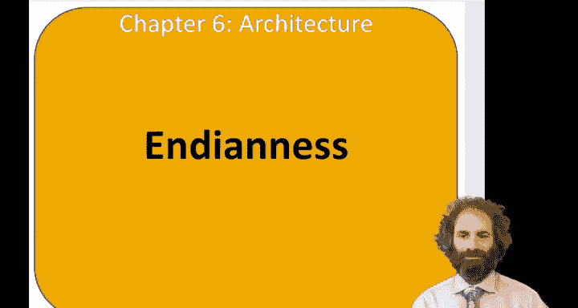
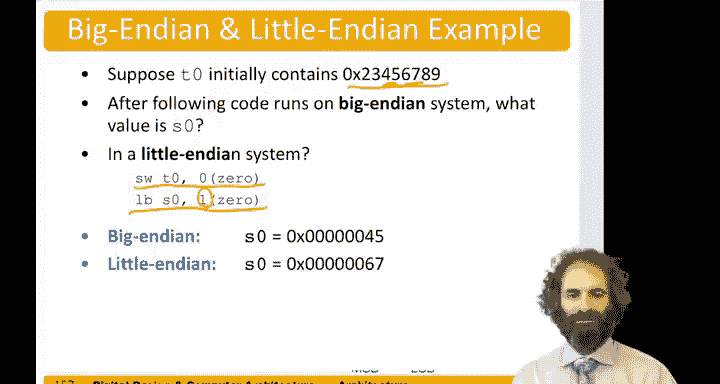

# 哈维穆德学院《数字设计和计算机架构RISC版｜Digital Design and Computer Architecture： RISC-V Edition》 - P90：Chapter 6 20.Big-Endian & Little-Endian Memory.zh_en - GPT中英字幕课程资源 - BV1JC1MY1E7F

Hello， in this video we'll talk about Indianness。So earlier。

 we had mentioned that memory is bite addressed。And the question is。

 how do we number the bytes within a word？So there are two orders called Little Indian and Big Indian。

In little Indian。Byte zero of a word is the least significant， byte three is the most significant。

In big India。Byte zero is the most significant and byte 3 is the least significant。In both cases。

 the word addresses are the same。 Word 0， word 1 is at address 4， word 2 is that address 8。

 word 3 is at address C。But the order of the bytes within the word have different addresses。

So it doesn't really matter how you do this， except that if you have two different systems that need to share data and one is big Indian and one is little Indian。

 and you look at bites within the word， then they come out backwards。So for a long time。

 computer architects had something of a religious war over which Indian inness was correct。

Some thought big Indian was more natural， some thought little Indian was more natural。

 and they came up with all sorts of contrived reasons。But really when you get down to it。

 there's no reason that one of them should be better than another， and it's just an arbitrary choice。

And I used to work with a computer engineer， a very clever fellow named Danny Cohen。

 who coined the term Indianness， it's with reference to Jennifer Swift's satirical novel called Guliver's Travels。

 in which there were warring tribes of little Indians and big Indians who broke their eggs on the Little end or the Big End and were in warfare accusing the other side of having the wrong way to eat their egg。

So computer makers went through this warfare for a while。

 and now many computers have the ability to swap Indianness as necessary。

There's one way you can tell the ininess of your computer， but say you had a word in memory。2，3。

45678 nine if you're on either a little Indian or a big Indian machine and you load that word。

 you'll get the same thing。But。If you store that word into memory， starting at byte zero。

 address zero， and then you load byte， say byte one。If you're in a big Indian system， bite one。

Would be  four， five， you'll get back  four five if you're in a little Indian system。

 byte one and get back6， seven。And so that's the place where things can go wrong between Indianness。

