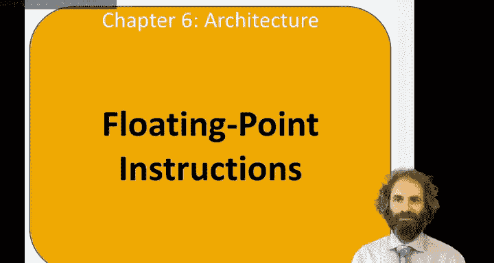
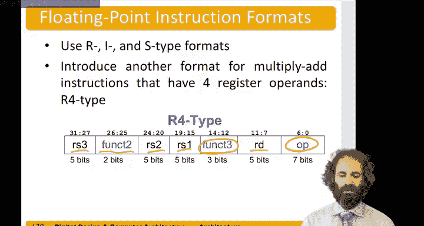

# 数字设计和计算机架构RISC版：6.23：浮点指令 🧮



在本节课中，我们将学习RISC-V架构中的浮点指令。这些指令用于处理单精度、双精度和四精度浮点数，是进行科学计算和信号处理等任务的基础。

## 浮点扩展与寄存器

RISC-V架构提供了三个可选的浮点扩展：F、D和Q模式，分别用于处理单精度（32位）、双精度（64位）和四精度（128位）浮点数。这些扩展定义了32个浮点寄存器。

这些寄存器的宽度取决于所实现的最高精度。例如，如果实现了四精度扩展，那么寄存器宽度就是128位。单精度数字则存储在该128位寄存器的低32位中。

浮点寄存器的命名和用途与常规的整数寄存器类似，也包含临时寄存器、保存寄存器和参数寄存器等类别。

## 浮点指令格式

浮点指令通常在其助记符后附加一个字母（S、D或Q）来指示操作数的精度。

例如，指令 `FADD.S` 表示对两个单精度浮点数进行加法运算。

以下是主要的浮点算术运算类别：
*   **基本运算**：包括加法、减法、除法、平方根、最小值和最大值。
*   **融合乘加运算**：这是一类非常重要的指令，包括乘加、乘减、负乘加和负乘减。我们稍后会详细讨论。
*   **数据移动与转换**：用于在不同精度之间移动和转换浮点数，例如将双精度数转换为单精度数。
*   **比较与分类**：用于比较浮点数的值，以及对数字进行分类和符号注入操作。

## 融合乘加指令

融合乘加指令（Fused Multiply-Add）是信号处理程序中最关键的指令之一。这类程序通常需要计算一系列乘积的累加和，即先进行乘法运算，再将结果加到累加和中。

指令格式示例如下：
```
FMADD.S F1, F2, F3, F4
```
这条指令执行的操作是 `F1 = F2 * F3 + F4`。

由于这类指令需要指定四个寄存器（两个乘数、一个加数和一个目标寄存器），因此需要一种新的指令格式，称为R4类型。

## 浮点程序示例

现在，我们通过一个具体的程序示例来理解浮点指令的应用。这个程序的目标是：将一个包含200个元素的浮点数数组 `scores` 中的每个元素都加上10。

程序的核心逻辑如下：
1.  初始化循环计数器 `i` 为0，设置循环上限为200。
2.  将整数10转换为单精度浮点数。
3.  进入循环：计算数组元素 `scores[i]` 的地址。
4.  从内存中加载 `scores[i]` 到浮点寄存器。
5.  执行浮点加法：`scores[i] + 10.0`。
6.  将结果存回内存中原 `scores[i]` 的位置。
7.  递增计数器 `i`，并跳回循环开始处判断是否继续。

以下是关键步骤的伪代码示意：
```assembly
# 初始化
li s1, 0          # i = 0
li t2, 200        # 循环上限
li t0, 10         # 整数10
fcvt.s.w ft0, t0  # 将整数10转换为单精度浮点数，存入 ft0

loop:
# 检查循环条件 (i >= 200?)
bge s1, t2, done

# 计算 &scores[i] 地址
slli t1, s1, 2    # i * 4 (单精度浮点数占4字节)
add t1, t1, a0    # a0 是数组基地址

# 加载 scores[i]
flw ft1, 0(t1)

# 浮点加法
fadd.s ft1, ft1, ft0

# 存回结果
fsw ft1, 0(t1)

# i++
addi s1, s1, 1
j loop

done:
# 循环结束
```

## 指令格式详解

上一节我们介绍了需要四个操作数的融合乘加指令。对于大多数其他浮点指令，它们可以使用我们已经熟悉的R型、I型和S型格式。

但对于融合乘加指令，我们需要新的R4格式。在这种格式中：
*   `opcode` 和 `funct3` 字段标识指令类型。
*   `rs1`、`rs2` 和 `rd` 字段分别指定源寄存器1、源寄存器2和目标寄存器。
*   指令编码中高位的一部分被用来存放第三个源寄存器 `rs3`。
*   还有一个2位的 `funct2` 字段，用于指定具体执行哪一种乘加操作（例如，是乘加还是乘减）。

---



本节课中，我们一起学习了RISC-V的浮点指令集。我们了解了支持不同精度的F、D、Q扩展，32个浮点寄存器的组织方式，以及包括基本运算、融合乘加、数据转换和比较在内的各类浮点指令。通过一个给数组元素加10的示例程序，我们看到了浮点加载、存储、转换和算术指令在实际代码中的应用。最后，我们特别说明了为支持四操作数指令而引入的R4指令格式。掌握这些知识是进行浮点密集型计算编程的基础。