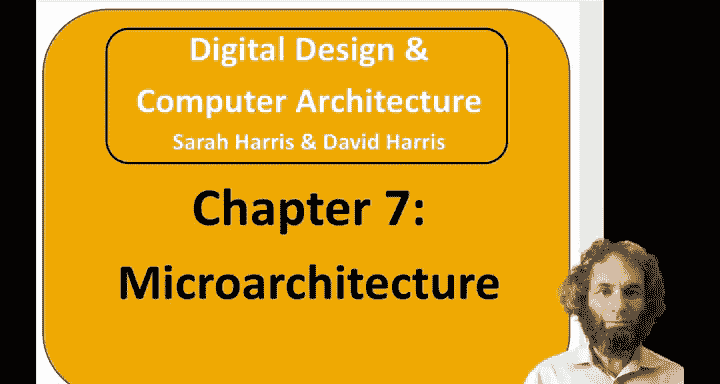
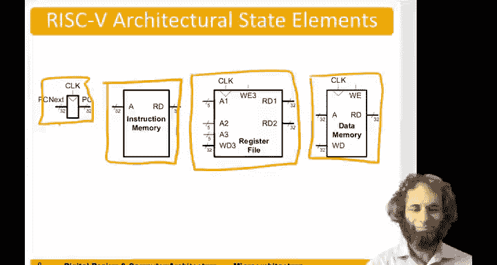

# 数字设计和计算机架构：第七章：微架构导论 🚀

在本章中，我们将把课程的前后两部分结合起来。在第一部分，我们从0和1开始，逐步学习了逻辑设计，掌握了设计ALU、存储器和多路复用器等组件的方法。随后，我们跳转到高级层面，从软件入手，向下探索了计算机架构，即计算机运行的原生指令。现在，我们将在中间汇合，通过**微架构**这个主题将这两条线索连接起来。我们将学习如何将硬件模块组合起来，实际构建一个微处理器。

我们将利用在逻辑设计中开发的所有组件，并以一种能够运行机器语言指令的方式将它们连接起来，从而构建我们的RISC微处理器。

## 性能分析 ⚡

在考察处理器时，一个关键问题是它的速度，因此我们将讨论性能分析。

## 三种实现方案 🔄

我们将探讨RISC-V处理器的三种不同实现方案，即三种不同的微架构。

1.  **单周期处理器**：所有工作在一个时钟周期内完成。因此，时钟周期必须足够长，以容纳最复杂的指令。
2.  **多周期处理器**：我们将指令分解为多个更简单的步骤。这允许每个步骤运行得更快，并且能让我们复用一些硬件。我们将比较其性能与单周期处理器的差异。
3.  **流水线处理器**：之前我们讨论过洗衣的流水线示例，同样地，我们可以重叠执行多条指令，从而大幅提高运行速度。所有注重性能的现代处理器都采用流水线技术。

最后，我们将概述当前处理器中使用的一些高级微架构技术。

## 微架构与架构 🧠

如前所述，**微架构**是在硬件中实现架构的方式。**架构**是程序员看到的机器视图，而**微架构**是硬件设计师的领域。

我们将把处理器划分为**数据通路**和**控制器**。数据通路包含对数据字进行操作的功能模块。控制器则产生控制信号，在正确的时间指示数据通路做正确的事情。

我们将考察同一架构的三种不同实现（微架构）。它们都将执行相同的功能，都是RISC-V处理器，但在运行速度、硬件成本等方面有不同的权衡。

## 衡量速度：程序执行时间 ⏱️

衡量处理器速度的最终标准是运行我们感兴趣的程序所需的时间。

程序执行时间由以下公式决定：
**执行时间 = 程序指令数 × 每条指令平均所需时钟周期数 × 每个时钟周期的秒数**

我们定义：
*   **CPI**：每条指令的周期数。
*   **时钟周期**：也称为 **`Tc`**，是一个时钟周期的秒数。
*   **IPC**：每周期指令数，是CPI的倒数。

我们的挑战是在成本、功耗和性能的约束下，或在成本或功耗约束下获得最佳性能。

## 指令子集 🎯

为了使构建过程易于处理，我们考虑一个最有趣的RISC-V指令子集：
*   **R型指令**：`add`, `sub`, `and`, `or`, `slt`
*   **存储器指令**：`lw` (加载字), `sw` (存储字)
*   **分支指令**：`beq`

我们将构建一个能处理这些指令的处理器。之后，我们会探讨如何添加其他指令，如`addi`或`jal`，但一旦掌握了这些基本指令，其余的都非常相似。

## 架构状态 💾

微架构中的下一个重要概念是**架构状态**。架构状态决定了理解处理器正在做什么所需知道的一切。

想象一下，如果我们记录了处理器的架构状态，就可以像科幻电影中冷冻大脑一样“冷冻”处理器。即使关闭计算机电源，之后当我们恢复架构状态时，处理器也能像之前一样继续运行。

对于RISC-V处理器，我们需要记录的架构状态包括：
*   32个寄存器的内容
*   程序计数器的值
*   存储器的内容

如果我们恢复这些寄存器、内存内容，并将程序计数器设置回原处，程序就会继续运行。因此，任何RISC-V处理器的实现都必须包含这些架构状态：一个程序计数器、一个包含32个寄存器的寄存器文件，以及一个存储器（我们可能会将其分为指令存储器和数据存储器，以分别存放程序和数据）。

## 后续内容预告 🛠️

在接下来的章节中，我们将把这些架构状态与算术逻辑单元等组件连接起来，对寄存器进行操作；使用多路复用器来选择所需的结果；并将它们组合起来构建我们的数据通路。然后，我们将创建一个控制器，在正确的时间向数据通路发出控制信号。

---

**总结**：本节课我们一起学习了微架构的基本概念，它是连接底层硬件设计与上层指令集的桥梁。我们明确了性能的衡量标准（程序执行时间），并预告了将学习的三种处理器实现方案：单周期、多周期和流水线。我们还定义了构建处理器所需的RISC-V指令子集，并理解了关键的“架构状态”概念，它是处理器能够暂停和恢复运行的依据。最后，我们概述了后续将如何通过组合数据通路和控制器来构建一个完整的微处理器。