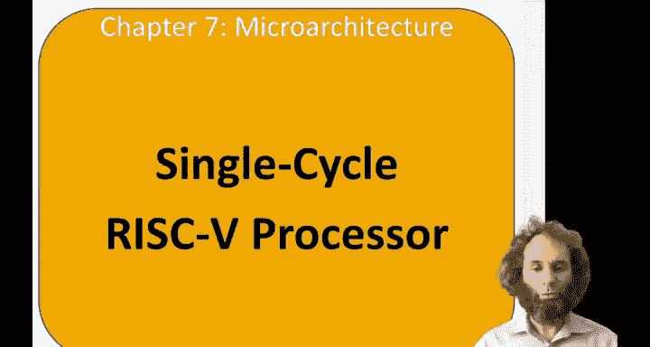
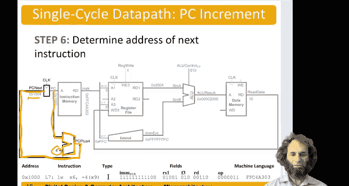

# 数字设计和计算机架构：7.2：单周期处理器数据通路之lw指令 🖥️

在本节课中，我们将学习RISC-V单周期处理器的基本构成，并重点讲解如何为`lw`（加载字）指令实现其数据通路。

## 概述

处理器通常分为两个主要部分：**数据通路**和**控制器**。数据通路主要对32位字（我们计算机的机器字长）进行操作。控制器接收指令，并根据指令内容向数据通路发送控制信号，以指导其执行具体操作。我们将从设计数据通路开始，并逐步构建其处理各种指令的能力。

为了直观地理解数据通路中的操作，我们以一个示例程序作为参考。假设程序从内存地址1000开始，第一条指令是`lw`（加载字）指令。

## 示例程序与指令

以下是示例程序中的几条指令：
1.  **加载字指令**：`lw x6, -4(x9)`
    *   这是一条I型指令。
    *   操作码`op`和功能码`funct3`共同表明这是一条`lw`指令。
    *   源寄存器是`x9`。
    *   立即数偏移量是`-4`。
    *   目标寄存器是`x6`。
    *   其机器码值为`FFC4A303`。
2.  后续指令还包括S型的`sw`（存储字）指令、R型的`or`（或）指令以及B型的`beq`（相等时分支）指令。

一旦数据通路能处理所有这些指令，我们就能运行一个基础程序中的所有关键操作。本节课，我们将从第一条`lw`指令开始。

## 数据通路构建步骤

上一节我们介绍了处理器的基本框架和示例指令。本节中，我们来看看如何为`lw`指令一步步构建数据通路。我们将从处理器的架构状态开始：程序计数器（PC）、指令存储器、寄存器文件和数据存储器。

以下是构建`lw`指令数据通路的关键步骤：

1.  **获取指令**
    首先，将程序计数器（PC）的当前值（例如1000）连接到指令存储器的地址输入端。指令存储器根据该地址读出当前指令的机器码（`FFC4A303`），并将其置于指令总线上。

2.  **读取源寄存器**
    `lw`指令需要一个源寄存器（`x9`）。我们从指令的`rs1`字段（位[19:15]）提取寄存器编号9，并将其送入寄存器文件的读地址端口1。寄存器文件输出`x9`中存储的值（假设为2004）。

3.  **扩展立即数**
    `lw`指令还需要一个立即数偏移量（-4），它编码在指令的位[31:20]中（值为`0xFFC`）。我们需要一个**符号扩展器**将这个12位的值扩展为32位。扩展后的32位值`ImmExt`为`0xFFFFFFFC`（即-4的32位补码表示）。

4.  **计算内存地址**
    接下来，需要将基地址（`x9`的值）与偏移量相加，得到要访问的内存地址。我们使用**算术逻辑单元**（ALU）来完成这个加法操作。将寄存器读出的值（2004）作为ALU的A输入，将符号扩展后的立即数（-4）作为B输入。通过设置**ALU控制线**为`010`（代表加法操作），ALU输出结果2000（即2004 + (-4)）。

5.  **读取数据内存**
    将ALU计算出的地址结果（2000）连接到数据存储器的地址输入端。数据存储器从该地址读取数据，并输出到读数据总线（假设该地址存储的值为10）。

6.  **写回寄存器文件**
    最后，需要将从内存读取的值（10）写回到目标寄存器`x6`。我们将数据存储器的输出连接到寄存器文件的“写数据”端口。同时，从指令的`rd`字段（位[11:7]）提取目标寄存器编号6，连接到寄存器文件的“写地址”端口。并激活**寄存器写使能信号**（`RegWrite`），这样在时钟周期结束时，值10就会被写入寄存器`x6`。

7.  **更新程序计数器**
    至此，`lw`指令的执行几乎完成。但还需要为下一条指令做准备：程序计数器（PC）当前仍指向1000。我们需要一个专用的加法器来计算`PC + 4`（即1004），并将这个值作为`PC_next`，在下一个时钟上升沿将其载入程序计数器，从而指向下一条指令。

## 总结

本节课中，我们一起学习了为RISC-V单周期处理器实现`lw`（加载字）指令数据通路的完整过程。我们逐步构建了从指令获取、寄存器读取、立即数扩展、地址计算、内存访问到结果写回的数据流，并理解了程序计数器如何更新以指向下一条指令。这个过程清晰地展示了数据在处理器各组件间的流动路径，是理解处理器如何工作的基础。在后续课程中，我们将以此为基础，扩展数据通路以支持其他类型的指令。