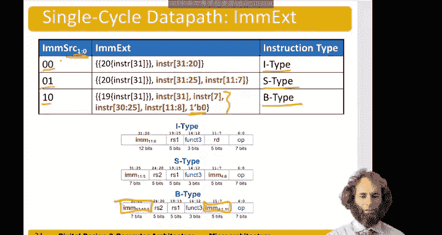

# 数字设计和计算机架构：7.3：单周期处理器数据通路 - 其他指令实现 🧠

在本节中，我们将继续构建单周期处理器的数据通路，重点实现除加载字指令外的其他核心指令，包括存储字、R型运算和分支指令。我们将看到如何通过复用现有硬件并添加少量控制信号来支持这些功能。

---

## 概述

到目前为止，我们已经实现了加载字指令。本节我们将依次实现存储字指令、R型指令（如OR运算）和分支指令（如BEQ）。我们将看到，数据通路的大部分硬件可以复用，关键在于添加正确的控制信号来指导数据流向和运算操作。

---

## 存储字指令的实现 💾

上一节我们介绍了加载字指令，本节我们来看看如何实现存储字指令。

在我们的示例程序中，地址1004处有一条存储字指令 `sw x6, 8(x9)`。这是一条S型指令，其结构与I型指令类似，但立即数字段位于指令的不同位置：低5位在指令的底部，高7位在指令的顶部。操作码表明这是一条存储指令，源寄存器x9作为基地址，源寄存器x6包含要存储的值。

机器码为 `0x0064a423`。硬件操作流程如下：
1.  程序计数器指向1004，从指令存储器中读取该指令。
2.  指令被送入寄存器文件和符号扩展器。
3.  寄存器文件根据指令中的 `rs1` 字段（值为9）读取寄存器x9的内容（假设为2004），并根据 `rs2` 字段（值为6）读取寄存器x6的内容（假设为10）。
4.  符号扩展器需要从指令的正确位置提取立即数（值为8）。我们引入一个名为 `ImmSrc` 的控制信号来指示符号扩展器应提取哪种类型的立即数。对于S型指令，`ImmSrc` 设为1。
5.  源A（寄存器x9的值）和源B（符号扩展后的立即数）被送入ALU，ALU执行加法运算：`2004 + 8 = 0x200C`。
6.  计算结果作为地址送入数据存储器。从寄存器文件读取的值（10）作为写入数据送入数据存储器。
7.  我们引入一个新的控制信号 `MemWrite`。当其为真时，数据存储器将在时钟上升沿将数据（10）写入指定地址（0x200C）。
8.  数据存储器也会输出读取的数据，但由于当前是写操作，我们忽略该输出。通过将寄存器文件的写使能信号 `RegWrite` 设为0，我们确保不会将无用数据写回寄存器。

以下是实现存储字指令所需的新增硬件和控制信号：
*   修改符号扩展器，使其能根据指令类型从不同位置提取立即数。
*   新增控制信号 `ImmSrc`，用于指导符号扩展器。
*   新增控制信号 `MemWrite`，用于控制数据存储器的写入操作。
*   需要从寄存器文件读取第二个源操作数的值。

与此同时，程序计数器加4的逻辑照常工作，因此下一条指令地址变为1008。

---

## 立即数格式详解 🔢

在深入下一条指令前，让我们进一步了解立即数格式。目前我们已涉及两种立即数类型：
*   **I型立即数**：当 `ImmSrc = 00` 时，从指令的 `[31:20]` 位提取12位立即数，并进行符号扩展。
*   **S型立即数**：当 `ImmSrc = 01` 时，立即数由指令的 `[11:7]`（低5位）和 `[31:25]`（高7位）两部分拼接而成，然后进行符号扩展。

---

## R型指令的实现 ⚙️

现在程序计数器指向1008，该地址的指令是 `or x4, x5, x6`。这是一条R型指令，其操作码标识R型指令，`funct3` 和 `funct7` 字段共同指定具体的OR操作。源寄存器是x5和x6，目的寄存器是x4。

所有R型指令的硬件需求相同，区别仅在于 `funct3` 和 `funct7` 字段，这些字段将决定ALU执行何种运算。

硬件操作流程如下：
1.  从指令存储器读取指令 `0x0062e233`（OR指令）。
2.  指令被送入寄存器文件，读取寄存器x5（假设值为6）和寄存器x6（假设值为10）的内容。
3.  对于R型指令，ALU的第二个操作数应来自寄存器文件，而非立即数。因此，我们在ALU的B输入前添加一个多路选择器，由控制信号 `ALUSrc` 控制。`ALUSrc=0` 时选择寄存器文件输出，`ALUSrc=1` 时选择立即数。此处设为0。
4.  ALU根据 `ALUControl` 信号（对于OR操作，设为 `01`）执行运算：`6 OR 10 = 14`（二进制 `1110`）。
5.  运算结果需要写回寄存器文件。在加载字指令中，写入数据来自数据存储器。现在，我们需要将ALU的结果写入寄存器。因此，我们在寄存器文件的写入数据输入前添加另一个多路选择器，由控制信号 `ResultSrc` 控制。`ResultSrc=0` 时选择ALU结果，`ResultSrc=1` 时选择数据存储器输出。此处设为0。
6.  将 `RegWrite` 信号置为真，将值14写入目的寄存器x4。

程序计数器同样加4，准备执行下一条指令。

---

## 分支指令的实现 🔀

最后，我们考虑实现相等则分支指令。为此，我们需要计算分支的目标地址：`PC目标地址 = 当前PC值 + 偏移量（立即数）`。

假设在地址 `0x100C` 处有一条指令 `beq x4, x4, label7`（label7指向程序开头）。这是一条B型指令，`rs1` 和 `rs2` 都是x4，操作码和 `funct3` 表明是BEQ指令。立即数字段编码了分支目标偏移量，其位分布较为特殊。

硬件操作流程如下：
1.  从指令存储器读取BEQ指令。
2.  从寄存器文件读取寄存器x4的值两次（假设均为14）。
3.  通过减法比较这两个值是否相等。设置 `ALUSrc=0` 使两个操作数均来自寄存器文件，设置 `ALUControl=110`（减法）。`14 - 14 = 0`。
4.  ALU会生成一个名为 `Zero` 的标志位。当减法结果为0时，`Zero=1`，表示两个寄存器值相等，应进行分支。
5.  接下来计算分支目标地址。B型指令的立即数字段经过特定编码（例如，可能代表-12）。符号扩展器需要支持这种新格式。我们扩展 `ImmSrc` 信号为2位，并定义 `ImmSrc=10` 对应B型立即数。符号扩展器需对立即数位进行重组和符号扩展。
6.  我们添加一个专用的加法器来计算目标地址：`PC + 符号扩展后的立即数`。例如，`0x100C + (-12) = 0x1000`。
7.  现在，下一条PC地址有两种可能：常规的 `PC+4` 或分支目标地址 `PC target`。我们添加一个由 `PCSrc` 信号控制的多路选择器。当需要分支时（`Zero=1`），`PCSrc=1`，选择 `PC target` 作为下一个PC值。本例中，选择 `0x1000`，程序跳转回开始处。

---

## 总结

本节课中，我们一起学习了如何扩展单周期处理器的数据通路以支持存储字、R型运算和分支指令。关键点在于：
1.  通过复用ALU、寄存器文件等核心部件，并添加关键的多路选择器（如 `ALUSrc`, `ResultSrc`, `PCSrc`）来控制数据流向。
2.  引入并扩展控制信号（如 `ImmSrc`, `MemWrite`, `ALUControl`）来精确指导不同指令的执行。
3.  符号扩展器需要支持I型、S型和B型三种立即数格式。
4.  通过 `Zero` 标志位和 `PCSrc` 信号共同实现条件分支逻辑。

现在，我们的数据通路已能处理加载字、存储字、R型运算和分支指令这些基本指令类型，构成了一个功能完整的处理器核心。