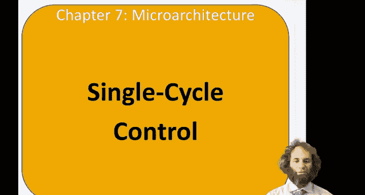
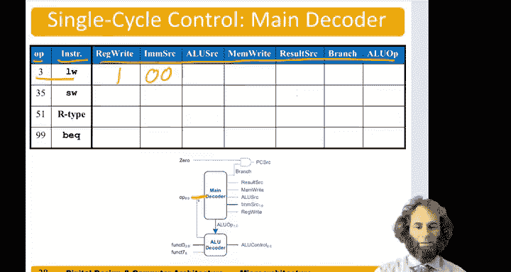
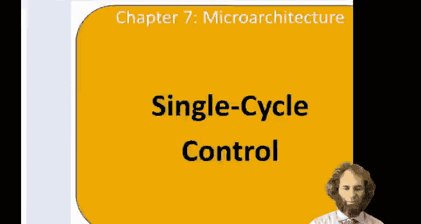
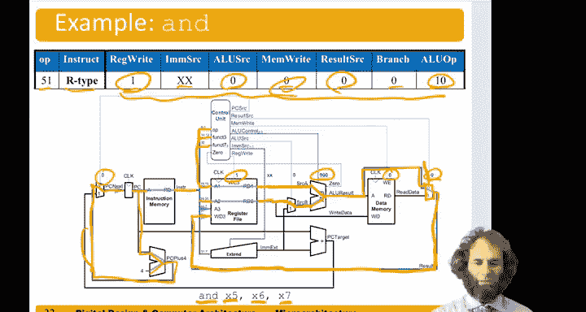

# 哈维穆德学院《数字设计和计算机架构RISC版｜Digital Design and Computer Architecture： RISC-V Edition》 - P97：Chapter 7 4.Single-Cycle Processor Control.zh_en - GPT中英字幕课程资源 - BV1JC1MY1E7F

Hello， in this video， we'll design the controller for the single cycle processor。

So let's take a look back at our data path。Datapath began with the。Architectural state。

 the program counter， the Reg file and the instruction and data memory。To that。

 we added an ALU to do the math。He added a sign extender to get the immediate。

We added a couple adders。For PC plus 4 and PC plus branch offset。And then we added some multiplexors。

To choose among possible inputs。That gives us the black data path。

The data path receives some blue control signals from a controller to tell it what to do。For example。

 the data path needed right enable signals。For the memories。

It needed an ALU control signal for the ALU。And it needed multiplexy enables。For the sign extender。

And the various multiplexors。So the job of the controller is based on the instruction we're executing to produce the appropriate control signals。

So let's take a look at how to do that。So at the high level， the controller。Texan。The instruction。

And in particular， it needs fields， the op code， the funt 3 field。

 and at least bit 5 with the funnc 7 code to tell whether we're doing the add or subjecttract。

It also needs the zero flag coming from the ALU to tell us whether branch should be taken。

The output of the controller。Are the right enable signals， red write and memory to the two memories。

The A L U control say not tell the A L U what to do。And the multipls selects PC source， Reg source。

 A U source， an immediate source to tell the other parts of the data path。Our we value is to select。

So。Let's break this controller down。Into a lower level。Into three pieces， a main decoder。

That just looks。At the op code。Figures out what type of instruction it is are type by type， S type。

 et cetera。And provides most of the control signals。And A L， U decoder。

That looks at the type of AU instruction， the type of R type instruction。

And generates the appropriate AU control。And then PC source logic that looks when we're doing a branch。

And。The result is 0， so values are equal。 Then tell us that we should do the branch。

So we'll design each of these three blocks and turn。Let's start with the main decoder。So。

 the main decoder。Took in the instruction field here， which is op。

And it needs to put out all of these different control signals。So for a load word。The Opus 3。

Load Word puts an answer into the register file， so registerr should be one。

It's an eye type construction， And we might remember that the immediate source for an eye type。Was 0。

0。The Aileus source。We want to select our second source from the。

From the immediate。

And looking back here。To chooseose the second source。

 source B from the immediate A U source should be one。A load word does not write to memory。

 so memory rate should be 0。Though the word takes the result。From here。

 so result or source should be one to take the load value that we read from memory。

Lad word is not a branch in destruction。So we'll make branch0。And now we need an ale U op。

AL U op is going to come from the main decoder， and it will tell the A decoder to either add。

 subtract or look at the function fields。So for Lo， we need to add。

 let's make AU off be 00 to indicate net。Next， look' silk at store。So， for a store word。

Star Word does not write anything to the register file it just writes to memory， so redrite will be0。

 but memoryite will be one。A store word was an S type instruction。

 and we might remember that IMM source should be 0。

1 to choose the immediate appropriately for S type。ALU source。Is one again。Because， once again。

We want to choose source B from the immediate。AReult source doesn't matter because we're throwing away the result or just writing to memory not to the register file。

This is not a branch。And once again， ail you up to 0 to tell us to add the base address to the offset。

For an our type instruction， our type instructions do right to the register file。

 so redWrite should be one。IMM source， well we're not using the immediate。

 so it doesn't matter what IMM source is。ALU source this time we're taking our。Second source。

From the register file， so ALU source should be 0 instead。

Memite is zero because our type instructions don't write to the memory。Result source。This time。

 we wanna choose our result from A L U result。So result source should be 0。

Our type instructions are not a branch。And the ALU up。

 let's make it 10 tell the AU decoder to look at the function field。

And we'll design the ALU decoder in more detail shortly。Next for a branch。

A branch does not write to the register file nor to memory。 so both right enables are0。

The branch takes a B type immediate， so IMM source is 10 to select the immediate appropriately。

ALU source second source should come from the register file， so just like an our type ALU source is0。

Our result source。Reult source， we are not using the result， so it doesn't matter what it is。

Branch is now one because this is a branch instruction and AL UO。

 we need to subtract the two registers to compare them， so let's make A UO 01 to indicate subtract。

So now let's go back and review the ALU for a moment。A you control of 0，0，0， and add。0，0。

1 meant subtract 0，1，0 for and，0，1，1 for or and 1，1，1，0，1 for set last。And here was our A L U。

With these different。Where we built it。Was we had an adder。An hand gate。And at wargate。

So to do an addd， we just take a。We pass B through。So AU control zero needed to be zero。And。

We do A plus B。Choose that result zero because AU control is 00，0， and we get out a+ B。For a minus B。

 L you control bit 0 as a1。 So this mugck chooses not B and puts in a carry of one。To the adder。

So we do a plus B bar plus1， which remember means subtraction。

We get out of answer alien control is 001， so we do a minus B。For and。嗯。We're doing。A and B。

Compute that and wouldn' it。Hail you control is 010， which is the end for 011， which is or。For set。

 less than we do a subtract。Because。The least significant bit is1。

 so we're doing a plus B bar plus1 is a minus B。We look at the most significant bit， which is。

Theign bit telling us if we're negative。So on set Le than， when the result is negative。

 we want to put that into the least significant bit。Of the answer。

And make all the other bits 0 because if a is less than B set less than。是。1。

 and if a is not less than equal to B。That should produce zero。

So this custom block takes to some bit， fills all the other bits with0， and we when A control is 101。

 we choose that answer accordingly。So now let's look at the AU controller。A little further。

 it takes the ALU up saying what whether to add subtract or look at the function of bits。

And it takes the function bits， and it needs to produce that appropriate ALU control signal。

So when A U up is 0，0， that meant always add。Doesn't matter what the function bits are。

 I we do this for loads and stores。We want AU control to be 0，0，0。For an nail you up of 01。

That is Subtract。We use that for branch unequal， doesn't matter what the function bits are and produce subtract。

When A up is 10， that means we need to look at the instruction。So if the funct field。Weiz。😔，0， zero。

 zero。This means we're doing a subtract。Sorry， 000 means we're either doing an ad or subtract。If。

Up 5 and the fifth bit of function 7 are both one。Then it's a subtract。That's a little convoluted。

 but you can figure that out by looking at the encoding instructions in table B。

So if you' subjecttracted， AU control should be 01。

For any other combination of op and funct we want to add。

The others are more straightforward when from three， it is two， we want to do a set less than。

 one of six， we want to do an or， one of seven， we want to do a set lesston。And。Here are the。

And serious。That would come out of A control。So AU control is a block of combinational logic。

It has inputs。 A you up。Here。Fhump 3， and they op。Here。And based on those inputs。

 it computes A U control。Which are these outputs。This column doesn't actually mean any hardware。

 It's just here to help us understand what instruction we're looking at。

And you can use any technique you like for designing combinational logic based on some inputs。

Do design this stuff。So let's take a look at an example of the and instruction。For doing an end。

X 5 gets x 6， and x 7。The op code for and is 51。 that indicates that it's an our type and instruction。

So the ALU， sorry， the main decoder puts out the control signals like we talked about， Ri write is1。

Immediate source is doesn't care。 A U source of 0， memory of 0， Ri source of 0。

 branch of 0 an A U hop of 1，0 from that truth table we built a couple minutes ago。

Let's take a look at the operation the program counter comes out of the。valueue。

ItGo into the instruction memory to fetch the instruction， which is theant。The hand。The two sources。

 x6 and x7。Put those addresses into the register file and we read out the contents of Registers x697。

Meanwhile， we send the instruction up to the control unit。And based on that。

 it produces all of these control signals like re asked。嗯。X 6 goes straight to the ALU。

 X 7 goes to the source B multixer。Because A U source is 0，0， you choose。嗯。X 7。

 instead of an immediate as the second source。Now， the A U。

Gets an ALU control of 000 from the ALU decoder because ALU up was 10 and the instruction said do an and。

We compute x7 and x6。Get our result。And the result multiplex here。Is receiving。Result source of。0。

Telling us， choose this result。From。The area you。result comes around。

And it goes to the register file。And。Rdge right is one。

Telling us to write the result of the and into the register file。Memite is 0。

 so we don't write anything to the memory。Branch is 0， so we don't want to do a branch。

So we have PC plus 4。Comes around。And because branch was 0。PC source will be 0。

And will choose this PC plus 4 has our next PC。

