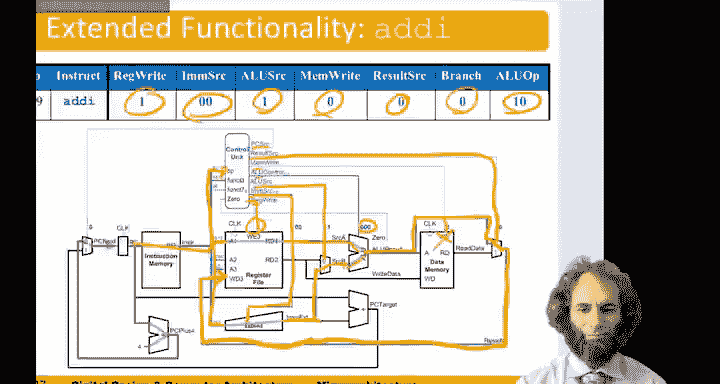
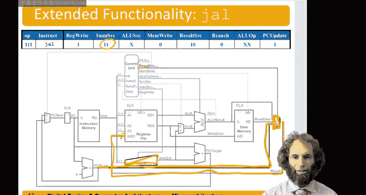

# 数字设计和计算机架构：7.5：单周期处理器扩展 🚀

在本节课中，我们将扩展单周期处理器，使其能够处理更多的RISC-V指令。我们将重点学习如何添加“立即数加法”和“跳转并链接”这两条新指令。通过这个过程，你将理解扩展处理器功能的核心方法：分析新指令的功能，找出与现有数据通路和控制器的差异，并进行相应的微小修改。

---

## 立即数加法指令

上一节我们介绍了处理器如何处理基本的R、I、S、B型指令。本节中，我们来看看如何添加“立即数加法”指令。

“立即数加法”指令类似于R型加法指令，但其第二个操作数来自指令中的立即数字段，而非寄存器文件。因此，我们可以复用大部分现有的数据通路。

主要区别在于，ALU的第二个输入源需要选择来自立即数扩展器，而非寄存器文件。这要求我们修改控制信号 `ALUSrc` 和 `ImmSrc`。

以下是主译码器真值表的更新。黑色部分是我们已为现有指令构建的逻辑，现在需要为“立即数加法”指令添加新的一行。

*   **Opcode**: `0010011` (I型指令)
*   **RegWrite**: `1` (需要将结果写回寄存器文件)
*   **MemWrite**: `0` (不访问内存)
*   **ResultSrc**: `0` (结果来自ALU)
*   **Branch**: `0` (非分支指令)
*   **ALUOp**: `10` (需要查看 `funct3` 字段以确定具体操作)
*   **ALUSrc**: `1` (关键区别：ALU第二个操作数选择立即数)
*   **ImmSrc**: `00` (关键区别：将立即数按I型指令进行符号扩展)

现在，让我们在数据通路中追踪“立即数加法”指令的执行流程：

1.  程序计数器指向指令。
2.  控制单元根据指令生成控制信号。
3.  寄存器文件读取源操作数1 (`rs1`)。
4.  立即数字段被送至符号扩展器，按I型格式扩展。
5.  由于 `ALUSrc = 1`，多路选择器选择扩展后的立即数作为ALU的第二个输入。
6.  由于 `ALUOp = 10`，ALU控制单元根据指令的 `funct3` 字段生成控制信号 `000` (代表加法)。
7.  ALU执行 `rs1 + 立即数` 运算。
8.  由于 `ResultSrc = 0`，结果多路选择器选择ALU的输出。
9.  由于 `RegWrite = 1`，运算结果被写回目标寄存器 (`rd`)。
10.  `MemWrite` 和 `Branch` 信号均为0，确保不进行内存写入或分支跳转。

总结“立即数加法”指令的添加过程：我们只需在主译码器中添加一行，其控制信号与R型指令行基本相同，仅需修改 `ALUSrc` 和 `ImmSrc` 两个信号，以选择立即数作为第二个操作数。

---

## 跳转并链接指令

处理完相对简单的“立即数加法”后，我们来看看一个更具挑战性的指令：“跳转并链接”。这条指令与我们目前处理的指令差异较大，但仍有相似之处可循。

它与“不相等则分支”指令类似，但存在三个关键区别：
1.  跳转总是发生，而非条件跳转。因此，我们需要确保 `PCSrc` 信号在跳转指令时为1。
2.  立即数的格式不同。`jal` 是J型指令，我们需要增强符号扩展器以处理这种新的立即数格式。
3.  `jal` 指令需要计算 `PC + 4`（返回地址），并将其存入目标寄存器 (`rd`)，以实现链接功能。我们已有硬件计算 `PC + 4`，但需要将其作为新的输入提供给结果多路选择器。

以下是实现“跳转并链接”指令所需的修改：

**1. 修改PC源逻辑**
我们需要确保在执行跳转指令时 `PCSrc = 1`。在原分支逻辑（`Branch & Zero`）的基础上，增加一个或门，当指令为跳转时，也输出 `PCSrc = 1`。
公式表示为：`PCSrc = (Branch & Zero) | Jump`

**2. 扩展立即数生成单元**
为符号扩展器添加处理J型立即数的功能。当 `ImmSrc = 11` 时，扩展器需按J型指令格式重组立即数字段：
*   将指令中的 `imm[20|10:1|11|19:12]` 位重新排列。
*   最低位补0（因为指令地址总是字对齐的）。
*   进行符号扩展。

**3. 更新主译码器**
为操作码 `1101111` (对应 `jal`) 添加新的一行。
*   **RegWrite**: `1` (需要将返回地址 `PC+4` 写入 `rd`)
*   **ImmSrc**: `11` (按J型指令处理立即数)
*   **ALUSrc**: `X` (无关项，因为ALU不参与此指令的核心操作)
*   **MemWrite**: `0`
*   **ResultSrc**: `10` (关键区别：结果选择 `PC + 4`)
*   **Branch**: `0`
*   **ALUOp**: `XX` (无关项)
*   **Jump**: `1` (新增信号，用于控制PC源逻辑中的或门)

**4. 修改结果多路选择器**
为结果多路选择器增加一个新的输入端口，其输入为 `PC + 4`。当 `ResultSrc = 10` 时，选择此值作为结果写回寄存器文件。

将这些修改整合到数据通路中后，`jal` 指令的执行流程如下：
1.  控制单元识别出 `jal` 指令，生成相应的控制信号，特别是 `Jump = 1` 和 `ResultSrc = 10`。
2.  `Jump` 信号使 `PCSrc = 1`，下一条指令的地址被更新为跳转目标地址（由扩展后的J型立即数与当前PC计算得出）。
3.  同时，`PC + 4` 的值被结果多路选择器选中。
4.  由于 `RegWrite = 1`，`PC + 4` 这个返回地址被写入目标寄存器 `rd`。

总结“跳转并链接”指令的添加，我们主要做了三处修改：
1.  在 `PCSrc` 生成逻辑中增加了一个或门，以支持无条件跳转。
2.  扩展了立即数生成单元，支持J型立即数格式。
3.  为结果多路选择器增加了 `PC + 4` 输入，用于提供返回地址。

---

## 课程总结 🎯

本节课中，我们一起学习了如何扩展单周期处理器的指令集。我们通过添加“立即数加法”和“跳转并链接”两条指令，演示了处理器扩展的通用方法：
1.  **理解指令**：明确新指令要完成的功能。
2.  **对比现有通路**：找出新指令与处理器已有功能之间的异同。
3.  **最小化修改**：通常只需在控制逻辑（真值表）中添加新行，并可能对数据通路进行微小调整（如增加多路选择器输入、扩展功能单元）。

核心在于，许多新指令可以共享大部分已有的硬件资源，只需通过控制信号进行不同的配置。这种模块化设计思想是计算机架构的核心之一。