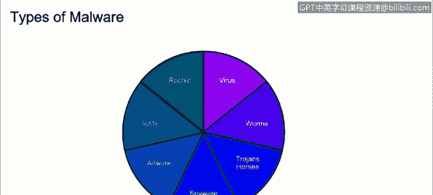

# IBM网络安全分析师专业证书课程1：《网络安全工具与网络攻击简介课程（IBM）》introduction-cybersecurity-cyber-attacks - P103：29_01_malware-and-ransomware.en_subtitled - GPT中英字幕课程资源 - BV1c84y1Z7Dp

Yes。In this video， you will learn to describe and define the term malware。

Describe the various types of malware， including ransomware malware。

 some of the questions that we're going to try to answer are what is malware。

 that was a malware and how do we protect from it？

The first thing that we're going to do is to define it。

Maicious code or MaW its any on desire or unized software running on a host either to disrupt operations or to use the host resources for its benefits。

 recent malware attacks attempt to remain hidden on the host using resources for potential uses such as launching the other service attacks。

 hosting illicit data， escheming personal or business information。Types of modelware。

 there are many forms of mywear out there with certain features， associated with a virus。

 which is a piece of a malicious code that spreads from one computer to another by attaching itself to other files using self replication。

Note that it require human interaction to self replicate。

Due to itself self replicating nature they are quite difficult to remove from a system。

 they also use our tactics to higher the system like polymorphic code which encrypts and duplicates itself。

 which makes it a little bit harder for the antivirus to find this is known as a polymorphic virus。

 other category that it's an armor virus which tries to shield itself by obscuring the true location in the system and its code makes it harder to a reverse engineer to create signatures for it。

Now we have worms。Warms are it's a self repulating Myware does not require human interaction。

 Their main goal is to just spread and cripple resources are turned computer into zombies。

Ttrojan horses also know as Trojans is hitting mal where that causes damage to assist or gives an attack access to the hose。

They are usually introducted into the environment to a computer by posing as a vending package such as a game。

 wallpaper， or any kind of download。Spyway。The main goal of Sp is to track and report the usage of the hose or to collect data that the attacker desires to obtain can include web browsing history。

 personal information， monkey information， any kind of files that the attacker wants to chase。

Then we have addway。Award code that automatically displays or downloads unsolicited advertisements usually seen on a browser pop up。

Rats。It stands for remote access tool or remote access Trons。

 rats allow an attacker to gain unor access and controller computing。Lastly， we have a root kit。

Is a piece of software that is intended to take full or pressure control of a system at the lowest level。

Now we have ransomware。 We all hear about it ransomware， but what really is ransomware。

 it's somewhere with an inect a host with a code that restricts the access to the computer or the data on it。

The attacker demands are ransom to be paid to get the data back if it's not paid in an amount of time the data will be destroyed on the right。

 we can see the banner where the ransomware takes control of the host asking for payment with a timer the most recent spread cure of May 2017 with a one aree ransomware。

If you wish to learn more on how to respond against ransomware attacks。

 please check the link that it includes topics such as how can you protect your critical information and resources。

 how to identify the specific variant of ransomware？

And how to contain and remove the ransomware from infected systems。

