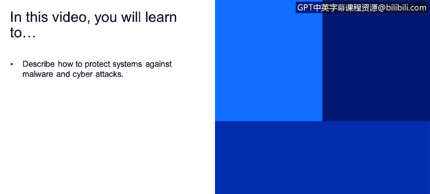
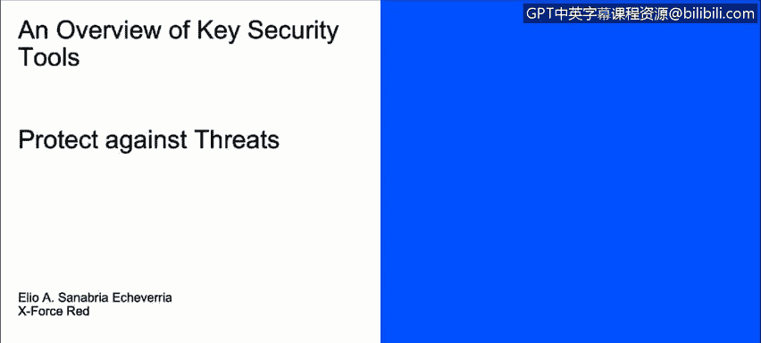

# IBM网络安全分析师专业证书课程1：《网络安全工具与网络攻击简介课程（IBM）》introduction-cybersecurity-cyber-attacks - P105：31_03_threat-protection-defined.en_subtitled - GPT中英字幕课程资源 - BV1c84y1Z7Dp

Yes。In this video， you will learn to describe how to protect systems against malware and cyber attacks。

We spoke about malware and the things that they do。 Now。

 let's talk a little bit of how do we protect against them。

How can we protect， How can we protect us We have。Technical controls。

 Tech controls are the hardware or software that are that are8 intoproect and information。

Which may include antivirus。Which is kind of files for executable code and much of signatures that are known viruses。

We also have interdepo systems， internal detection systems and unified trade management systems。

 those are systems that can look for tax signatures in progress indicate of a compromise on the environment。

 each implementation is unique and it depends on the organization's security needs。

Then we have updates。With all the software deployed。

 we need to stay up to date to prevent creating new holes into our security。

 this is done by applying the security patches。Then we have operational controls。

 also known as administrative controls。They are put in place by management and depends on the staff on complying in order to be effective。

One of those controls are policies。So policies， it's a written document issued by an organization to ensure that all its users。

Comply with the rules and guidance related to security。An example could be a password。Policy。

 which the enterprise requires a minimum of 15 characters with at least one especially symbol。

 Then we have trainings training is to make sure that users of organization are aware of its policies or threats out there。

An example could be a switch engineering training。How it shows the user。

 it shows the user how to deal with the social engineering attacks。And lastly。

 we have revision and tracking revision and tracking。

 it means ensuring that the items that we just mentioned is stay up to date。

