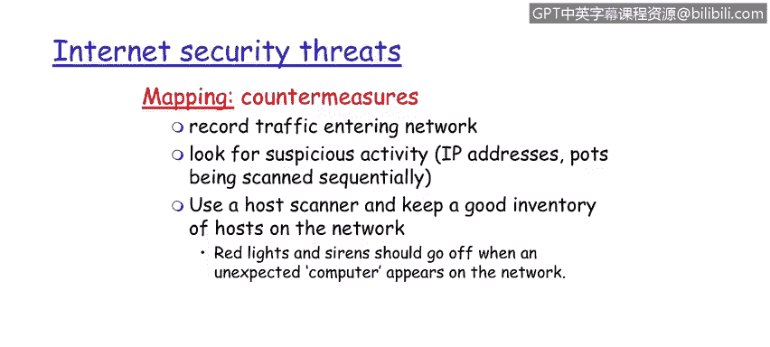

# IBM网络安全分析师专业证书课程1：《网络安全工具与网络攻击简介课程（IBM）》introduction-cybersecurity-cyber-attacks - P106：32_01_internet-security-threats-mapping.en_subtitled - GPT中英字幕课程资源 - BV1c84y1Z7Dp

Yes。In this video， you will learn to describe how network mapping or casing the joint is used by bad actors。

 what commands are used and what information is commonly gathered。

Describe the countermeasure that can be used against mapping threats。

Now let's take a dive into specific security threats against internet based enterprises。

One of the first ones we'll take a look at today。Herere in slide 12 is the idea about network mapping。

So this is basically casing the joint where our adversaries will scan。The network。

 they'll find out what devices are on there， what services， what protocols。

Are on the network using pin commands， right， there's also other tools like NMap to determine what hosts are on the network and what their addresses are。

Certainly port scanning。Is comes into play， and we talked about Nmap a little bit earlier。

 which is a network exploration tool。 So one of the questions is， given this problem set。

Of our adversaries。Scanning our network and looking for houses essentially getting the topography of that。

 what can we do and take a look at recording network traffic， entering the network。

Looking for suspicious activity， IPp addresses。Ports being scanned， sequentially， by the way。

 these are network anomalies that。Good seas like Q radar will be able to pick up and create an alert。

We can also use a good host scanner， for example。As that founding Q radar。

 keep a good inventory of the hosts on the network。 What， What would that do for us Well， by by。

Good asset management， by the way， which is needed for patch management at a minimum。

 We can create a white list or a list of authorized devices by Mac address that are allowed on the network。

So that we can。If there's。Additional activity and other hosts that get puts on play。

 we will know this because it'll be a white list violation。

