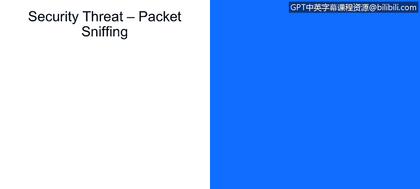
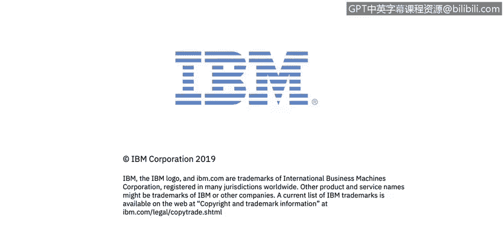

# IBM网络安全分析师专业证书课程1：《网络安全工具与网络攻击简介课程（IBM）》introduction-cybersecurity-cyber-attacks - P107：33_02_internet-security-threats-packet-sniffing.en_subtitled - GPT中英字幕课程资源 - BV1c84y1Z7Dp

Yes。In this video， you will learn to describe packet sniffing and how it can be used to gather information about your network。

Describe the countermeasure you can deploy to safeguard against packet sniffs packet sniffing。

 which is another predominant Internet security threat。

 So this is a broadcast style where it uses broadcast methods， for example， such as UDP。

The network interface card the NIC by definition。Reads all packets that are passed by。

When it's in the promiscuous mode。It can read all in unincrupptted data so that if the password is sent in the clear。

 for example， like we tell that。Wr a niIC card that's in promiscuous mode will pick that up。

We'll take a look at this diagram here on slide 14， and we see client B communicating with client A。

The payloads， rather the field headers and the IP package talks about the source as being the B。

 the destination being A and the payload well， client C。Running in promiscuous mode。

Note we'll be able to detect all of that information。

So how do we conduct countermeasures against this？One countermea for packet sniffing is that all of the host。

 all of the computer clients， plus the computer network services like servers and routers and Switch run software that check periodically if that host interface is in a promiscuous mode。

 So as you can see that Nick card promiscuous mode is the dangerous element。

Right so and basically we also have the setup， there only one host per segment。

Of the broadcast media， which is either switchedther not at the home。

 so the diagram once again on the bottom of page 15 shows the threat and the opportunity for client C to pick up message traffic between DNA when it's in a promiscuous mode。

