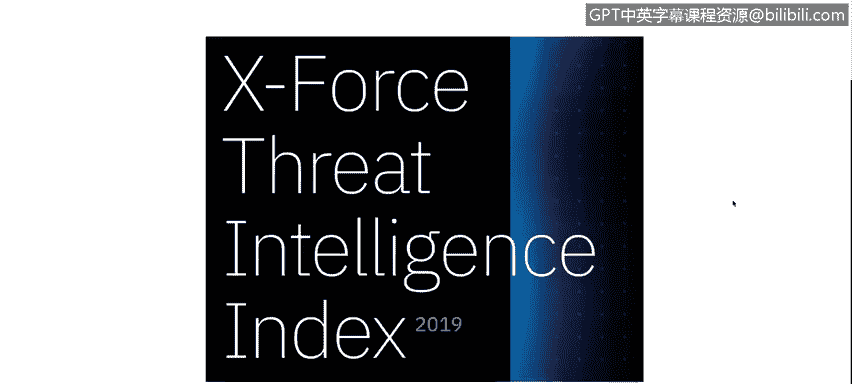

# IBM网络安全分析师专业证书课程1：《网络安全工具与网络攻击简介课程（IBM）》introduction-cybersecurity-cyber-attacks - P10：9_当今网络安全.zh - GPT中英字幕课程资源 - BV1c84y1Z7Dp

Yes。In this video， you will learn to describe how cyber vulnerabilities after 9/11 have been weaponized by governments and exploited by criminals and how rapidly the problem is growing as our reliance on the digital world continues to increase。

A couple of other things， especially for the 911， The important part here to understand is that the new Freedom Act was the key part to start the mass reilance programs that I Snowden reveals a couple of years ago。

 And this fact it attacked the 911 was the cornerstone to。To start the new cyber war。

 the new cyber arena award that， for example， we're not going to talk a lot about that。

 but there is an attack call or a virus actually called the Stuxnet that was delivered into the Iran nuclear plants。

And that that process， that virus， that Trojan was created。

Supposedly by United States and Israel into or using one operation call Olympic Games。

 but that kind of things happen because 911 because United States or the US government wants to not just understand what is happening into the cyberber world but also prevent and try to stop wars in the real world doing things on the cyber first。

 so that's the Stnet was an example of that。

Here are some numbers。I think that is important to understand cybersecurity numbers。

 Here is 2017 numbers。 obviously， since we have the report for 2017。

 the numbers that we have on that report are from to 16 to 216。2016。

 sorry so basically we have a lot of software vulnerabilities。 We have things like， for example。

 crci scripting。 we have SQL injections。 We have local file privilege or we have privilege escalations on software。

 We have local and remote file uploads that goes or try to create access or backdoors into the systems。

 So year by year， we have an exponential increase of that software vulnerabilities。

 even if companies try harder to fix those vulnerabilities detect and correct those vulnerabilities。

 We have a lot of vulnerabilities in software。 Actually。

 we are going to see a couple of news slides on the new export threat intelligence index report that we have for this year。

Also， some numbers。 those numbers came from Forbes and the study that Forbes。

Developed on the year 2016。For cyber attacks， we have almost 400 billions of losses on year basis around the globe。

 so between the denial of service between data lake between nationstate attacks。

 there is a lot of money lost in cyber attacks。 The cyber crime is a business is a 100 billion business only in the United States。

 there is a lot of money on the cyber war and the cybercr。

 it's trying to take advantage of the use or not use of protections for the users that actually goes into the internet and tries or buys things perform things on their computers。

And data lost 2。1 billion onto on this year。 That's the project that Forbes generate on。

2016， and for the export trade intelligence index， Here is a link to download the latest report。

 But let's take a look into the report。 Let's take a look into。

The first report for this year， let's go to page number 16。

This report is actually pretty good。 So I recommend。

 I recommend this report for actually everybody that wants to understand the current cybersecurity status of the year or quarter or something。

 So， first of all， we have the most frequently target industries in 2018。Obviously。

 we have finance and insurance。 Why， obviously， because there is a lot of money there。

 there is a lot of people that。Does not necessarily protect their accounts or their systems into the financial and insurance ward。

 but there is a couple of other interesting industries also， for example， the healthcare。

 we have 6% of the targets was healthcare institutions in 2018 we have energy that's something important because with the in a couple of minutes we are going to talk about one example in Ukraine。

 but there is a lot of malware， a lot of tools that hackers use to target energy industries or energy energy infrastructure。

 so that's something important。Let's go to page number 23 on 23。

 we are going to see the same numbers that we saw regarding vulnerabilities over the year。

 But with the update for 2018。 So we have。Pretty huge increase in the number of vulnerabilities。

 And that's something obvious because normally when in the past we use couple of systems。

 we didn't actually use， for example，15 years ago， we don't use Twitter， We don't use Instagram。

 we don't use web application。 don't use mobile applications。 but now we use a lot。

 we have a lot of information。 We have a lot of systems。

 a lot of platform platforms on our smartphone。 So if we have a software。

 if we have an application in our smartphone in our computer。

 there is a chance that that application， that software may came with a lot of vulnerabilities。

 Not necessarily discover vulnerabilities or things that the attackers already know。

 but there is a big chance that those applications came with a lot of box and a lot of things to be worried about。

And the last one on page。28， we have the Maicious domain categories category is blocked by Quad 9。

 A lot of urls that are blocked right now in our systems and our infrastructure and our Utms or farwalls are related to spam。

So we have a  77% of URLs are span， but there are also a lot of cyber crime。

 a lot of computer crime and hacking8%， then we have 5% for malware and fishingish and 4% for Butnet command and control servers。

 we are going to talk about each of those topics in the following videos on this course。

So， on that。There is a lot of information on this report。 I recommend。

 I highly recommend that you download and read a report， almost 30 page，35 page of reports。

 So that's good information。 That's something important to understand。

