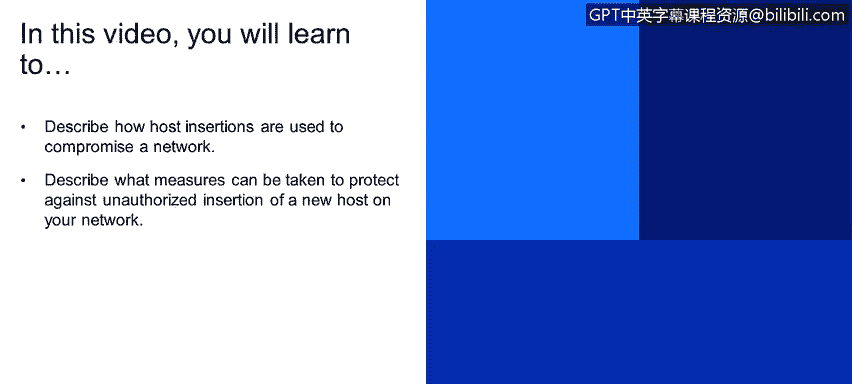
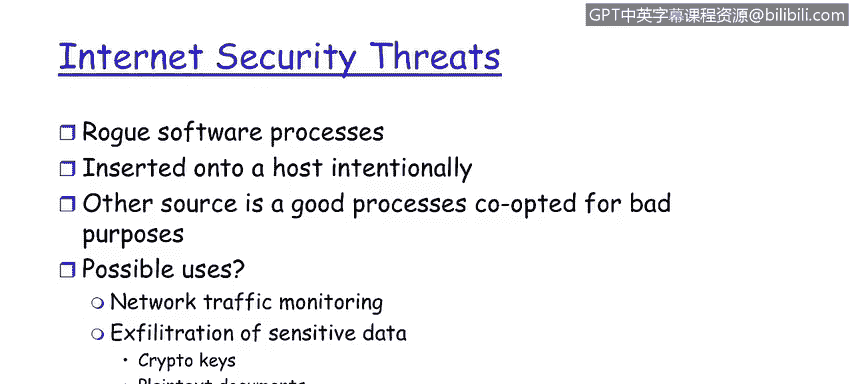

# IBM网络安全分析师专业证书课程1：《网络安全工具与网络攻击简介课程（IBM）》introduction-cybersecurity-cyber-attacks - P110：36_05_security-attacks-host-insertions.en_subtitled - GPT中英字幕课程资源 - BV1c84y1Z7Dp

Yes。In this video， you will learn too。Describe how host insertions are used to compromise a network。

Describe what measures can be taken to protect against unauthorized insertion of a new host on your network。

 host insertions， right， So the ability once an insider threat。

 the ability to place a computer client on the network or a server on the network with that intent。

 So this is actually goes onto the network， hoping that it's not going to be detected and it contain。

Move on to its nefarious goals。 These are done both its clients and as server。

 So how can one protect against host insertions。 Slideide 21 talks about the idea about maintaining accurate inventories of computer hosts by Mac addresses。

 This is the this is the fundamental technology behind asset management。

 Solid asset management as part of a larger governance program。 It also applies directly。

To patch maintenance。And vulnerability management。So the idea about a scanner。

 Q radar has a scanner internally that can generate very accurate inventories of computer assets on the networks。

 so not just hosts， but all of this servers， the network criteria。

 all of those can be listed by Mac addresses。so嗯。With a constant or continual scanning capability reading。

 you will determine the scanner will ascertain computer clients or hosts that are not on the white list。

 So missing host or okay。 This is somebody that's where system turned off either for maintenance or it's a notebook computer that's off of the network。

New hosts that are not on that Mac address whitelist， that's bad news。

 and that's when the red lights and the sirens go on。

Some of the remaining security threats to keep into mind are that of the rogue software process。

This is。A software program， a software agent that has been inserted maliciously on the internal network。

This can be inserted both by the internal and the external threat。Once again。

 a whitelist approach about being able to maintain a list of viable and legitimate software applications in the enterprise。

A key part of a solid governance program will help identify unwanted and uninvited software processes in the enterprise once those are identified right a vulnerability management software can help eradicate those software processes。

These generally are inserted onto a host right a computer platform。

 either a client or a server intentionally the other variation of this is that a legitimate software process is modified for evil purposes so what would they do for this obviously network traffic monitoring to be able to ghost or understand the network traffic patterns so we talked earlier also。

In the first module about traffic flow analysis。 Well。

 these are actually the tools that observe traffic flow and in turn in ascertain and try to obtain intelligence or at least information about the enterprise given the way the traffic patterns are shaping。

 and additionally， this is also used for the exfiltration and sensitive data。

 we think about customer information， credit cards。

 but crypto keys also are a target for x filtration。

