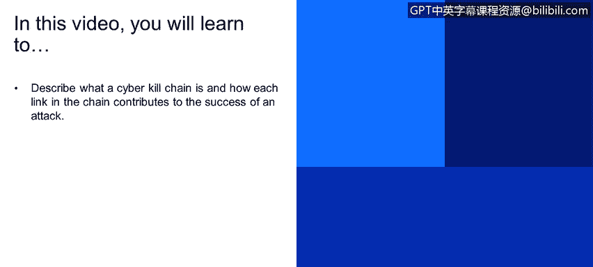

# IBM网络安全分析师专业证书课程1：《网络安全工具与网络攻击简介课程（IBM）》introduction-cybersecurity-cyber-attacks - P111：37_01_the-cyber-kill-chain.en_subtitled - GPT中英字幕课程资源 - BV1c84y1Z7Dp

Yes。In this video， you will learn to。Describe what a cyber kill chain is and how each link in the chain contributes to the success of an attack。

嗯。The key chain， as I said before are a set of activity that needs to be done to compromise the victim。

Usually， the kill chain is referred the Mar， but each single attack as could have a specific field shape。

 So if weciated， the gial injection requires some specific activity that needs to be done。

For what regarding the Maro itself， those are the most cost common activity that needs to be done。

 So recognize science that means basically understand what type vul can be exposed。

 where polarization means。Identify or identify what is the exploit things to onenari， for example。

 the onenari exploit was a turn blue of delivery。 I need to。

Make sure that the malicious payload that I have created could be an application to us for ransomware could be exploit to the vulnerability。

 But at the end of the story， there is something that needs to arrive from the target。

 and that is delivery part， Expation is the activity to start the to start the exploit of the specific vulnerability。

 So once the malicious malicious payload is arrived， I need to exploit that specific vulnerability。

 Then， of course， I need to restore some other component that are not necessary Mar， but our。

Things that I know to start my activity。 So if I if I need to create some data。

 take ask ransom later， I can， I need 12 the on the target。

 also a tool that makes a cring of the data。 This is not a marvel because of。 And by the way。

 this is something that is very important for Mar in general。You you will be surprised。

 but developing a malware is not illegal。Its very difficult to define what is illegal。

 Once you have a problem that does something。The fact that the problem does something not necessary can be associated to a ma。

 sometimes we create something that can be used by a good guy but can be used also but yeah。

 so crpting a data in general is not is not something bad but if you crypt a data and give us ranom for them that that caused a leader that is also another particular challenge that we have in the defense。

 or this is quite common， this is quite common for Marl establish a common control session So I need to control the activity from outside。

 and that in the last families of Marware this is also something that is very much interesting in the sense that very often my real objective is not to compromise the victim。

 but to use the victim or computer to start an attack to third parties。So this is like itself。

 So if' a captured。Your computer wait， from your computer that to form and adapt to the Martina computer。

 Okay， in this case， I。第个。The real incident， if you want are two。

 One is that I'm using your computer to perform a title to third party。 The certain that I use it。

 your computer to store some data from the material。 and finally， actions and objecting。

 So once you have a command control， you can perform such scripting data or installing。

The application for the ransom request morning and the service of。

Another thing that I think that is very much interesting in this is the fact that。

We think of the model as。Something that has been created by one person to compromise another person。

 Each single of these activity usually is performed by could be performed by different organizations。

 Very often， we talk about cyber crime as a service。

 So each there are several organizations that are specializing in delivery。

 for examples to spam through modern and。And are the people that are very well specialized in the Recon Recona sensor space。

 So understanding what are the vulnerability。 is nice to know that there are， I mean。

 I see often very more often companies that order to understand。

If their system are vulnerable or not。Launch some specific contests that are called back bank。

 Well bond， back bond。is the right work。 So basically。

 bug boing is it's a sort of challenge that the company does to understand it vulner in their services。

 Actually， the same step is done by attacker as well and。

So also talk very often launch contest in that web to find some borabi The set pack can use can exploit。

Yeah。

