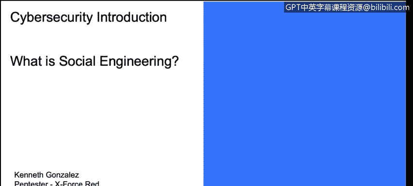
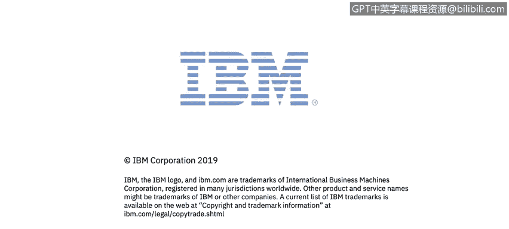

# IBM网络安全分析师专业证书课程1：《网络安全工具与网络攻击简介课程（IBM）》introduction-cybersecurity-cyber-attacks - P112：38_02_what-is-social-engineering.en_subtitled - GPT中英字幕课程资源 - BV1c84y1Z7Dp

In this video， you will learn too。Describe social engineering and how it is used as an effective method of cyber exploitation。

 So now let's talk about social engineering Social engineering is actually pretty easy to understand。

Question yourself， how could you trick somebody to do something that they don't want to do。

And think it a good way。 I mean， how could you trick trick somebody to give。

 give you help or his password， I mean， if you go and ask your friends to give him a password for a social network。

 Probably they won't do that because they understand that the password is something important for for them to have privately or separate from the public information that they could give to somebody。

 So the question or the process to perform a social engineering attack is how could you trick somebody to give you something that is private。

And this is something that we use normally on offensive security operations。

Because when we try to exploit things from the technical perspective。

 in some occasions we deal with advanced firewalls with advanced systems that will block all the effects that we are delivering into the client or the victim network so one of the easy way to perform or get information or try to exploit things inside the network of the client of the victim is try to gain information from the users。

 gain information from somebody inside a network that already have， for example。

 a password username username to log in into a BPPN system， so if you already have the URL。

 the external URL to log in into SSL BPPN system， but you need the password。

 you need the username from for you to be able to log in into that remote system。

 the easy way to get that probably is the social。engineeringering attack。Now。

 how could you perform a social engineering attack that's actually。Pretty easily also again。

 this is something that you need to have permission to do that or to do it there is a lot of tools over there that you could use a tool that it's actually pretty easy called set toolkit。

Set toolkit is something that came in Tele Linux， but you also could install on your system without any Linux installation or without any specific Linux Linux distribution。

 but it's something that will have a set of tools is like on the title is a toolkit where you can create。

 for example， fake websites create or clone websites from public internet domains or private internet domains。

 for example， you can go and clone external website from your client from your victim and where a couple of dws。

 you could try to。Imersonate somebody。 And that somebody could。

Send an email using a phishing attack to username inside the network。

 inside your victim network or your client network and see if the user get or click on the link that you send and add all the credentials put write all the credentials on that user and password log in fake HTML。

 for example。 So that's not all。 I mean， the social engineering toolkit has a lot of tools。 Actually。

 you could also sofing web sorry， spofing voice calls。

 So that's something interesting for you to to test。 again。

 you need to have permission in order to try to exploit something from a client。 I mean。

 you cannot not do by any mean， any kind of clone private website and try to ph in set of usernames。

And try to get try to get them to click a link and give you the credentials for any kind of systems you need to have the permission for doing that。

 but the important part here to understand if is there is a lot of good tools。

 there is a lot of things that you can start doing to understand how could you trick somebody to do something that they shouldn't do。

