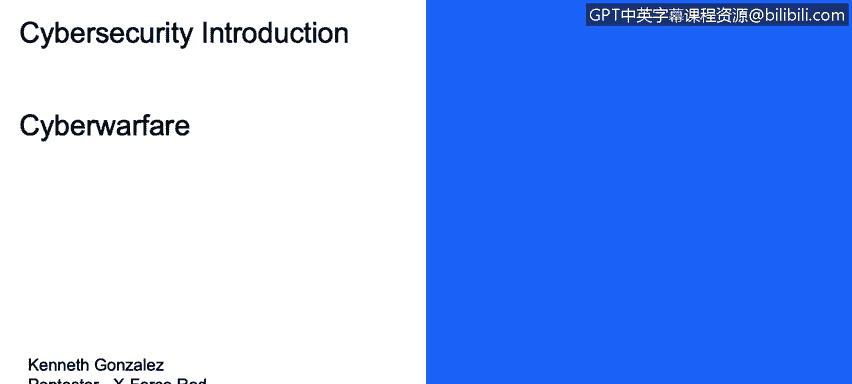
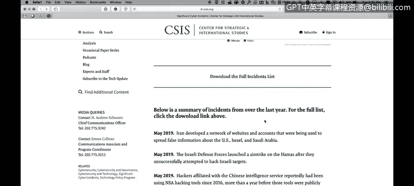
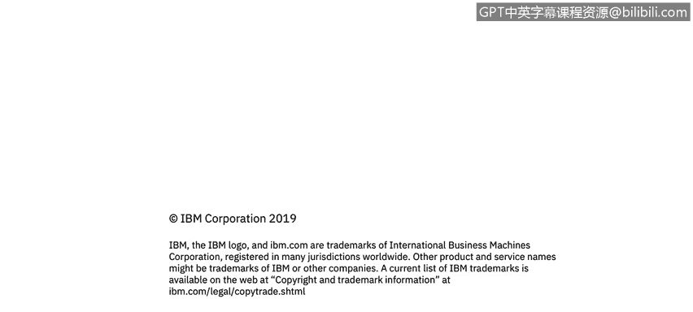

# IBM网络安全分析师专业证书课程1：《网络安全工具与网络攻击简介课程（IBM）》introduction-cybersecurity-cyber-attacks - P114：40_04_cyberwarfare.en_subtitled - GPT中英字幕课程资源 - BV1c84y1Z7Dp

In this video you will learn to describe what is meant by cyber war and the online resources available to understand the global picture For this lesson。

 we will talk about cyber war It's a link where you will find information regarding significant cyber incidents since 2006 so there is a information regarding the current cyber operations delivered by countries or forces that allies with countries to execute cyber operations so for example。

 one of the interesting parts here in these infographic is the amount of cyber incidents per nation even if the nation generates the incident or the nation receive the attacks so for example。

 as you may see here based on this information from this cybersecur。

The report China performed during this year， almost 100。

Nate incidents where he deploy cybersecurity attacks。

 He receive also or the nation of China receive also 25 incidents。

 But one of the interesting part here is United States。

 United States receive 117 incidents during this year。

So this is something important againll also understand that United States deliver nine incidents or create or generates9 incidents during this year。

 so if you want to understand more about which incidents the countries receive or what are the cyber operations that the nations are developing right now。

 heres a lot of examples， so for example， this one in April of this year。

 Iranian hackers reportedly undertook and hacking a campaign against bank local government networks and other public agencies in UK so the important part here to understand。

 first of all， is it says Iranian hackers， but it doesn't necessarily means that the government of Iran is performing the attacks。

And this is something important because as you may know。

 there is a lot of actor in the cyberseity warfare here。

 normally we have cyber operations from nations directly。

 so there is a cyber command on US on UK on China that will develop not just offensive but also a defense security operations。

But then we have like hackers hired by those nations to perform the attacks。

 so one of the things that we need to understand is when these kind of reports or if you see you saw something or you see something on the news。

 talking about cyber warfare or China attacking United States or United States attacking North Korea。

 normally and that's the tricky part of the cyber warfare as an scenario normally we're talking about groups of hackers that covers their operations using。

Using states as the as the falses flag for their security attacks。 So again。

 there is some interesting attacks here， probably some of them as some of these attacks are。

 like I mentioned， generated by not actors that are not necessarily governments。

 but there is some actions that definitely are generated by by government。 So， for example。

This one on March of this year， Iran's intelligence service attack hack into a former IF chief and Israeli opposition leader Ben Gs on the cell phone on his cell phone ahead of the Israeli April elections So this is the actually the Israeli intelligence the。

 and they point all all the IocCs， all the information that they collect to the government intelligence agency from Iran。

 So that's here is an example of one operation generated and deployed by the government。

 not necessarily deployed by the group of hackers， so that's one of the tricky parts of the cyber warfa ass right now again。

 you could go and download the full list， understand what is happening right now。

 there is a good resources on Amazon for example， to to understand a little bit better the cyber war as。

Area currently， so there is a good book called Sires。

It's the history of actually it' actually also a film here。

 But there is a book countdown to Sira day。 This book will。Tell the story of Stuxnet。

 Stuxnet was a Maware virus deployed by supposedly by a nation to cause some destruction on the Iranian's nuclear plan。

 So here is a good resource for you to understand the Korean。 Also is more like， like in story。

 So these， this stillnet Maware happens 2007。 So it's actually pretty old。

 but it's like the first major cyber attack from nation to nation recorded in the recent history on the Internet。

 So that's a good resource for you to understand and take a quick look of his cyber war in these days。

