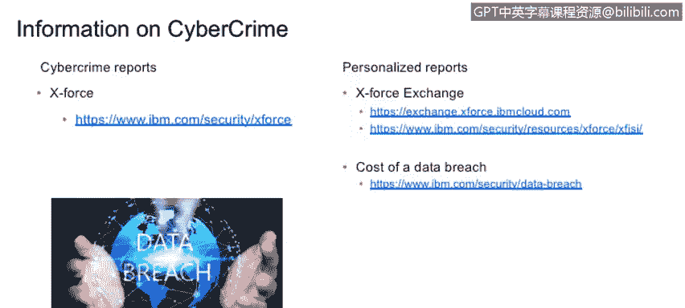

# IBM网络安全分析师专业证书课程1：《网络安全工具与网络攻击简介课程（IBM）》introduction-cybersecurity-cyber-attacks - P115：41_05_cybercrime-resources.en_subtitled - GPT中英字幕课程资源 - BV1c84y1Z7Dp

Yes。In this video， you will learn to。Describe various resources available to you to help your organization protect itself against cyber crime and cyber criminals。

We started with the attack methodologies， But attack methodologies， of course。

 is are something mandatory that， I mean， if someone wants to attack you。

 you would understand what is the arsenal that the possible attacker has。

But are a lot of information that， of course， to be needs to be understood and digest very well here。

 there are。A couple of information that I would suggest to have a look。 But， I mean。

 there are many other information that you can go and start on Internet and search for it。

Information is very much important。 every single day。

 usually I quite understand what is happening today because this is something that is very much different from automation and security and cybersecurity agenda or automation。

 you can surviving。 can alive。 You can stay alive。 You can keep your compete skill updated also for without studying each single day。

 cybersecurity in portion。 Every single day， people develop a new arsenals that need to be very well digested because if not。

 you cannot be protected by something that you didn't。Okay， so information。

 let's start with the cyber crime or。Cyberseity trade reports。In IBM we have the exposure report。

 export also is a report that is created by IBM versus cybersecurity research。

 so these three reports I would say， are quite are very trusted reports and they here after quarter after quarter for some of this book there are rapids that I would recommend to。

To download。 And I' always keep in mind。Then， there are also of。

Information that you can search that provide to use and much more personalized information。 So。

 for example， in Avm， we have exchanger， Are you exports exchange。 Exs exchange is a portal。

 And this portal， you can query the portal with some specific， you see。 So I address or name D。

Ash file email address。 And you can see if this specific and exports。

 will talking to you everything that they know about that specific， about that specific。嗯。

You see that You have quite。WellAlso， IBM make available a portal that provides you in a cyber security report that is very much specific to the sector。

 to the industry， to the country that you are going to。 So， for example， do you want to know。

 how many if IQ injection is used in Italy。 Okay， at that point， you can ask a report。

 a specific statistic on this。 And you can understand how this is important。 I mean。

 if you need to protect your client and or if you need to protect yourself。

You want to understand that if there are threats that are referring to that specific client to that specific area。

 in this case， you can decide to spend at least 1 cent。In in that particular area。So if maybe， so。

 for example， if you know that you do not if you do know that you do not tell an nail doubt。

And if you know that SQl injection is not very popular in the south of E， while you should start。

Were worrying about protecting against Sl injection。

 Maybe you can invest something this one set on a totally different that。Also。

 something that I would recommend to use is the data branch report。

 So that basically provides you the information on how much it can cost a data breach or a specific client。

This is not do not。 This is not cost to the exact。The exact data。 But， of course， I mean。

 this is something that you can use， either in case of selling or in case of also deciding on what you do you want to invest your dog。

 I mean， if you think if you know that data match to yourself side。

can cost a lot of money other you know that maybe but probably is protecting and against that specific temperature。

