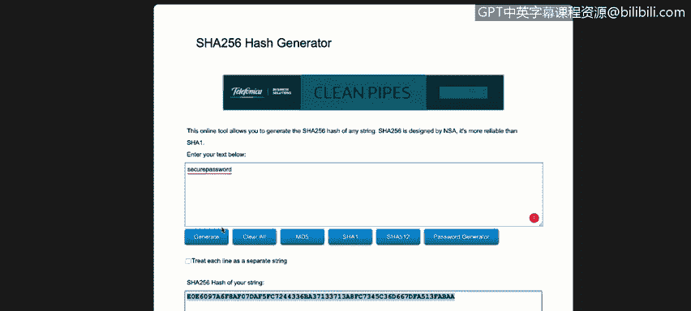

# IBM网络安全分析师专业证书课程1：《网络安全工具与网络攻击简介课程（IBM）》introduction-cybersecurity-cyber-attacks - P120：46_02_cia-triad-integrity.en_subtitled - GPT中英字幕课程资源 - BV1c84y1Z7Dp

Yes。In this video， you will learn to describe what is meant by integrity in the context of the CIA triad。

 The other concept that we are going to explore today is integrity integritytegrity is actually something that is similar to confidentiality。

 but there are some differences， for example， integrity is just the principle that all the data。

 all the information， all the。

Systems that we are going to use are not modify， are not changed by any system by any user。

 by any person in the transit or in the meantime that we are going to use that system。 So。

 for example， if we are going to send an email from our email client to our company's headquarters saying that we are going to。

 I don't know。 we are going to， were going to use system to。

To access remotely the computer of the client and we send on that email， the software。

 the PPN software that we are going to use， one of the key concepts that integrity deals with is the importance that that mail that we're going to send is not going to be T is not going to be modify in the transit。

 so basically integrity deals with with the process that each the pieces of the information that we're going to send that we're going to receive are the original pieces。

How can we implement， How can we use integrity in our company in our cybersecurity life。

 We normally use hashes。 that that concept that hash。

 the hash concept is something important is something that we' are going to explore in in some videos in the future。

 But in the meantime， the important part of the hashes is explained that the hash is an algorithm is a mathematical algorithm that it's going to create like a signature of the file of the email of the data that we are going to use。

 For example， and I use going to。Explore a couple of things here。 So， for example。

 if we go to Internet let's go to Google and we can go to hash generator online。Here we could。

 for example， go to the second link。

Here， here is the URL password generator donet。 and here we are going to enter a password。

 enter a text。 Actually， we could add something like。Secure password。These secure password。

 if we generate a hash algorithm using the Sha 256 algorithm or mathematical encryption。

 we are going to translate this word， the secure password word into these numbers and letters。

 these information actually if you use this secure word to logging into for example。

 into your email account， if you go and try to instead of use the secure password you use this string here。

 these letters and numbers， you are going to be rejected by the system。

 but in the cybersecurity word， these numbers， these key these letters and numbers means that if somebody it's going to use this password。

 the signature， the hash will be something like this， if for example， if we change the D for。For us。

 for example， the the hash totally change。 So again， if we change the S 4 D。

 the hash will be the same。 So this is a clear example of what what hash means it's procedure where the mathematical algorithm goes and。

Generate a signature for in this case for a word， but we can generate a signature for for a file for something like like a document。

 something like that。 another example， probably more clear example is something like this we could go to Callli org this is a Linux distribution we used by normally by pan testers to test security in the enterprise environment but if we go here and we go to download then download Call Linux we're going to see a lot of links to download these Linux distribution but one interesting part here is this chat 256 z this is the algorithm。

 this is the hash that we need to validate as soon as we download these Cal Linux light version of Callli so for example if we download this file wester download for example here in HttP the file will be download and as soon as。

Don't want finish， we could or we should actually go to something like this。fiile。Online。

 we could go to maybe here via calculator。In this case， we are going to use。Yeah。So this site。

 Md5fiile。com will allow us to drop files。And generate share algorithms or the share results for these six。

Sorry five different algorithms， this means that for example。

 as soon as these don' hold finish if we upload the file here into this online calculator and we receive something different than this number in the Sha 256 zm the file probably will be corrupted or the file suffers something in the transit between the caI servers in our computer so that's a clear example of how we could use。

Hashs in the， in the real world， in the， in the cyberseity world。

