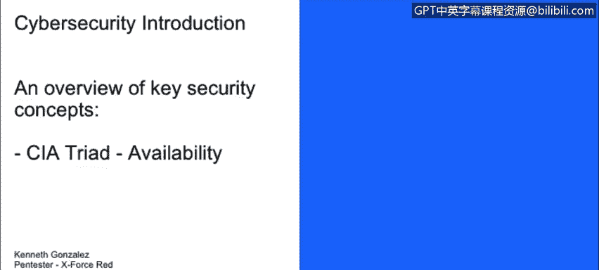
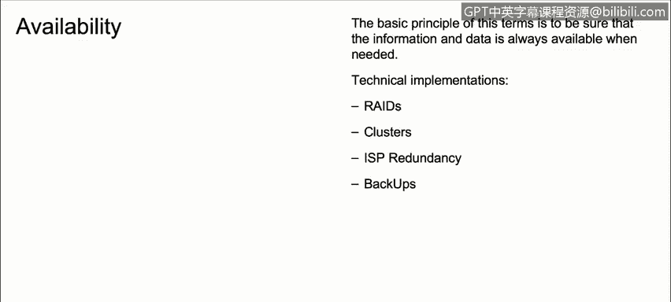

# IBM网络安全分析师专业证书课程1：《网络安全工具与网络攻击简介课程（IBM）》introduction-cybersecurity-cyber-attacks - P121：47_03_cia-triad-availability.en_subtitled - GPT中英字幕课程资源 - BV1c84y1Z7Dp

Yes。In this video， you will learn to describe what is meant by availability in the context of the CIA Triad。

And the last one， it's for availability， availability means actually we deal with availability。

Every day， but means that any data should be available always when it's needed。

 so a clear example of a lack of availability is do not have any kind of backups for our data for our systems So what happens when where a cyber attack for example。

 occurs and somebody download ransomware in our network and all the data from our computers from our servers are erased or are encrypted。

Well， the easiest thing to do actually is go to our backup and restore the data using the last available backup available or using the last backup that we have on our system and restore everything and continue our life continue how we work as nothing happen。

 but in some occasions these kind of processes， restoring a backup or generating backups。

 it's something that is not necessarily common in most of the enterprises。

So some technical implementations that we could use or we could yeah use to implement or add availability in our network in our systems our rates。

 rates are like this arrangements， this technology is something that for example。

 will allow us to keep or to install two， three， or four even naturally having our thousands of hard drives in our servers in our systems to backup or to add redundancy into our servers for our data。

 so for example， if we have four different drives in our file server and OneDrive goes down because a mechanical part broken。

Well， it doesn't matter。 We have three different drives that has the same information and we could maintain the access to our data。

 clusters， cluster clusters are a technology that allow us to maintain different set of servers working as one。

 So it something similar as a rates but on clusters， we are not dealing with hard drives。

 we're not dealing with drives。 we're dealing with servers。 ISP redundancy。

 obviously something important。 What happens if we only have one Internet connection to our company。

 and something happened and that internet connection connection goes down。 Well。

 something important is in in these days when we are using a lot of things on cloud。

 probably it's a good idea to have an next or a second ISP to。

To have internet in our company and obviously back appss where we already talk about backup apps and the things the important things that we need to keep in mind as soon as we work with back apps and restore data。

