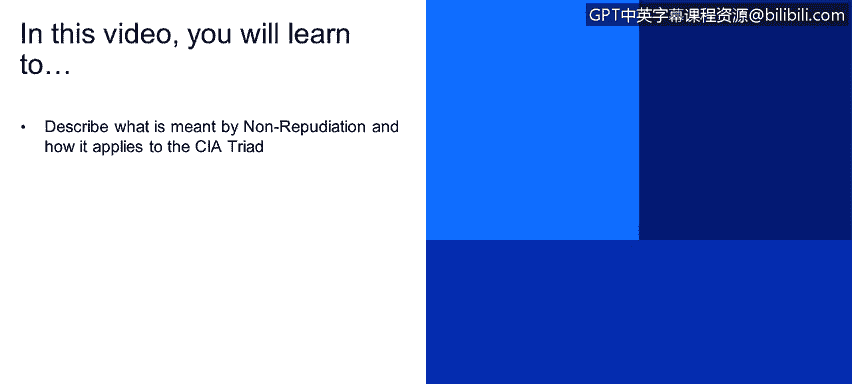
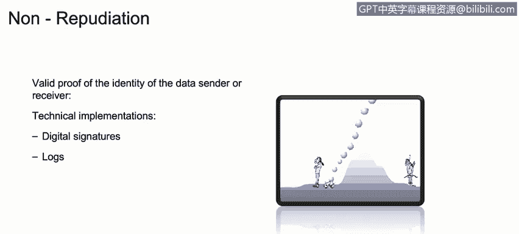

# IBM网络安全分析师专业证书课程1：《网络安全工具与网络攻击简介课程（IBM）》introduction-cybersecurity-cyber-attacks - P122：48_04_non-repudiation-how-does-it-apply-to-cia.en_subtitled - GPT中英字幕课程资源 - BV1c84y1Z7Dp

Yes。In this video， you will learn to。Describe what is meant by non repudiation and how it applies to the CIA Triad。

Another term， another key term that we need to understand is something called non-reputdiation。

 nonreputation is pretty simple is actually abundant proof that the identity of that data sender of the data receiver its not modify is not alter。

 not even on the transit， but in the region of the data， so for example。

 how could we use something or how how could we implement some technology that will allow us to understand if somebody send an email。

 that person is actually that person is not an attacker from I don't know from another country trying to impersonate the person that send the email。

 so that something that we normally implement with digital signatures and obviously if we go to our for example this specific scenario。

SoIf we go to our mail server。We could also go to the logs and see if somebody， for example。

 if Kenneth send an email to his boss saying that he quit so if there is no logs。

 if there is no digital signature on on the receiver side that says that Kenth send these email。

 that should be something important to keep in mind for the nonreudiation concepts so as soon as the Kenth boss goes to Kennenet office and says hey。

 are you really quitting here that's something that this isary Kennet could say hey Kennenet could say like hey no I'm actually not sending those emails。

 somebody is trying to impersonate so that's something that we're going to talk about in the future how could we use encryption。

 how could we use public key infrastructure to generate digital signatures and how could we understand logs in different systems but at this moment。

It's important to understand this concept and non reputation concept。

