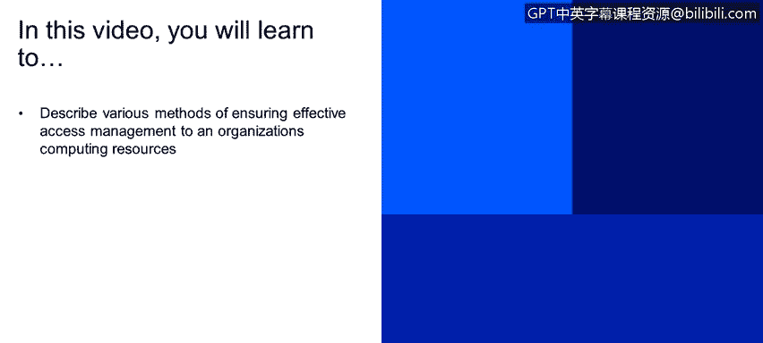
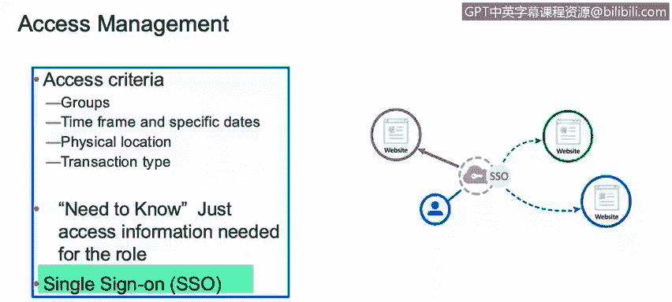
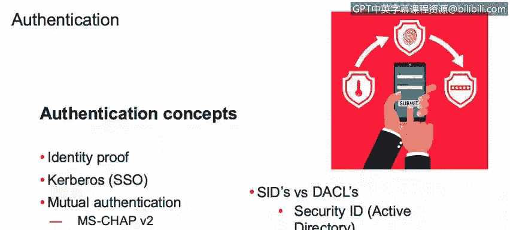

# IBM网络安全分析师专业证书课程1：《网络安全工具与网络攻击简介课程（IBM）》introduction-cybersecurity-cyber-attacks - P123：49_01_access-management.en_subtitled - GPT中英字幕课程资源 - BV1c84y1Z7Dp

In this video， you will learn to。Describe various methods of ensuring effective access management to an organization's computing resources So we're going to go over some key tens now we're going to talk about authorization。

Plarization， as is the process of allowing somebody to access a specific object。

There are different type of criteria。Restrict access by groups like time frames or specific dates。

 also by physical location or transaction type， What this means is basically we can do。

 it could allow， in this case subjects or people to access objects or files or directories based on specific groups。

 for example， the industry group will have access to more data than for example。

 somebody on a different group such as maybe a financial person in a different group like a financial group or something like that。

You could also restrict access by time frame， meaning from 8 to5。People can to specific files， but。

Any attempt to access those files outside those timeframes， those will be denied。Also， specific date。

 let's say， Monday to Friday。Those will be the days that the people working on site will be allowed to。

Access those files。You could also restrict the access to specific objects or file directors， again。

 by physical locations。 So for example， you want people only located in the USA to access those files。

Or you want people only outside the USA to access those type of files or specific information。

You could also restrict the access through transactions。 You don't want people to。

Write new specific files。 But maybe you want people to be able to read those filess。

We need to talk about need to know as well。 The need to know is the justification for somebody。

To request access to a specific data， if my specific job or my job do you require me to know something。

 and maybe that would be the justification for me to have access to a specific files and directories。

And all of this is basically centralized on something that's called single sign on。

 This is a very widely use on enterprises。 And what this does is basically you log in once and the single signon will allow you access to websites or to different files with just a single onetime login process。

There are some authentication concerns that we need to understand。 First of all。

 it's the identity proof。On most systems， they will ask you for a identity and authentication。

To put an example， the username will be your identity group。 That's something that identifies you。

And only you by you need identifying yourself， you need to authentic that you， I actually。

Who you were saying you are。 And basically， that's done through the password。

 So the password will give you authentication and you using will give you identification。Gberros。

 it's a protocol used to implementing cos on。And there are some mutual authentication， like Chap。

AndThese are some type of authentication processes that are used to communicate to systems。

 They rely on a secret tree， or a free turkey。More specifically， in active director。

 we have something called security Id。 And this basically。

 it's a unique I given to objects and subjects。 meaning it's an idea that identifies a person。

And also， it's able to identify an object meaning， for example。

 a group a specific group with a specific profile。Most of the over resistanceist that we know it use discretionary access controls。

 basically that the discretionary access control is a type of access control that allows the users to give access to their own data to whomever they want。

Mean if I have a text file with a sensitive data， I'm responsible for who's allowed to view and edit that file because it's my file and it's discretionary to me to give that access to anyone that I want。

