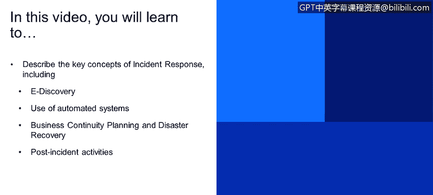
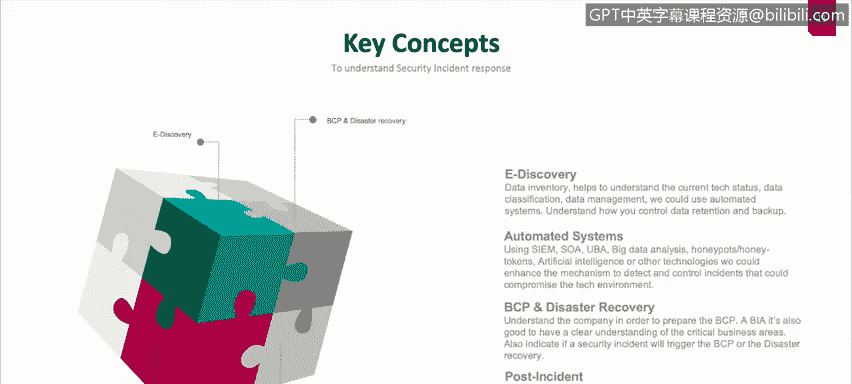

# IBM网络安全分析师专业证书课程1：《网络安全工具与网络攻击简介课程（IBM）》introduction-cybersecurity-cyber-attacks - P125：51_02_key-concepts-incident-response.en_subtitled - GPT中英字幕课程资源 - BV1c84y1Z7Dp

Yes。In this video， you will learn too。Describe the key concepts of incident response。

 including e discovery。Use of automated systems。Business continuity planning and disaster recovery。

Post incident activities。

There are some key concepts that we need to understand understand also first the edicovery process is something really。

 really important。 we need to have our baseline regarding technologies and systems and assets that we are going to use in our systems in our companies so the edicovery process will allow us to get the current status of all the data。

 all the systems， all the information that we are dealing with in our computers in our systems in our network。

 also will allow us to understand how could we control the data retention period and the backups of that data not necessarily data but we could also understand things like for example。

 if the systems it's important if we have the system that will deals with a payroll on monthly basis。

 is this really important do we need to care about the data retention here， do we do we need to。

to care about the backup do we need to care about the rest of this system in case of any incident happened。

 so that's an important process， that e discovery process。Then we we have automated systems。

 we have a lot of things right now in our cur environment cur environments。

 we have CNs like splung curator our site。We have user behavior analytics， we have big data analysis。

 we have honeypots and honey tokens， artificial intelligences。

 we have a lot of things why we have a lot of things because we have a lot of assets we have a lot of data if we only have one computer in our company probably will be easy for the response team to understand why why an incident happen。

 how could we restore the service affected and why this incident is happening again and again and again。

 but what about if we have 1000 computer100 servers 10 different routers and systems we need to correlate we need to centralize all the data generated by those systems and generate reports generate useful data on that system and more importantly generate incidents or generate automated incident alert。

That could allow us or could alert the incident response that something has happened even before the user or the company was affected by that incident。

We have BCP and disaster recovery recovery BCP means a business continuity plan and disaster recovery is something similar。

 but we are going to talk about the main differences that business continuity process is a whole process a whole plan that we need to implement in our company in order to prevent or in order to actually guide not just the incident response team but guide all all the all the organization as soon as something happened what happened when。

Service was affected， and that service won't be available for the external users until the next 3。

4 hours。 How our company will deal with that， How client server the systems or how the I department will deal deal with that。

 how the。Plying service department will deal with all the calls that they are going to receive from different people outside to the organization。

And disaster recovery actually is the process that we need to implement or we need to follow in order to recover all the different areas if a disaster occurs。

 by by the term disaster doesn't necessarily mean that we are going to be affected by a hurricane or by a tornado or something like that。

 could be something like a cyber attack that will destroy all the data in our data center。

 how could we go and recover everything from our data center。

 how could we restore everything and the process that we need to implement not just to recover that。

 but also to inform the authorities to inform the CEO of the company or inform to the public that we are going to have a service disrupted because we have an incident that happened in our data center。

And obviously then the last term that we are going to explore is the past incident This past incident is well as soon as everything goes okay as soon as we recover everything as soon as the service now up and running what what this incident happen。

 what is the root cause of this incident， who did the attack for example。

 who implement or who make the changes understand what is the difference between an error what is the difference between a problem and what is the difference between an incident。

 so the important part here is an error， it's something that happened on the system because somebody make an error so for example。

 if you go to to the finance finance system and you type your bank account and instead of your bank account you type your name and you hit enter and the system crash because of that that's probably an error because。

They handle poorly the input of the user into a text box。A problem。 It's something that is。

 it's a number of errors that normal generates a problem。 So if you detect that and you。

You update the system and you implement a patch to fix that input error。

 But what happen if you detect that somebody or another user goes into another part of the system。

 And again， instead of numbers， they they put letters and the system crash。 Well。

 that could be a problem。 The system could be could have a problem on on the input validation side。

And isolated incident could be something that well it happened once we don't know we still don't know what it happened。

 but as soon as the user put numbers or put letters instead of numbers。

 the system crash but if we go and try to replicate the error will try to replicate the same behavior nothing happened so that could be an isolated incident。

 the thing is we need to understand we need to investigate and we need to fully understand and now this is all the different types of errors。

 problems and systems error error sorry error problems and incidents that we detect on our systems。

 but we need to understand what is an error， what is a problem and what is an isolated incident the next part of the post incident concept is well。

Let us learn and the reports that we could generate from those errors。

 problems and incidents in order to understand in order to learn what happened。

 how could we prevent those events and what happen if those events happen again。

 how could we restore the service as soon as possible。

