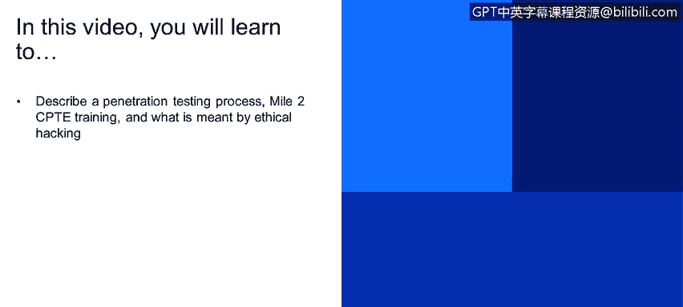

# IBM网络安全分析师专业证书课程1：《网络安全工具与网络攻击简介课程（IBM）》introduction-cybersecurity-cyber-attacks - P130：56_04_pentest-process-and-mile-2-cpte-training.en_subtitled - GPT中英字幕课程资源 - BV1c84y1Z7Dp

Yes。In this video， you will learn too。Describe a penetration testing process mile to CPptTE training and what is meant by ethical hacking part of this session is the penetration testing process the penetration testing faces that in the audit。

 we just understand for example， that we don't have on the web system we don't have any assessment yet to understand or to review if the system is prompt to crossa scripting well on the pen testing site we will go and we will test a crossa scripting into the system we will act like like an attacker like an hacker and try to exploit the system。

 try to perform the crossi scripting and understand what happens。

 understand if the system is prompt to crossas scripting well let's simulate let's attack the system。

 let's generate a cross I scripting attack into the system and。

Let's see what's happened。 Let's see if the system， let me。

 let me send a message to a user and let me trip the user to go to an external website and try to。

Hack the user computer try to hack the system。 So basically the penetration testing or the yet hacking process。

 This is just methodology used by mile to is a vendor that has a lot of cybersecurity certification this is just a basic and standard process So you will need to footprint in your your target on the same target that we have the web application program we will need to understand first of all。

 what kind of system we are dealing with， if this is a web system dealing with a WordPresspress platform we're dealing with a customized platform we're dealing with HTML5 platform the scanning process will let us know or in the pen tester view will the pen tester will give the pen tester the knowledge to understand if if there is any port open What is operative of the。

Of the web server application， What is the language， What is the database that the web application。

It's reporting to。😡，On the enumeration we will understand any kind of techniques。

 any kind of processes that we are going to generate that we are going to use for test the system and obviously we have the exploitation or penetration part and this means that we are going to perform the attacks we are going to generate the attacks if we understand that we are dealing with a WordPress platform and the WordPress platform isn't a server in the internal network and the same word WordPress platformform from to a SQL injection attack and we could get the information for the database well let's generate the attack list create the attack and see what happened if the attack was successful we will have to perform a set of steps for example we could elevate the privilege we could manipulated the data we need to cover our tracks。

 for example we don't want for the or we don't want the CSA to detect our steps in the system。

Probably we will need to cover our track。And we will have to leave a backdoor for example。

 if we want to come back later into the system and we don't want to perform any of the previous steps。

 we just want to go and double click on the link in our desktop and get access to the system。

 then we will need to leave a backdo those processes those steps will understand or will give us and understand that the system is prompt to attacks and not just prompttu attack。

 but the system will have or will deal with the attack in a way that will give the attacker the full control of the system or will block the attack and will drop all the connections from the attacker computer so that process。

 the fence process is normally known as an offensive security scan is something that you will need to act like an attacker。

 you will need to act as an hacker and perform。Tact into systems。 obviously。

 you will need to have permission from your client in order to proceed with this kind of task。

 But on the out。And the important part here is understand that if you will perform an audit。

 this is not necessarily app penist or app penist is not necessarily an inau。

 So there is a lot of differences。 There is a lot of。

Things that you will keep in mind in order to perform each of both or each of the the of the processes。

 each of the techniques that we show you in this session。

