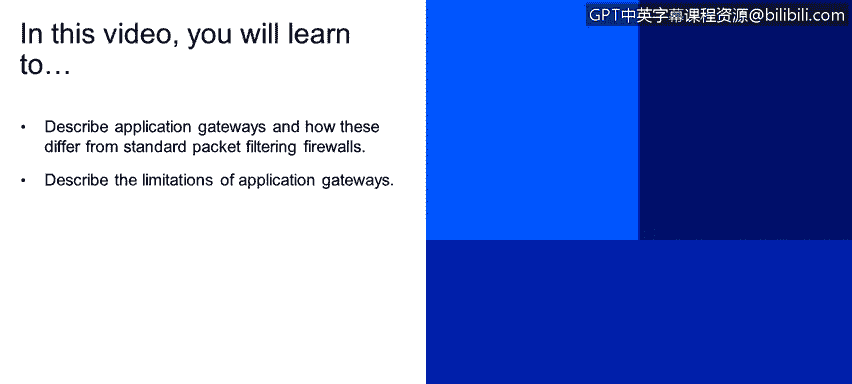
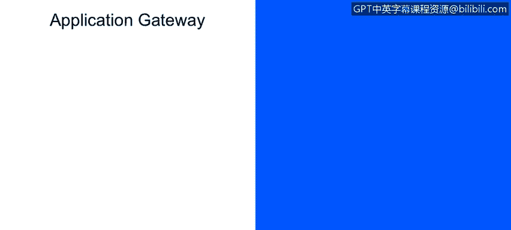

# IBM网络安全分析师专业证书课程1：《网络安全工具与网络攻击简介课程（IBM）》introduction-cybersecurity-cyber-attacks - P135：61_03_firewalls-application-gateway.en_subtitled - GPT中英字幕课程资源 - BV1c84y1Z7Dp

In this video， you will learn to describe application gateways and how these differ from standard packet filtering firewalls。

Describe the limitations of application gateways now at application gateways。

 so these also are filter packets， but they are on the application data。

 which is the payload right at the top level of the OSI stack。

 as well as these IP transport fields that are in there。 So this allows。

For example， select users to employ the Telnet application right outside。So effectively to do this。

 we will mandate， we require all Tnet connections to go through a gateway。

 there's an access control mechanism that says， yes。

 this is a Tnet connection and then is this user authorized or not？Authorize， so it is a， once again。

 an access control type。Mechanism that apply to。An application。

So there's some limitations right here， one of the things that as I said is that these are based on transport protocols so we can IP we can masquerade or spt the IP address。

This is done significantly with internet attacks that the source destination is not， in fact。

 the true source destination， but it'。Masqueraded， it appears to be coming from either a customer or trusted source when in fact。

 it is anything but these firewalls that we've been discussing。

Do not have a mechanism to really validate this， but so a significant threat area right there。

For application。Gateways， application fault one， right。

 This is a one to one relationship so that if you've got an single application like a tnet or in a broadcast UDP。

 each one of these is going to require its own。Application gateway。

 So there's this one to one relationship。 This gets into a very expensive。Process。In addition。

 the client software， the applications， the web browsers， the email tools， the FTP tools。

 instant messaging， all of them have to be smart。Right， so they need to have the protocol。

Pdetermined， right our priori to know how to communicate with the gateways。

 whether that's an application or a packet filter。These packet filters frequently are an all or nothing application relative to UDP。

There's a security thought that UDP should be largely disengaged because it's broadcast。

 there's a number of security vulnerabilities that are associated with that。

 So what is the trade off right， The trade off is open communication with the outside world。

 No security policies and played at all。As opposed to an increasing level of security。

 And with the increasing level of security， there's more control on protocols and applications and user access。

So that is the trade space that the security engineer needs to operate。Despite that， right， many。

 many highly protected sites， US government sites still suffer from。Cyber attack。

