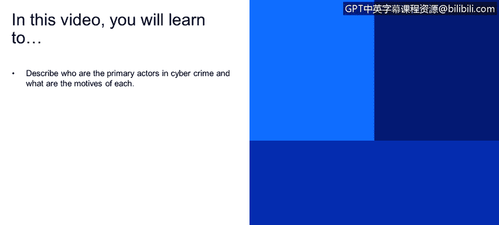
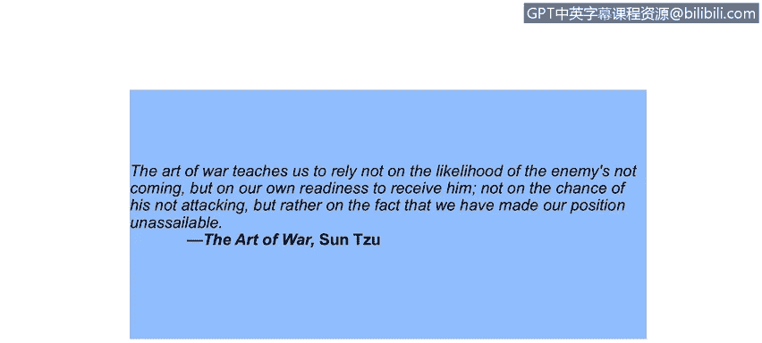

# IBM网络安全分析师专业证书课程1：《网络安全工具与网络攻击简介课程（IBM）》introduction-cybersecurity-cyber-attacks - P13：12_什么是安全.zh - GPT中英字幕课程资源 - BV1c84y1Z7Dp

Yes。In this video， you will learn to describe who are the primary actors in cyber crime and what are the motives of each。

So what is security？

Within the principles of security， you frequently will hear about CIA and that talks about confidentiality。

Integrity and authentication， so it's actually a little wider than that， right so confidentiality。

Is a major principle and this is where only the sender and the receiver can understand the message。

 So if it is an intercepted midway we'll take a look at some diagrams for that that those interceptors will not be able to understand the message so fundamentally the sender which would be Bob right in the literature sends the encrypted message。

And Alice， on the other end， receives and decrypts the message。

Associated with this is authentication where the two senders， Alice and Bob， in our example。

 need to confirm the identity of each other before sending a message。

Equally important for authentication is integrity that the sender and receiver。

 Alice and Bob want to have some assurances that the message has not been changed。

 right whether this is going to be in transit or whether it's going to be in some intermediate stage on the receiver's end。

 most importantly。Has it been changed and they want to be able to ascertain if it's been changed without detection。

 we will look at several mechanisms for that to happen。Last is the access and availability。

 right so that the security services， the IT services that are available in the enterprise have the correct access control mechanisms in place。

And also have significant availability to allow the enterprise to operate according to SP。

I am a big fan of Sun， too。The art of war teaches us not to rely on the likelihood of the enemy not coming。

 but our own readiness to receive him。Not on the chance of his not attacking。

 but rather on the fact that we have made our position unassailable。

So this speaks to that principle of a， well， it couldn't happen to me。Largely you need to be ready。

I'll follow on to this， the combination of space， time and strength that must be considered as the basic elements of this theory of defense。

Makes us a fairly complicated mat。 Consequently， it's not easy to find a fixed point of departure。

So security is a complex field that's dynamic and changing。

Before we jump into the dynamics and the interaction with cryptography， let's take a look at。

The playing field so that we can get the lexicon the terms defined in the actress。Well， so Alice。

 Bob and Trudy， you see this。Throughout cryptography literature。 And so it's A， B。

And T are the actors， but back in the 60s in a few papers。

 these were given names Alice Bob and Trudy and they continue today so Bob and Alice right want to communicate securely it can be for any reason a personal reason or business reason。

Trudy， who is the interceptor， desires to intercept， deletemin add messages， change messages。

 effectively a bad actor。 So we take a look at the diagram here on slide7 and we see Alice on the right hand side and Alice has some data This could be an email could be a note。

It could be a web page， number of elements with that。And she secures this message。

Moving from clear text。To cipher text。Transmits it across a channel。 Now， the channel can be。

Any any form of transmission that we that we can consider， so certainly email direct transfer。

 file transfer protocol， it could be a text message these days。Back in the in the Napoleonic period。

 this would be a letter that a young naval midshipman may carry between Whitehall and。

Other parts of London。 So the channel right is the transmission mechanism and within the channel is the data。

 This is the payload。Right control messages who is it going to how long is it good for what's the address of the recipient Bob in this case you know obviously in the internet world we look at IP addresses we look at Mac addresses in the manual world we think about the Napoleonic era when British intelligence started its ascendancy this would be a name and a physical mailing address so physical mailing addresses our manual interpretations of control messages so Bob receives the message decodes it and has the clear text that Alice had sent to him Trudy has the ability to intercept these messages on the channel but because of the secure nature of the encryption the protection for that cannot read or delete or alter those messages。

So who could Bob and Alice be？ Well， they could be Bob and Alice。

There's no reason it's not real people。But that also could be。A client server relationship， right。

 clientient servers and banking elements， DNS servers communicating with clients during the I。

Lease phase Cl certainly network routers right exchanging and information with other routers and updating tables and there you know there's other examples such as firewalls communicating with security intelligence systems。

Security intelligence systems communicating with database protection。

 so we have a sender and a receiver many， many instantis of that so our next slide nine right now the NIST group from the US government right has a very vibrant computer security practice and I have a definition for computer security that's been provided。

The protection afforded to an automated information system in order to attain the applicable objectives of preserving the integrity。

 availability and confidentiality of information system resources， it includes hardware， software。

Firmware， information data and telecommunications， so taking a look in reverse order， right？

The scope of。Computer security is the OSI protocol stack that starts with applications on the top moves down to the presentation and the session down through the transport layers。

 down into the physical layers。 All of those are within scope of computer security。

 And you'll notice that it says the protection。Provided to an automated information system。

 So this is protection for not only the platforms， the host。Software。

 but the information that these systems are。

Processing。