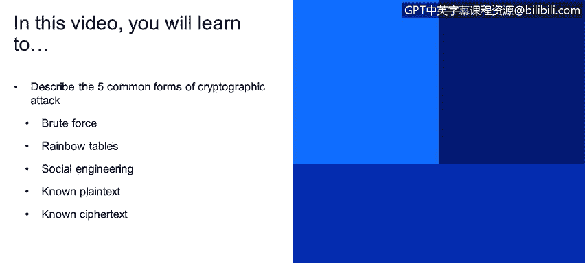
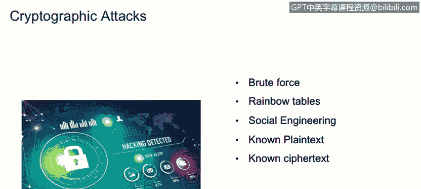

# IBM网络安全分析师专业证书课程1：《网络安全工具与网络攻击简介课程（IBM）》introduction-cybersecurity-cyber-attacks - P141：67_03_cryptographic-attacks.en_subtitled - GPT中英字幕课程资源 - BV1c84y1Z7Dp

Yes。In this video， you will learn to describe the five common forms of cryptographic attack。

Brrote force， rainbow tables， social engineering， known plain text， known cipher text。

Now we'll discuss some cryptographic attacks。Some basic cryptographic attacks that we have seen in the past are brute forests。

 the rainbow tables， of course， social engineering， known plan texts， and known se texts。

So brute force is an attack。Based in trial and error。And I think it will go through。

Sumission of many password or pass traces。Do hope that eventually it will guess correctly。

Rainbow tables are similar， but they use a limited amount of information or files。

 and they actually contain。Free hash passwords that we can check against hash passwords make a lot that make the attacks a lot faster。

 Social engineering influences in using nontechnical methods to get those maybe hit the password from the end users themselves。

The known plane tax attack is based on having。Only plain text。In doing。

Analysis based on that plain text。To try to understand how the cipher works and how thecipher。

Inncs the information。 This is an attempt to actually understand and try to。

Get the actual key that it's used in the cipher to encrypt the information once you have the key you're able to decrypt or encrypt any information a known cybertext is the process of having only cybertex。

 it's similar to the think text attack but with the difference that we don't own plain text we just own cyber textex and based on that cybertex we try to defer the key use in the cipher to again encrypt and decrypt the information。

