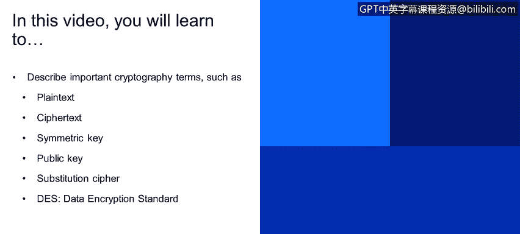
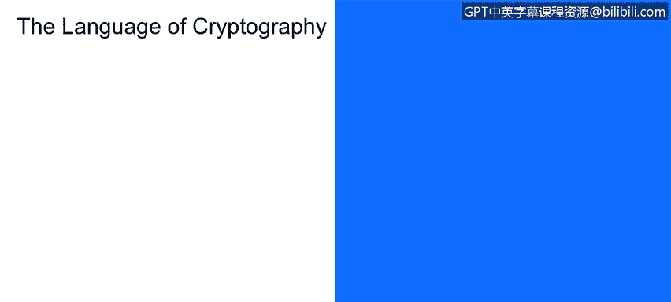

# IBM网络安全分析师专业证书课程1：《网络安全工具与网络攻击简介课程（IBM）》introduction-cybersecurity-cyber-attacks - P142：68_04_cryptography-a-different-perspective-from-a-security-architect - GPT中英字幕课程资源 - BV1c84y1Z7Dp

Yes。In this video， you will learn to。Describe important cryptography terms such as plain text。

 ciphert， symmetric key。Public key， substitution cipher， data encryption standard。

So诶。Before starting， one of the things we should do is set our lexicon or dictionary about cryptography。

 So there's a couple of key points to be made here。 Looking at this diagram。

 we see Alice communicating to Bob again， Alice， Bob the center and receiver。

Respectively。Alice has a plain text message。That she wishes to send them Bob。

So the plain text message is human readable， This is a clear text。It can be an email。

 a Microsoft Word document。A web page link， Anything that。

Alllice may wish to send to Bob and like I said， it can to be clear text and in this simple form。

 readable by anyone。So then there Alice runs through an encryption algorithm to create the cipher text。

 so the cipher text is the encrypted message。We talk about a message。

 but it could be a word document once again any number of types of content。

You'll notice that Alice has an encryption key。So this encryption key。Is designated by the letter K。

 and you will notice there's a small subscript right here。That indicates that is Alice's。Key。

So K A is Alice's key once again， this creates the cipher text。

 which is put on the communication channel and said to Bob who's the recipient。Bob decryptps the。

Message the cipher text to recover the plain text using his key。Which is designated by Ks for key。

 lower case B。Subscript。B for Bob。 So K A， Alice's T， K， B， Bobbsky。Truly。

In the center here is the interceptor。The eavesdpper。

Now where there's a basic architectural difference between two types of cryptography architectures。

 one is a symmetric key， this is where the receiver key， Bobs key and Alice's key are identical。

 so in this case KA equals KB。Public key cryptography。Is uses a difference of K。

 There is a secret key， right that the Bob has。 So K A does not equal。期别。

So let's move on and let's take a look at some principles of symmetric cryptography。

Let's take some time and investigate。The principles behind symmetric T cryptography。

There's a couple of architectures， a couple of styles of symmetric key cryptography that we will look at。

 So one of the first ones is the substitution。Ccipher， so this is the equivalent of a。

Magic decoderory。That we have a simple substitution of one letter， it's a monoalbetic cipher。

 which means that we substitute one letter for another and that substitution does not change for the entire message。

You'll take a look here at a plain text tour， we just simply run A through Z。

And the ciphert is M through Q， so M is the 13th letter of the alphabet， so this is K equals 13。

 meaning that we shift。Cyphertext 13。Characters to the right。

In the monoalbetic presentation of A through Z and our plain text as in the example from Bob。

Rather from Alice to Bob says Bob， I love you， Alice and the ciphert， as you can see， is N N。

 and you can certainly read the rest。 So one of the questions of。Before us is， you know。

 how difficult is it to break this simple cipher Well。

 the answer is it's not very hard at all because there's a very uneven distribution of the use of letters in the English language。

So we know， for example， that the letter E occurs most frequently。

So a simple histogram of the recurrence of。Letters in the cyclic text will reveal what E is in any case。

And in this case， E will be C。So， this。Frequency histogram will quickly， quickly yield the ciphertex。

 So in fact， this is not a very。Secure method to be user Now。

 from a graphical at what a symmetric key cryptography architecture looks like。So once again， Alice。

Who is。Sending a plain text message and we designate the messages am。Ecrypts the。

Plain text with a key。Especially designed between Alice and Bob， that's what the subscripts of A。

 dash， B indicate。This go through the encryption algorithm to create the cipher textex。 Now。

 look at the designation right here。 So we have the ciphertex is。

Identified as the key Alice to Bob parenthetically message。

 So this is the distribution that we saw earlier with a one letter shift， for example。

Bob here receives the cipher text， applies the decryption key。

 which is identical to the encryption key。 So this is K AB and recovers the plain text。

 So mathematically， the message。Here。Is found by applying the decryption key to the encrypted message。

Or the cipher text that。Bob has received from now so that this element right here。

 this is the message， this is the decryption key， and that will result in the extraction or recovery of the plain text message。

就啊。Bob and Ellis， right for this to work， right have to share the distribution key， KA B。Now。

 the question is， how does Bob and Alice agree on the key value？

And that is actually the weakness for symmetric key cryptography。The actual encryption of that。

 and we'll take a look at some other methods that are just not monoalbetic。

Or no stronger or no worse than。Asymmetric or public key cryptography。 But the issue is。

 how does the is about key distribution， How does。Bob， get the key from Alice。Right， so。

She could email it， but could truly intercept that key and then use that for decryption of that message and the answer was obviously yes so the problem and we'll talk about this in more detail。

For the foundational problem for symmetric key cryptography is actually in key distribution。

So let's take a look at another symmetric key。Methd。

And we'll take a look at some of the technology behind slide six。Let's talk about D ES。

 So this is a IBM historical。Cryptography approach。 So this is actually。BuBuilt to a standard。

 right that NIS published。It's a 56 bit symmetric key。

 so that means that the key from Alice to Bob is 56 bits long。When you see 64 bit plain text input。

That just simply means that the algorithm， the DES encryption algorithm。Ingests。

Digests text in 64 bit chunks。So if you had a 640。Bit plain text message。

You'd had 10 64 bit groups that are going to be encrypted。So one of the questions。Of course。

 is how secure is DES， the data encryption standard？我。56。Bit keys right， like I said。

 is the encrypted key leg。It is a brute force approach， which was。

Taken undertaking about several years ago， it said you know。

 this could be broken in about four months， so did how to defeat that well。

 change the key every three months and then they have to simply start over。Great。

 so there's no known back door this has been gone through peer review within the cryptography community and those people will report on the slightest。

Vulnerability in an encryption standard。 So this has never been published。

 So we have a sense that there's some strength right here。

So we'll take a look at how to make this a little more secure right we can simply use three keys on each of these data blocks right that's the 64Kbit that we see。

Coming through and there's an architecture called cipher block chain。

 let's take a look at that briefly on the next slide。Here in slide 7。

 right is an architectural element for DES。So the there is actually。

 you could take a look and just kind of do a little finger walk right here that you can see that there's a left and a right。

Part of the 64。And those are reversed， right， so we and then we apply 48 bits out of the 56 bits。

Against this element and they're swapped left and right， and there's a permutation element。

 So the point being。Is that there are 16。Rounds。Of this segmentation and encryption。好。

Encryption cycle on each of the 64 bits。 So once I said earlier， we had 640。Bit input。

 This would happen 10 times， and we would concatetnate those tend and send that as the encrypted message。

Following。D E S in November of 2001， missed。Published a new standard。

So what we did was is that the NIST moved the ingest block by a factor of two。

 so went from 64 bits to 128 bits。The key length。Moved from 56 bits to these larger numbers that we see here。

 128192 or 256 bits。Why are the three， Well， this is a user selected。Key length。 Now， keep in mind。

 the longer the key。The more computationally intensive the algorithm will be so that if we've got。

Information that is at one level of sensitivity and information。

 It's at a higher level of sensitivity。 There's an argument for using。The longer bits。

 the 128 bit versus the 64 bit makes for a more efficient algorithm。

So if you remember on the previous slide， we mentioned。That we had a brute force approach that。

With the high end computers that are available today， we would take， know， just a second。To find。

The DE S key。As you can see moves to 149 trillion years for Aes。

 So you see the attraction that brute force is essentially off the table when it comes to the advanced encryption standard。

 So the salient point for this training module is to know that the first。Commercially available。

Electronic encryption algorithm is DES， and then the second follow on was AES。

 which effectively removed brute force。

