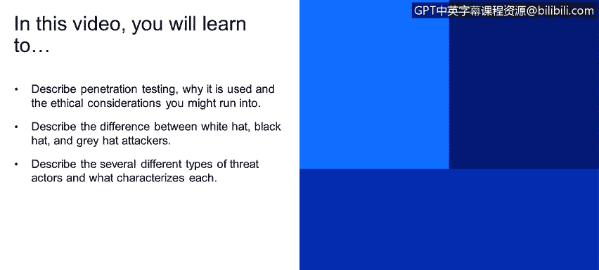

# IBM网络安全分析师专业证书课程1：《网络安全工具与网络攻击简介课程（IBM）》introduction-cybersecurity-cyber-attacks - P143：69_01_penetration-testing-introduction.en_subtitled - GPT中英字幕课程资源 - BV1c84y1Z7Dp

Yes。In this video， you will learn to。Describe penetration testing。

 why it is used and the ethical considerations you might run into。

Describe the difference between white hat， black hat， and gray hat attackers。

Describe the several different types of threat actors and what characters each Okay。

 for our next update， we're going to talk a little bit more a little bit about penetration testing。

So penetration testing it's also called pen test or pen testing。

 it's also referred as ethical hacking。It's basically the practice of testing a computer system。

 a network application， either a web application or software application。

 to find a security vulnerability that an attack could use to exploit and gain unary access to a system or an application。

The main objective of app pen test is to identify security witnesses before attackers can identify them and use and exploit them。

penetrationeneration and testing， it's something that it's a practice that requires several contracts before it can be performed。

 For example， service level agreements， engagement rules。

 also all sorts of documentation to make the penetration testing a legal agreement between two parties。

The penetration testers are the ones in charge of doing the technical process。

 and they are also called white hackers。There are different type of hackers。

 and we can divide them into three categories， basically white hat hackers。

 gray hat hackers and black hat hackers。The white hat hackers， as we discussed earlier。

 are basically the ethical hackers， people that do this under contract。 and for security reasons。

 they are authorized to perform penetration testing on companies。

 and they do it for the good of the company。GGray hat hackers。

 they stand like in between the whiteheads and the gray hats。

 they usually perform penetration testing without authorization。

But they usually report back to their customer or not the customer or the possible victim。

 because they were not contracted to do this。 So they were not authorized or previously authorized by a company to perform any type of security assessment on their infrastructure or their network。

 they do it anyways。 And they report back to their customer or the victim， the possible victim。

On the other hand， we have the black cat hackers。They are quote unquote， the bad guys。

 they usually do this type of attacks for personal recognition， money。

 political agenda or social change。They do not do it under contract if they are not authorizedized to perform any type of penetration testing activity on any of their victims。

We also have something called threat actors。 It's basically an entity that is partially responsible for an incident or an attack。

It usually affects the security of organizations， and they are also referred as malicious actors。

There are different types and with different types。

 there are also different skill levels associated with them。To start with script keys。

 basically the script kits are unexienced hackers， they have limited technical knowledge and they relied on automated tools to hack。

 they do not develop their own tools and they pretty much use what's publicly available with very little technical knowledge。

We have also the heivs， these type of hackers， they are usually motivated for a political。

 They have a political agenda or some sort of a social change in their minds。

They are also organized strength。 These are usually external to the company。

 They're highly sophisticated， meaning they have very high technical knowledge。

They are also heavily funded from an economical standpoint。

And they are usually attacking through some sort of a highly developed sub malware。

 like Branssonware and nowadays。Insiders， they represent past or pressing employees， contractors。

 partners or any entity that has access to。A company property or confidential information。

The insiders can be a security risk for intentionally or unintentionally。 Basically。

 a insider or an employee could be。Fired from the company， for example。

 And they could be motivated to perform some sort of disruption activity。On a company。

 they are could also be unintentionally。 an employee maybe deleteleting some sort of some sort of information that it was not to be supposed to be deleted。

 but they made a mistake， and they deleted that information by mistake。We also have the competitors。

 A competitor could be。A potential security risk to other organizations because other organizations。

 because they could be motivated by maybe releasing a product before the competition。And finally。

 we have the nation states。Nation states are。External to the company。

 They are also highly sophisticated。 They are very well economically funded。

 They could be something related to politics， military， technical or economic agendas。

We have a few samples of some nation state。Threat actors， the Fed bear， also called AP 28。

Laer's group Sff also called CRB 123 or the APT 29。

 these are all examples for nation state funded hacking organizations。

