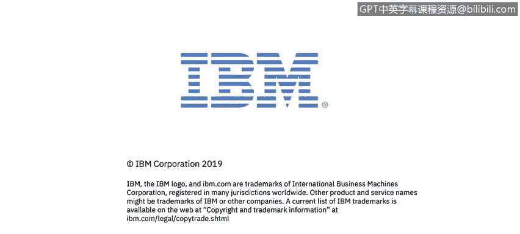

# IBM网络安全分析师专业证书课程1：《网络安全工具与网络攻击简介课程（IBM）》introduction-cybersecurity-cyber-attacks - P145：71_03_vulnerability-tests.en_subtitled - GPT中英字幕课程资源 - BV1c84y1Z7Dp

In this video， you will learn to describe the vulnerability assessment methodology There is something that also when and as I mentioned before。

 we normally use in the pen testing pen testing word or as scenarios。

 but it could be something that is separate from the pen testing word and this is vulnerability assessment test。

 So as I mentioned， there is tools that well exploit or will try to give us vulnerabilities for each of the systems that we are dealing with。

 So for example。

When we have a system and we know that that system runs on port 80， again。

 a patch server on depression version 2。4， for example。

 we could start understanding each of the exploits doing a manual search。

 but we can use something we can use openb for example。

 to perform a vulnerability assessment automated vulnerability assessment。

 So the tool will be run on on the system on the network from your client and will give us a lot of information from possible exploits that we could use as a pan testers to gain access to the system Now the important part of the vulnerability assessment methodology is the vulnerability assessment finish with the report finish with understanding of the vulnerability the vulnerability assessment report will not will not exploit the vulnerability identified on the system so only will give us the report。

Only will give us the information to exploit that vulnerability but will not exploit the vulnerability itself。

 so that's the next step if we're dealing with a pan testing methodology。

 but if we're talking about vulnerability assessment。

 we're just dealing with information that could harm a system or could be used to exploit a system not necessarily the exploitation process or the both exploitation process。

 that's something important to understand。So here is a quickest scenario or recommended by some companies or followed by by some companies。

 so the vulnerability assessment or the vulnerability scanner could be done quarterly or by monthly or buy weekly or on monthly basis。

 why because normally something automated is something that it's already very configured in a system is already very configured in a tool and we'll be running actually automatically on regular basis on the internal network So when we have all the information regarding vulnerability scanner scanners we could start trying to attach patch the systems or adding。

Security into the systems for the vulnerabilities or the exploits not be longer available for attackers to get access on the system now to start or to test that we are doing the current patching or the current sanitization of each of the vulnerabilities that we detect on the vulnerabilityil scanning normally we perform penetration testing process this could be done annual。

 for example， in some occasions one or two times per year is it's important or is recommended but this case the pen testers will take not just the vulnerabilities that you already know that you have but probably will take some additional exploits or techniques。

 for example the social engineering techniques to try to exploit your systems so this is something that will be manually made。

 I mean， there is companies that will。Spials will bring consultants to deploy or to execute pen testing in the other scenario area and the w of will assessment as scenario scenario。

 there is not necessarily a consultant， but could be a system generated information on the boom of ala that you have。

