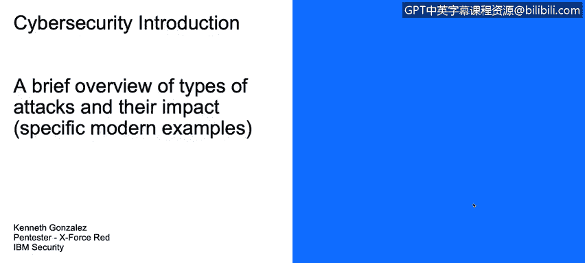

# IBM网络安全分析师专业证书课程1：《网络安全工具与网络攻击简介课程（IBM）》introduction-cybersecurity-cyber-attacks - P20：20_主要不同类型的网络攻击.zh - GPT中英字幕课程资源 - BV1c84y1Z7Dp

Yes。In this video， you will learn to describe the major different types of cyber attacks and the impacts they have had。

We' are going to talk about here about different types of tax and their impact。

 We are going to show quick examples， reasonable examples。

For example， we have the Sony attack。Theyate the Lu set group on。2011 goes to Sunny and hack。

Their PlayStation network system。 And they leak a lot of information regarding credit cards regarding accounts on their PlayStation network。

We have the single pure attacks we talked about before these attacks， but in simple words。

 there is a lot of hackers that send attacks into websites， not just government websites。

 but also banks and companies on Singapore peer to protest for some policies and laws that the Singapore pure government are passing。

On 2014， we have a lot of attacks。 We have the linking attack。 Actually， that attack。

 that leak was something pretty important。 we have Ebay。 We have Home Depot， Oh Yuvissa。

 We have a lot of governments on 2015。 We have target。 at least 100 million of credit cards was leak。

On 2016， we have a lot of things， we have the US election attack， we have the CNN attack。

 we have the Zen attack using something called Mirih attack。

 first attack using IO to perform a DDS attack into Team service DNS servers。

And there is a lot of things we have on 2017， 2018， we have shadow brokerkers， we have Eterno Blue。

 we have Wanna cry， we have Mmot， we have NSA Lakes this year， for example。

 and that's something that happened actually this week， we have an attack from Neus。

 actually here's a group example of something called supply chain attacks。

 somebody or a group of hacks a group of hackers or somebody hack into Nes and。

On their supply chain for their computers， especially for the operative systems and software on their computers。

Installam hardwareware。 So each computer that came from A from the last 2，3，4 months。

Could be infected with the malware。 And that's why on the supply chain of the process to add software to install the operative system into the Asus machine。

 somebody implant some malware。 So there is a potential risk here， if you own As machine。

 it's a good idea to contact your vendor to contact your provider and to run some antivirus software。

Then we have some examples。 cyberattack using Swift Swift is actually a bank protocol to transfer money。

 and here's a list of the millions of millions of losses of the banks that they are having because attacks are exploding this shift technology and it's not necessarily something that is related to the servers to the implementation of the technology is something related to the identityative to the identity impersonation。

 a user could receive an email like this。 let them know that they are receive they are receiving a transfer or they are receiving an alert for from their credit card holder and they need to go into this link to upload or to update their personal information with that information an attacker could try to apply international transfers international money transfer using Swift and here's the report。

 for example， on。Of a Bank of Ecuador Banco de Laustro that loses almost 10 million of dollars on 2015 on these hacks on these identity and dataexs。

And to close this video， we will talk about the tools and effects that those cyber actors are using。

 for example， the cyberverse for the US election hacks used to tools called Cdaddy and C Dukeuc。

 those tools were used to generate backdoors into the committee of the party to at least have access to emails。

 documents for at least six months， that's the number that some investigators are dealing with。

Then we have the black energy。 Those are Russian hackers。

 This tool is used to exploit vulnerabilities onkda or Plcs or Is systems that those systems are normally used on。

On power plants， on nuclear plants， on water plants， things like that。

 And Ukraine was part of that attack on 2016 and 2017 series of attack from Russia。We have Shaon。

 we have Duka and Flalamme， We have Dark Seul， and we have wannary。

 Those tools are used for criminals and sponsor hackers from governments to exploits。

 not just infrastructure， but also data and other information from businesses。

 personal information and Internet at all。 Compan are normally targeted by these groups。

 for example Google， Simone， companies that have intellectual property that could be installed or could be sell in the black markets。

So， it's all， I think， for these videos。

