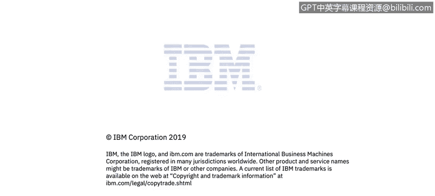

# IBM网络安全分析师专业证书课程1：《网络安全工具与网络攻击简介课程（IBM）》introduction-cybersecurity-cyber-attacks - P24：24_网络安全模型.zh - GPT中英字幕课程资源 - BV1c84y1Z7Dp

Yes。In this video， you will learn to describe various network security models。

Okay， so let's take a look at a couple of network security models。

 so we understand mechanically in terms of processes in terms of logical decomposition。

 what we're looking to achieve。

So let's talk for a moment about a generalized model for network security and here on slide 17。

We see an extract from the Staings text。About communication between a sender and a receiver。

 So this is Alice and Bob and our examine and they have a communication channel between them that is non secure。

And they need to send， wish to send a message。 that is。Protected。Can be intercepted。

 has integrity components to this， has confidentiality components to that。

 And there's an availability part of the network。 So what， what can。Bob and Els do， well， obviously。

We have the。Initial。Clear text message。 and that's this element that we see right here。

From Alice is sending to Bob。 So send is Alice。We shippingient is well。

So the security related transformation process。Is encryption。99 times out of 100。

So there's some secret content right here。That is。Maintained and the secret content is actually the encryption keys。

So， the encryption keys。Follow you allow the security related transformation or the encryption of the message。

 and here is the encrypt encrypted or secure message right now。

Alice puts this onto the information channel or adversary。Here can intercept the message。

 but because。The adversary Trudy doesn't have access to the keys that are found here。

Well not be able to read this。Now， how does so then Bobholes the message off of the communication channel。

 so this message here is the same thing as this message here。Applies his key。

Here now the keys can be the same or different。 we'll explain that a little in a little bit later。

 but he's using the same。Encryption decryption protocol that Alice is using。

 and then we add the clear text。The message here is the same as the message there。Yes。

Now that we have the generalized model plus the foundational concept describeds as module1。

Understood， let's start moving into security architectures and what it means to have an attack against the security architecture。

 So quick review of what security means is that within X 800， right。

 which is that international telecommunication union。Document。

 part of a Un governance element on that。 What is meant by security that's actuallyly used just simply in terms of managing the。

Vulnerabilities and their exposure。Of risk to both assets and resources right so an asset right here can mean anything。

So in our context， that means。The valuable information maintained by an enterprise， it also means。

The security enforcement。Point， write that technical implementation of a security policy that if it's disabled。

 increases the risk factor for the enterprise。 So both of those are in play in terms of a security asset。

So a vulnerability， Staings and 801s。800， excusecus me。

 says any weakness that can be exploited to violate a system。

Or the information that it can contains in the actual lexicon of a security professional。

 a vulnerability is an unempeployed exploit。 We think about a vulnerability from a software manufacturer from。

A security company right is a is a back door。 It's a window。 It's a way that security policies。

Can be circumvented and information can be stolen。Now。

 a vulnerability that's put into play is called an exploit。

So a threat right is the potential violation of security。

 so we have a definition for security and then the threats right here right are what we are protecting against。

So。诶。Security， architecture and motivation。So 801 800 rather right here talks about the motivation for security and open systems。

So let's define open systems for a moment， the absolute opposite of an open system is a proprietary or a closed system。

They need not be open systems need not be defined by standards。

Most standards organizations move at a pace that only a geology can geologist can appreciate。

But those。Protocols， those interfaces are published to the open。

 This is IBM's approach to security and software systems。 We are in open systems。

 not necessarily a standard。so诶。CCIT right， which is a group that comes out of that ITU。

has a piece of rocket science here that says， know we need to enhance security of open systems。

Because of society's increasing dependence on computers。

That are accessed or linked by data communications， which require protection against various threats。

So that's ground truth， right， the world's becoming more connected， needs more protection。就嗯。

There's several countries。That have increasing。Legislation。Right about data protection。

 the European Union comes to mind safe harbor in terms of managing some of the risks that are associated with that。

 so the deliverer。Let's use that rather than a term suppliers， the deliverer of。A secure enterprise。

Needs to take into consideration the risks and the legal ramifications of its systems。so诶。

And this is some marketing from ITU right here。Right， there， there's a number of standards。

 but open systems generally very， very popular and should be。

So we have security architecture and protective elements of that。

 One of the questions that we need to take a look at is what actually what needs to be protected。

 So this is this is not rocket scientists we've talked about this before， obviously。

The information and data right， needs to be protected。 This is the crown jewels of the enterprise。

 the customer credit card information， healths， records。Bank information。

All of the elements around that， including security measures such as the passwords right we think about the Yahoo breach where passwords were stolen。

All of that is target， fair games for the adversaries。

We also have the context of communication and data processes processes and services right here。

 These are the security enforcement points that we talked about earlier。 Remember。

 security enforcement points are。Technical implementations of security policies that are derived from business policies。

 And we obviously need to protect against。Modification， destruction of our equipment and facilities。

