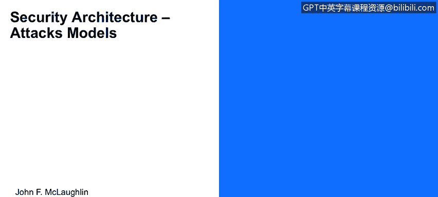
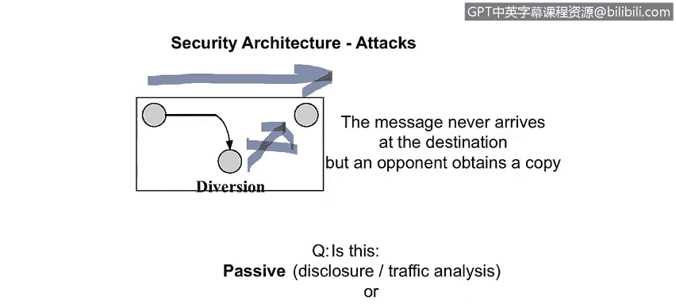

# IBM网络安全分析师专业证书课程1：《网络安全工具与网络攻击简介课程（IBM）》introduction-cybersecurity-cyber-attacks - P28：28_安全体系结构攻击模型.zh - GPT中英字幕课程资源 - BV1c84y1Z7Dp

Yes。In this video， you will learn to identify and classify the various forms of active and passive attacks。

Let's now take a look at。

A couple of model descriptions for these attacks。 So this is how life should work。

 our normal flow of information。 So the information source in this context。Is。好我。

The information destination， the receiver is Bob， this is the communication channel described earlier and what we don't see in here are the encryption capabilities we'll get to those a little bit later。

 but this is the normal flow of information from Alice。这宝。

So this is a an attack that is an interruption of services。

 So Alice here attempting to send a message to Bob。Here。Has the message disrupted by trudy。

 the interceptor in route。So this is a passive or an active attack， Well， it's an active attack。

 right， because。Bob here will know that the message had not been received at some point， right。

 Alice will know that that the message was never delivered。 So by the fact that the two recipients。

 Alice and Bob will have knowledge that the message was not delivered。要。Becomes not a passive attack。

 therefore it must be enact。And。The traffic analysis files of this is that Bob may say， hey。

 I used to get 10 emails a day from you， Alice。 and now I'm not getting any。Right， something's wrong。

 right， So we don't know what the content is， but we know that the parameters surrounding the。

Message。Delivery， right in itself carries a message。 This is an active system。

 So out of the four models that we talked about， masquerade， replay。

 modification or denial of service， which of this obviously the denial of service because Trudy is simply stopped all messages from going going through。

At Trudy getting into play right here on slide 32， so once again we have。Alice。

 sending a message to Bob and Trudy is the interceptoror who is C right here now。

The only thing that's occurring is that Trudy is making a copy of the message traffic moving from Alice to。

Bob， so the question here is that， is this a passive or active。Attack， Well。

 I would argue that it's a passive attack。Because。Alice sends a message to Bob。

 Bob receives a message。From Alice， it can be authenticated。 It makes sense。It can be。

 we can have some mechanisms in place to explain， to， to test for modification。And all of those pass。

 so it's a legitimate message。 The only thing is that Trudy。

 the interceptor has a copy of the message so。Given that。What is the the effect of this， right？

 So it's， you know， none of these are in play because it's not inactive， but the potential for this。

Is going to be disclosure from Trudy。A wackki leak st。Sending the copy of the email to the boss。

 whatever bad people do with copies of information between good people would come into play right there。

 Another attack is the modification phase。 So once again， we have Alice， we have Bob。

 who are sending a message。 Now， notice this time that the message path does not go directly。

From Alice to Bob， but vectors down and goes through Trudy， so the opponent that's Trudy。

intertercepts the message and forwards a modification of that message to Bob and appearing to come from the original source。

So what kind of attack is this， Is it a passive ordinate active attack。 Well， obviously。

 it's an active attack， right， So because Trudy is intercepting the message and choosing to modify that and send it along with it appearing that it had come from。

Alice， so is this a masquerade， Well， yes。Right so that she is modifying Trudy。

 modifying the message to appear to come。From。Alice， so Trudy is appearing to be Alice， the sender。

 Is it a replay。 Well， it could be。 We never really talk about when it's said。

 is the message modified， It is absolutely modified。Deial of service， no， it's not。

Now let's take a look at a fabrication model here。If you'll notice， Alice never sends Bob a message。

 she's sitting there mining her own time， she may be asleep。Trudy sends Bob。A message。

Let's go to lunch， this is Alice。So she is a pairing to。Represent Alice in the context of this。

 This could also。Right be anything else。 It could be a service。

 It could be your bank calling you up to change， say， okay， go change your password。

 and then we're going to put in place some mechanisms to intercept that password。

So it appears to come from a legitimate source。So our questions again， passive versus active， well。

 it's obviously active， right？And it is a masquerade， because。

Trudy is appearing to be Alice in communicating to Bob。 So this is a serious。

Type of an attack because Kay actually isn't doing anything I mean excuse me Alice isn't actually doing anything and so from her perspective there's nothing wrong。

So now we have only one element and because it appears to come from Alice。

 that awareness of the security attack may be， may be delayed another denial of service。

So in this one， once again。Alllice is attempting to send Bob a communication。

 but Trudy intercepts this prevents。The transmission to Bob。And so what happens here， right。

 So Alice sends Bob a message。Trudy intercepts that。Alice thinks it's been delivered。

Because in this case， there's obviously no message delivery verification。

And so are questions about this being passive of that？

It's obviously active because Trudy's taking an event。

 taking an action which changes the state of the system。

And so what type of an active system I would view this actually as a denial of service because of changing the state of the system and preventing a service from occurring the services message delivery does not occur。

 meets the definition formal for denial of service。And。Trudy。

 because she's got a copy of the message， right， can then release this content。

To third a unauthorized third party。 So this is a dangerous style attack。

